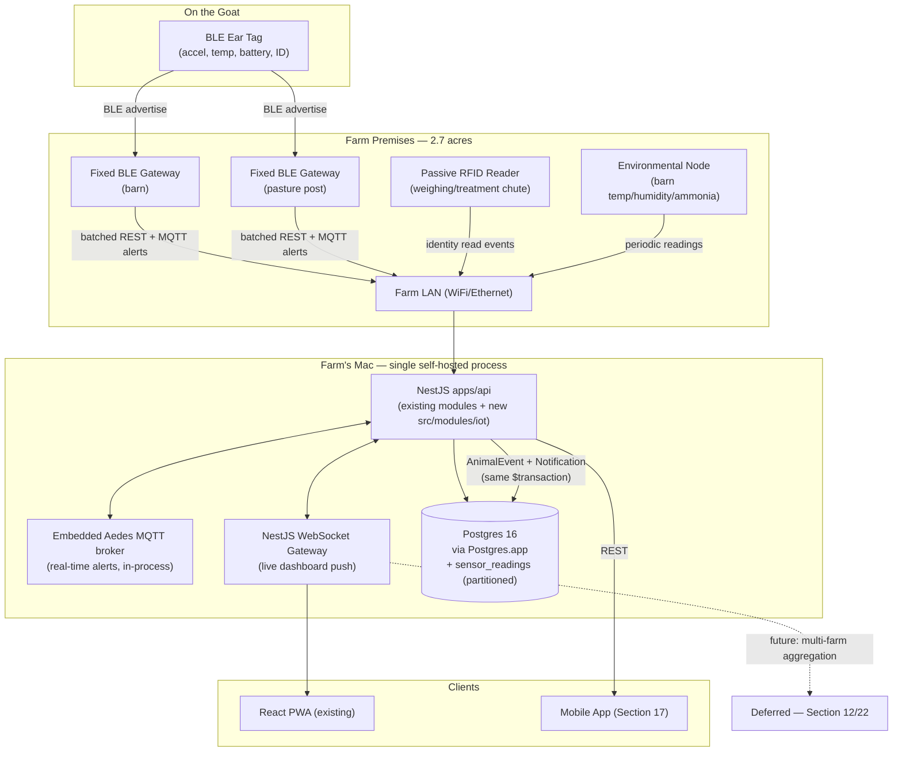

# Pandora IoT Platform — Section 1: System Architecture

**Team**: Senior IoT Architect, Embedded Systems Engineer, Firmware Engineer, Electronics Engineer, Livestock Technology Specialist, Veterinary Doctor, Goat Behaviour Researcher, AI Engineer, Edge Computing Specialist, Cloud Architect, Backend Engineer, Mobile App Engineer, Hardware Product Designer, Industrial Designer, Data Engineer, Cybersecurity Engineer, DevOps Engineer.

## 1. Executive Summary

Pandora Farm (Birbhum, West Bengal, ~2.7 acres, <100 goats today) already runs a
self-hosted livestock ERP on a single Mac (Postgres 16 via Postgres.app, NestJS API
on :3300, React PWA). This section sets the foundational architecture for an IoT
layer that gives every goat a digital identity via a smart ear tag, and continuously
feeds identity, location, health, activity, feeding, fertility, behaviour, and
environmental data into that same ERP — **without changing what the ERP fundamentally
is**: one lean, self-hosted, modular-monolith process per farm.

The central engineering tension in the brief is that a textbook "enterprise IoT
platform" (microservices, MQTT broker, GraphQL, WebSockets, cloud AI, fleet
management) is a different *shape* of system than this repo's mandated architecture
(flat `AppModule`, no per-context Nest modules, no microservices, no Docker on this
host). This document resolves that tension explicitly rather than silently picking
one: the **physical** system is distributed (tags, gateways, sensors), but the
**software** system stays a single process, because at this farm's actual and
realistic future scale, a service mesh would add operational risk with no benefit —
and where the brief's ambitions only make sense at a scale this farm will never
reach alone (50,000+ animals), the architecture becomes *federation across
independently self-hosted farms*, not a bigger central cloud (§12).

## 2. Engineering Decisions

### 2.1 System boundary — **new `src/modules/iot/` inside the existing `apps/api` monolith**
- **Why**: CLAUDE.md rule 1 mandates a flat, modular monolith — "no per-context Nest
  modules, no repository-interface ceremony unless the domain genuinely needs
  swap-ability." IoT ingestion, device registry, and alerting are CRUD- and
  rule-shaped, not swap-ability-shaped. Reusing the existing `@Perm` guard, Zod
  pipe, `$transaction` pattern, audit log, and `AnimalEvent`/`Notification` tables
  means IoT alerts flow into the same UI the farm manager already checks every
  morning — no second dashboard, no second login.
- **Rejected**: a standalone IoT backend (own repo/service) integrating over a
  public API. Rejected because it doubles operational surface (two deployments,
  two auth systems, two databases to keep consistent) for a single farm on a single
  Mac with no current multi-tenant need. Revisit only if/when a genuine multi-farm
  SaaS product is greenlit (§12).

### 2.2 Physical connectivity — **BLE ear tags + fixed BLE gateway(s) + passive RFID at chokepoints**
- **Why**: 2.7 acres is small enough that a handful of fixed BLE receivers (barn +
  1–2 pasture posts) give full coverage without per-animal cellular cost. This
  mirrors proven commercial livestock-wearable architectures (BLE/UHF tag + local
  base station), not experimental tech. Passive RFID at the weighing/treatment
  chute gives a zero-battery, 100%-accurate identity read exactly where the ERP
  already needs positive identity (health cases, weight records) — complementing,
  not replacing, BLE's coarse zone-level presence tracking. Full technology
  comparison (RFID/BLE/LoRa/UWB/NB-IoT/GPS etc.) is Section 3's job; this section
  only fixes the top-level call so later sections elaborate rather than re-litigate.
- **Rejected**: per-tag cellular (NB-IoT/LTE-M) — recurring SIM cost per animal for
  a 2.7-acre property is unjustified when a fixed gateway solves it once. Rejected
  GPS-on-every-tag for the same reason (cost, power, and unnecessary precision at
  this scale) — flagged as a future option for open-range deployments (§16 Future
  Improvements), not R1.

### 2.3 Backend transport — **embedded pure-JS MQTT broker (Aedes) for real-time alerts, batched REST ingestion for routine telemetry; no GraphQL, no external microservices**
- **Why**: the brief's "MQTT / WebSockets" ask is legitimate — a tamper or escape
  event should reach the dashboard in seconds, not on the next batch sync. Aedes is
  an npm package (pure JS, MIT-licensed) that runs an MQTT broker *inside* the same
  Node process as the NestJS API — no Homebrew install, no Docker, no second
  process to keep alive. This directly avoids the exact trap CLAUDE.md already
  documents for Postgres: Homebrew has no bottles for this Monterey host, so any
  new infra dependency should default to "pure JS/npm, runs in-process" unless
  there's a strong reason otherwise. Routine high-volume sensor readings (battery,
  RSSI, accelerometer summaries) go through a plain batched REST endpoint instead
  of MQTT — simpler to test with the existing supertest e2e pattern, and telemetry
  volume at this scale doesn't need pub/sub. The web dashboard gets live alert
  pushes via NestJS's built-in WebSocket gateway (`@nestjs/websockets`), reusing the
  same session auth as the rest of the PWA.
- **Rejected**: GraphQL — the whole codebase standardizes on Zod contracts +
  REST (`packages/contracts`); adding a second query language for one module
  breaks "validation lives in one place" and buys nothing a typed REST endpoint
  doesn't already give. Rejected a standalone Mosquitto/EMQX broker for the same
  Homebrew-on-Monterey risk that ruled out `brew install postgresql`.

### 2.4 Telemetry storage — **native Postgres declarative partitioning on `sensor_readings`, no extension**
- **Why**: TimescaleDB would be the textbook answer, but it's a Postgres *extension*
  that has to be present in the Postgres.app build this farm runs — an untested
  assumption on a host that has already burned hours on Homebrew/Monterey package
  gaps (CLAUDE.md environment quirks). Plain Postgres 16 supports declarative range
  partitioning (by month, on `capturedAt`) natively, with no extension and no new
  operational risk, and comfortably handles the actual volume at farm scale (a few
  hundred goats × a few readings/minute is tens of millions of rows/year, well
  within a single unpartitioned table's limits even before partitioning helps).
- **Rejected**: TimescaleDB — real capability, real risk (extension availability
  unverified on this host, adds a dependency the rest of the ERP doesn't have).
  Revisit only if partition-pruned Postgres actually becomes a bottleneck in
  practice, with real numbers, not in advance of evidence.

### 2.5 Device identity — **ULID + manufacturer serial number; no human-facing counter**
- **Why**: `tagNumber` (`PGF-0001`) exists because *farmers* read and write animal
  tags by hand. Devices are never referenced by a human in conversation the way an
  animal or invoice is — the manufacturer serial number (printed on the tag) is
  already the human-readable identifier for physical handling, and the ULID is the
  join key everywhere else. Adding a `device.next` counter (mirroring `tag.next`,
  `invoice.next`) would be unused ceremony. **Rejected** per CLAUDE.md's "keep the
  codebase lean" — abstraction only where a real rule lives.

### 2.6 Event/alert integration — **consolidate the three duplicated `event()` writers into one shared timeline service; alerts materialize as `Notification` + `AnimalEvent` rows in the same transaction**
- **Why**: exploration of this repo found `herd.service.ts`, `health.service.ts`,
  and `breeding.service.ts` each carry their own private `event()` helper writing
  to `animal_events` — functionally identical, duplicated three times. IoT would be
  a *fourth* caller (heat detected, escape alert, low activity, illness risk). Per
  CLAUDE.md rule 9 (timeline is written only by services inside their transactions)
  and the lean-codebase directive, this is the right moment to extract one shared
  `TimelineService.record(tx, animalId, eventType, summaryCode, params, ref?)` used
  by all four modules — a real, load-bearing simplification, not a speculative one.
  Alerts follow CLAUDE.md rule 4 (transactional side effects or nothing): an
  IoT-detected condition writes its `IotAlert` row, a `Notification` row, and an
  `AnimalEvent` row in one `$transaction` — a 2xx from the ingestion pipeline means
  all three happened, exactly like every other mutation in this system.

### 2.7 i18n and RBAC — **follow existing conventions exactly, no exceptions**
- Every new `summaryCode` (timeline), `titleCode` (notification), and error code
  ships with both `en.json` and `bn.json` entries in the same change (rule 13) —
  this binds every later section that introduces new event/alert types. A new
  `iot` permission module is added to `MODULES` in contracts and the `MATRIX` in
  `prisma/seed.ts` (rule 3), with `view` (see device/alert data), `edit` (register/
  reassign/retire devices, acknowledge alerts), and `approve` (e.g. force-reassign
  a tag still linked to an active animal — a soft-rule override per rule 10) tiers.

## 3. Alternative Options & Trade-offs

| Decision | Chosen | Alternative | Why not chosen |
|---|---|---|---|
| System boundary | In-monolith module | Standalone IoT service/repo | Doubles ops surface for one farm, one Mac, no multi-tenant need yet |
| Tag radio | BLE + gateway | Per-tag NB-IoT/LTE-M | Recurring SIM cost per animal unjustified at 2.7-acre scale |
| Tag radio | BLE + gateway | Per-tag GPS | Power/cost too high for zone-level precision that BLE already gives |
| Real-time transport | Embedded Aedes MQTT | Standalone Mosquitto/EMQX | Homebrew/Monterey bottle risk (same class of problem as Postgres) |
| Real-time transport | Embedded Aedes MQTT | HTTP polling only | Alert-to-dashboard latency too high for escape/tamper events |
| API style | REST + Zod (existing) | GraphQL | Second validation system contradicts "validation lives in one place" |
| Telemetry storage | Native Postgres partitioning | TimescaleDB extension | Unverified extension availability on Postgres.app/Monterey; no proven need yet |
| Scale-to-50k model | Federated per-farm instances | One shared multi-tenant cloud | Matches existing self-hosted-per-farm model; avoids building unrequested SaaS infra |

## 4. Architecture Diagram

## 5. Hardware Components (overview — detail in Sections 2, 4, 11)

- **Ear tag**: BLE SoC (e.g. Nordic nRF52-class), accelerometer, temperature
  sensor, battery, tamper switch — full spec in Section 2.
- **Fixed BLE gateway**: low-cost SBC or ESP32-class device, mains-powered with
  battery backup, Ethernet/WiFi uplink — full spec in Section 11/12.
- **RFID reader**: passive UHF/LF reader fixed at the chute — full spec in Section 6.
- **Environmental node**: ESP32 + temp/humidity/ammonia sensors in the barn —
  full spec in Section 10.

## 6. Software Components (overview — detail in Section 13)

- `apps/api/src/modules/iot/iot.service.ts` + `iot.controller.ts` — device
  registry, batched reading ingestion, alert evaluation, following the existing
  `<context>.service.ts`/`<context>.controller.ts` pattern.
- `packages/contracts/src/iot.ts` — `RegisterDeviceInput`, `ReassignDeviceInput`,
  `SensorReadingBatchInput`, `AcknowledgeAlertInput`, following the existing
  Zod-schema-per-module convention (see `herd.ts`).
- Embedded Aedes MQTT broker (device liveness + real-time alert publish).
- Shared `TimelineService` (extracted per §2.6) used by `herd`, `health`,
  `breeding`, and the new `iot` module.

## 7. Database Design (overview — full DDL in Section 14)

New models attaching to the existing schema, none duplicating `CaseVital` or
`HeatRecord` (IoT feeds these processes, doesn't replace their tables):

- **`IotDevice`**: `id` (ULID), `deviceType` (`ear_tag`/`ble_gateway`/`rfid_reader`/
  `env_sensor`), `serialNumber` (unique), `animalId?` (FK → `Animal`, ear tags only),
  `status`, `firmwareVersion`, `lastSeenAt`, `batteryPct`, `installedAt`,
  `deletedAt` (soft delete, rule 7).
- **`SensorReading`**: append-only (rule 6), `id`, `deviceId` FK, `readingType`
  enum, `capturedAt`, typed value columns, `gatewayId?`, `receivedAt` — range-
  partitioned by month on `capturedAt` (§2.4).
- **`IotAlert`**: `id`, `deviceId?`/`animalId?`, `alertType` (`escape`/`tamper`/
  `low_battery`/`no_comm`/`inactivity`/...), `severity`, `status`
  (`open`/`ack`/`resolved`), `triggeredAt`, `resolvedAt`, `sourceReadingId?` — on
  creation, writes a `Notification` row and an `AnimalEvent` row in the same
  `$transaction` (§2.6).
- `AnimalEvent.eventType` gains new codes (`iot_heat_detected`, `iot_escape_alert`,
  `iot_low_activity`, ...) written by the shared `TimelineService`.

## 8. Firmware Design (overview — full design in Sections 2, 20)

Ear tag firmware operates as a BLE peripheral, deep-sleeping between adverts and
waking on accelerometer interrupt to adapt advertising interval to observed
activity (power management detail in Section 20). Not designed further here to
avoid duplicating Section 2's dedicated ear-tag design work.

## 9. Communication Flow

1. Ear tag broadcasts a BLE advertisement (ID, battery, coarse activity flag) on a
   fixed interval, adaptive under §8/Section 20's power scheme.
2. Fixed gateway(s) receive adverts, buffer locally, and either:
   - batch-POST routine readings to `/iot/readings` on the farm LAN (idempotent
     per rule on mutations — one `Idempotency-Key` per sync batch), or
   - publish a real-time alert (tamper/escape-pattern-detected-at-edge) to the
     embedded MQTT broker for sub-second delivery.
3. RFID reader posts identity-confirmed events at the chute directly to the API.
4. `iot.service.ts` validates via `packages/contracts` Zod schemas, evaluates
   alert rules, and commits readings/alerts/timeline/notification rows inside one
   `$transaction` (rule 4).
5. NestJS WebSocket gateway pushes new alerts to the connected web PWA; the
   mobile app (Section 17) polls/pushes via the same REST API other ERP data uses.
6. All of this terminates on the farm's own Mac — **no WAN dependency for R1**;
   gateways only need the farm LAN, not the internet, to keep working.

## 10. Security Considerations

- **BLE broadcast is inherently unauthenticated** — mitigated by physical range
  limits plus a gateway-side allowlist: only serial numbers already registered in
  `IotDevice` are accepted into the pipeline; unknown broadcasts are logged, not
  linked to an animal.
- **Gateway ↔ API**: TLS even on LAN, with a machine-auth pattern (API key or
  device cert) modeled on the existing `@Public()` ops-token-guarded scheduled
  endpoint in `notifications.controller.ts` — not the session-cookie auth used by
  human users.
- **Device lifecycle is audited**: registration, reassignment, retirement call
  `audit.log`/`audit.version` (rule 11) exactly like other master-record changes;
  individual sensor readings are not audited (too high-volume, not a master
  record) — only device state changes are.
- **No cloud attack surface for R1** — everything terminates on-prem. Residual
  risk is LAN-local; network segmentation (a dedicated IoT VLAN) is noted as a
  future hardening step (§11), not a hard R1 requirement given current farm network
  reality.
- Full threat model (secure boot, OTA signing, key rotation, tamper detection
  circuitry) is Section 19's job.

## 11. Scalability Plan (100 → 50,000)

This farm has <100 goats today and will not have 50,000 on 2.7 acres — so "scale to
50,000+" is interpreted as a **product** scalability requirement, not a requirement
that this single Mac serve 50,000 animals. The plan:

- **R1 (this farm, up to a few hundred head)**: single process, single Postgres,
  native partitioning — no architecture change needed as this farm grows within
  its own realistic ceiling.
- **Beyond one farm's ceiling**: the unit of scale is a **farm**, not an animal.
  Each additional farm runs its own self-hosted instance (same modular monolith,
  same install pattern as this one) — this is horizontal scaling by *replication*,
  not by making one instance bigger. It also matches the ERP's existing
  self-hosted-per-farm philosophy rather than inventing a new SaaS multi-tenant
  model this project was never asked to build.
- **Cross-farm aggregation** (fleet dashboards, benchmarking across farms) is
  explicitly a *future*, separate product decision — deferred to Section 22
  (Roadmap) as a later phase, not assumed or half-built now.

## 12. Cost Estimate (architecture-level only — full BOM in Sections 2 & 21)

Rough order-of-magnitude to set expectations, not a quote: ear tag hardware in the
$5–15/unit range at moderate volume; a fixed BLE gateway in the $30–80/unit range
(2–4 needed for this farm's footprint); a chute-side passive RFID reader as a
one-time few-hundred-dollar fixture. **No recurring cellular or cloud fee for R1** —
the only backhaul is the farm's own LAN and existing internet connection (used for
software updates, not device telemetry).

## 13. Risks

| Risk | Mitigation |
|---|---|
| BLE range/attenuation from goat body tissue and barn structure | Gateway placement + RSSI tuning validated in a field pilot before full rollout (§14) |
| Homebrew/Monterey package gaps for any native infra dependency (same class as the documented Postgres issue) | Default to pure-JS/npm in-process components (Aedes) over brew-installed daemons wherever possible |
| Reading volume underestimated at scale | Native partitioning + adaptive/configurable sampling (power management, Section 20) rather than a storage-engine change made in advance of evidence |
| BLE broadcast spoofing | Gateway-side device allowlist; unknown broadcasts logged but never linked to an animal (§10) |
| Farm power/connectivity interruption (rural, monsoon-prone) | Gateways buffer locally and resync; no WAN dependency for core function since backend is on-prem (§9) |

## 14. Testing Strategy

- **Field pilot first**: instrument a small subset (5–10 goats) to validate BLE
  range, battery behavior, and read reliability in real barn/pasture conditions
  before wider rollout — no simulated-hardware assumptions substitute for this.
- **Backend**: extend the existing `test/unit` (DB-free contract/rule tests) and
  `test/e2e` (real-Postgres, real-Nest-app, supertest) pattern to the new `iot`
  module — ingestion validation, transactional alert-generation tests, idempotent
  batch-replay tests — shipped in the same commit as the business rules, per
  existing repo convention. No DB mocking in e2e, consistent with how constraints/
  triggers are tested elsewhere in this repo.
- **Firmware**: bench power-draw measurement and battery-life projection; detailed
  further in Sections 2 and 20.

## 15. Future Improvements

- GPS module option for future open-range/larger-pasture deployments (deferred,
  not needed at 2.7 acres).
- Solar-assisted power for pasture-edge gateway nodes.
- Cross-farm fleet aggregation / benchmarking product, once (and if) a genuine
  multi-farm need exists (§11).
- Edge AI inference on the gateway once data volume and a proven model justify
  the added complexity (Sections 12, 15, 22).

## 16. Approval Gate

- [ ] BLE ear tags + fixed BLE gateway(s) + passive RFID at chokepoints as the
      top-level connectivity architecture (full technology comparison in Section 3)
- [ ] New `src/modules/iot/` inside the existing `apps/api` monolith — no separate
      service/repo, no microservices
- [ ] Embedded pure-JS MQTT broker (Aedes) for real-time alerts + batched REST for
      routine telemetry; no GraphQL, no standalone broker daemon
- [ ] New `IotDevice`, `SensorReading` (partitioned, append-only), `IotAlert`
      Prisma models, attaching to existing `Animal`/`AnimalEvent`/`Notification`;
      consolidate the three duplicated `event()` writers into one shared
      `TimelineService`
- [ ] Scale-to-50,000 interpreted as federated per-farm self-hosted instances, not
      one shared multi-tenant cloud — cross-farm aggregation deferred
- [ ] No cloud/WAN dependency for R1 — gateways sync to the farm's own Mac over LAN

**On approval → Section 2: Ear Tag Design** — enclosure, waterproofing, battery,
attachment mechanism, tamper detection, and full BOM for the physical tag.
