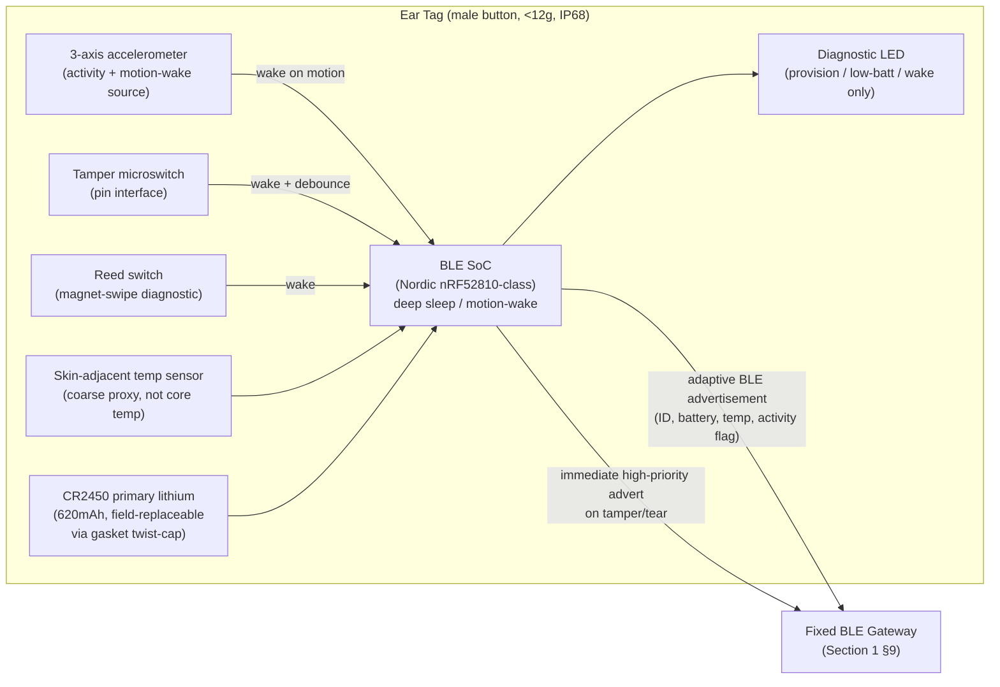

# Pandora IoT Platform — Section 2: Ear Tag Design

## 1. Executive Summary

The ear tag is a BLE peripheral (Section 1 §2.2) carried by a **Black Bengal goat**
— the dominant breed in Birbhum, small-framed (20–30 kg adult) with thin ear
cartilage. That single fact drives most of this section's decisions: weight and
attachment force matter more here than on a cattle tag, and West Bengal's climate
(45°C+ summer, monsoon downpours June–September, high dust in the dry season)
sets the environmental envelope. The design goal is a tag that survives 3+ years
outdoors on a live animal, is field-serviceable by farm staff with no special
tools beyond what livestock tagging already requires, and costs little enough
that losing or damaging one is a shrug, not an incident.

## 2. Engineering Decisions

### 2.1 Form factor — **standard two-piece "button" livestock ear tag, off-the-shelf shell**
- **Why**: the button-tag mechanism (male stud pierces the ear, locks into a
  female receiver) is the global livestock-tagging standard — vets and farm staff
  already know how to apply it, and standard applicator tools exist. Electronics
  live in the larger male button (outward-facing side); the female receiver stays
  a simple passive locking piece. Using an **existing, commercially available BLE
  ear-tag shell** (several Indian/Chinese contract manufacturers offer white-label
  shells sized for small ruminants) avoids custom injection-mold tooling cost
  (§12) at this farm's volume (order of 100 units for R1).
- **Rejected**: a bespoke enclosure shape. Custom tooling ($5k–30k+) is only
  justified at volumes this farm won't reach alone — revisit only as part of a
  genuine multi-farm manufacturing phase (Section 21), not for a 100-tag pilot.

### 2.2 Enclosure & environmental rating — **UV-stabilized polycarbonate, IP68, potted electronics**
- **Why**: IP68 (not just IP67) because Black Bengal goats in this region regularly
  wallow/lie in monsoon mud, not just brief rain exposure — the tag needs to
  tolerate sustained, not incidental, water contact. UV-stabilized resin (UV
  inhibitor in the masterbatch, not a coating) is non-negotiable for multi-year
  direct-sun exposure; an un-stabilized shell yellows and embrittles within a
  single West Bengal dry season. Electronics are fully potted (epoxy) except the
  battery compartment, which is the one serviceable opening (§2.5).
- **Operating temperature**: design target **−10°C to +65°C**, not the more common
  industrial −10°C to +60°C spec — a black or dark plastic tag in direct
  West Bengal summer sun can run well above the ~45°C ambient, and the margin costs
  nothing at the component level (automotive/industrial-grade parts already cover
  this) while avoiding a field failure mode that's hard to diagnose remotely.
- **Rejected**: a lower IP54/IP65 "splash resistant" spec sometimes used for
  indoor livestock tags — inappropriate for an animal that lives outdoors through
  monsoon.

### 2.3 Weight & dimensions — **target <12 g total, ≤32 mm diameter × ≤10 mm thick**
- **Why**: cattle EID tags commonly run 20–30 g; that's disproportionate on a
  30 kg goat's thin ear cartilage and risks tissue tearing, chronic irritation, or
  the animal catching the tag on fencing/browse. Goat/sheep-class commercial EID
  tags run 5–10 g — **<12 g including battery** keeps this tag in that proven
  range while leaving margin for the BLE SoC + accelerometer + tamper switch this
  design adds over a passive EID tag. This is the single biggest constraint on
  every other decision in this section (battery choice, sensor choice).
- **Rejected**: a larger housing to fit a bigger primary-lithium cell (ER14250,
  ~1200 mAh) for longer battery life — the weight/comfort cost isn't justified
  when the target animal is this small; battery life is instead solved by
  serviceability + adaptive firmware duty-cycling (§2.4, Section 20), not by
  brute-force cell capacity.

### 2.4 Battery — **CR2450 primary lithium coin cell (620 mAh), field-replaceable**
- **Why**: CR2450 is widely available, ~6 g, and its 620 mAh capacity is the best
  fit inside the <12 g weight budget. Combined with adaptive BLE duty-cycling
  (deep sleep + motion-wake, detailed in Section 20), realistic **typical life is
  2.5–3.5 years**, with worst-case West Bengal summer heat de-rating primary
  lithium capacity/self-discharge factored into that estimate (not the
  manufacturer's 25°C datasheet number). This meaningfully undershoots the
  brief's "ideal 5 years," and that gap is closed by making the battery
  **field-replaceable** (§2.5) rather than chasing a bigger cell at a weight cost
  the animal shouldn't carry.
- **Rejected**: rechargeable cells (no charging infrastructure exists at the farm
  and solar-on-a-goat's-ear is impractical — hair coverage and tag orientation
  defeat a panel small enough to fit). Rejected chasing 5-year life via a larger
  primary cell for the reason in §2.3. Both are logged as explicit future options
  (§16), not silently dropped.

### 2.5 Serviceability — **gasket-sealed twist-cap battery door + magnet-swipe diagnostic wake**
- **Why**: a torque-rated, gasket-sealed cap lets farm staff swap the battery in
  the field (re-sealing restores IP68) without special tools — aligned to the
  farm's existing annual health-protocol muster (`ProtocolDue` in the health
  module already brings staff into contact with every animal on a schedule; a
  battery check rides along on that existing workflow rather than requiring a new
  one). A **reed switch** triggered by swiping a small service magnet near the tag
  wakes the MCU, blinks the diagnostic LED, and fires an immediate BLE self-test
  packet — this lets staff confirm a tag is alive in the barn with no phone or
  laptop, which matters on a farm where connectivity is not guaranteed everywhere.
- **Rejected**: a fully sealed, non-serviceable tag (replace-the-whole-tag on
  battery death) — at $5–15/tag this isn't ruinous, but it wastes a working
  radio/sensor stack over a dead $0.50 battery, and conflicts with the brief's
  explicit "battery replaceable" requirement.

### 2.6 Tamper & loss detection — **mechanical pull-switch at the pin interface + software corroboration**
- **Why**: a microswitch integrated into the male-pin/female-receiver interface
  detects forcible removal or tear-through and fires an immediate high-priority
  BLE advertisement (picked up by the real-time MQTT alert path from Section 1
  §2.3/§9). Because ears get scratched on fencing and nipped by other goats,
  firmware debounces the switch (a confirmation window, not an instant hard
  alert — detailed in Section 20) to avoid false-positive tamper alerts. A
  **second, independent signal** — sustained accelerometer stillness combined
  with RSSI dropout from all gateways — corroborates possible tag loss even
  without a clean switch trigger (e.g., tag found on the ground, switch didn't
  fire cleanly). Both feed the same `IotAlert.alertType = 'tamper'` /
  `'no_comm'` rows from Section 1 §7.
- **Rejected**: switch-only detection with no software corroboration — a single
  hardware signal with no debounce or corroboration would either nuisance-alert
  constantly or miss clean losses; the two-signal approach is the standard
  pattern for wearable tamper detection.

### 2.7 LED indicator — **diagnostic-only, not continuous**
- **Why**: a single low-power LED fires only on (a) provisioning/pairing, (b)
  magnet-swipe diagnostic wake (§2.5), and (c) entering low-battery mode — never
  during normal operation. Continuous or periodic blinking during normal
  operation would burn a meaningful fraction of the power budget for a feature
  whose entire value is "confirm the tag is alive when someone's looking at it,"
  which the magnet-swipe already delivers on demand.

### 2.8 Identity broadcast — **static device ID, no rotating/obfuscated identifier**
- **Why**: BLE advertisements broadcast a static device identifier rather than a
  privacy-preserving rotating one. The threat this would defend against —
  someone with a BLE scanner learning "a goat wearing tag X is near location Y"
  — isn't a meaningful risk for livestock at this farm, and rotating identifiers
  cost real power (extra crypto/compute per advertisement) on a coin-cell budget
  that's already tight. Section 1 §10's gateway-side allowlist is what actually
  matters for security here: it stops an attacker from *injecting* fake data,
  which is the real risk. **Rejected** rotating IDs for R1 — revisit only if this
  becomes a customer-facing product where tracking privacy is a real concern for
  someone other than this farm (Section 16).

## 3. Alternative Options & Trade-offs

| Decision | Chosen | Alternative | Why not chosen |
|---|---|---|---|
| Enclosure | Off-the-shelf button-tag shell | Custom injection-molded shell | Tooling cost unjustified at ~100-unit R1 volume |
| IP rating | IP68 | IP67 | Monsoon wallowing is sustained water contact, not incidental splash |
| Battery | CR2450 (620 mAh), replaceable | Larger primary cell (ER14250, ~1200 mAh) | Weight budget for a 20–30 kg goat's ear takes priority over max battery life |
| Battery | CR2450, replaceable | Rechargeable + solar | No charging infra exists; solar-on-ear-tag impractical given hair coverage and orientation |
| Tamper detection | Mechanical switch + software corroboration | Switch only | Reduces false positives from fence-scratching/nipping without losing loss detection |
| BLE identity | Static ID | Rotating/obfuscated ID | Power cost isn't justified by this farm's actual threat model (§2.8) |

## 4. Architecture Diagram

## 5. Hardware Components (BOM)

| Component | Choice | Rationale |
|---|---|---|
| BLE SoC | Nordic nRF52810-class (or equivalent) | Commodity, well-documented, integrated radio+MCU, low BOM cost at moderate volume |
| Accelerometer | Low-power 3-axis (e.g. ADXL362-class) | Motion-wake source + raw input for activity/tamper corroboration (Section 8) |
| Temperature sensor | Integrated in SoC/accelerometer or discrete thermistor | Coarse skin-adjacent proxy only — **not** a substitute for core body temperature (veterinary caveat carried into Section 5) |
| Battery | CR2450 primary lithium, 620 mAh | §2.4 |
| Tamper switch | Mechanical microswitch at pin interface | §2.6 |
| Diagnostic trigger | Reed switch (magnet-swipe) | §2.5 |
| Indicator | Single low-power LED | §2.7 |
| PCB | 2-layer, minimized area | Cost control; fits off-the-shelf shell footprint |
| Enclosure | UV-stabilized polycarbonate, off-the-shelf button-tag shell | §2.1, §2.2 |
| Attachment | Standard male pin + female receiver, standard applicator tool | §2.1 |

## 6. Software Components

Ear-tag-specific firmware only (device registry/ingestion software already
specified in Section 1 §6); see Section 20 for the full power-management state
machine. At a high level, firmware maintains: BLE advertisement payload
construction (ID, battery %, temp, activity flag), the tamper-debounce timer,
the motion-wake → adaptive-interval logic, and the magnet-swipe diagnostic
handler.

## 7. Database Design

Extends `IotDevice` (Section 1 §7) — no new table needed. Tag-specific fields
already covered by that model: `deviceType = 'ear_tag'`, `animalId`,
`batteryPct`, `lastSeenAt`, `firmwareVersion`, `status`. `IotAlert.alertType`
gains concrete values `tamper` and `low_battery` sourced from this hardware
(§2.6, §2.4).

## 8. Firmware Design

Detailed state machine and power budget belong in Section 20 (Power Management)
to avoid duplicating that section's work. This section fixes the inputs that
state machine must handle: motion-wake (accelerometer interrupt), tamper-wake
(debounced switch), diagnostic-wake (reed switch), and periodic timer-wake for
routine sampling — four wake sources feeding one adaptive advertising scheduler.

## 9. Communication Flow

1. Normal operation: MCU deep-sleeps; accelerometer interrupt or periodic timer
   wakes it to sample temp/battery and send an adaptive-interval BLE advertisement.
2. Tamper event: microswitch fires → debounce window → confirmed tamper sends an
   immediate out-of-cycle high-priority advertisement, picked up by the nearest
   gateway and routed to the real-time MQTT alert path (Section 1 §9).
3. Diagnostic: magnet swipe → reed switch wakes MCU → LED blinks + immediate
   self-test advertisement, confirming liveness without any tooling.
4. All advertisements are received by fixed gateways per Section 1's flow — this
   section doesn't change anything downstream of the gateway.

## 10. Security Considerations

Static-ID broadcast trade-off already covered in §2.8. Additionally: firmware
update path (OTA over BLE from a gateway during a brief pairing window) and its
signing requirements are Section 19's responsibility — flagged here only as a
dependency, since the reed-switch diagnostic wake is also the natural trigger
point for entering an OTA-receptive window without burning battery listening
for it continuously.

## 11. Scalability Plan

The off-the-shelf-shell + semi-custom-PCB approach (§2.1) is deliberately the
lever that lets this scale later: going from a 100-unit pilot to a larger run
changes only sourcing volume and (eventually) justifies custom tooling — it
doesn't require a redesign of the electronics or firmware. Nothing in this
section assumes or requires this farm's specific herd size.

## 12. Cost Estimate

At the ~100-unit pilot volume, per-tag cost sits toward the upper half of
Section 1's $5–15 estimate (BLE SoC + accelerometer + tamper/reed switches +
CR2450 + off-the-shelf shell + assembly); this compresses toward the lower end
only at meaningfully larger order volumes. No recurring per-tag cost — battery
replacement (§2.5) is the only ongoing cost, on the order of the cost of a
coin cell every 2.5–3.5 years.

## 13. Risks

| Risk | Mitigation |
|---|---|
| Ear tissue tear/chronic irritation from tag weight | <12g target, informed by proven goat/sheep EID tag weight range (§2.3) |
| Battery life falls short of 3-year target in field heat | Life estimate already de-rated for West Bengal summer conditions, not datasheet 25°C numbers; field-replaceable battery closes any remaining gap (§2.4) |
| Water ingress after repeated battery-cap openings | Gasket replacement kit + torque spec + reseal check as a defined service step; IP68 re-validated after N open/close cycles in testing (§14) |
| Tamper switch false positives (fence scratching, nipping) | Firmware debounce/confirmation window before raising a hard alert (§2.6) |
| Skin-temp sensor over-read as clinical fever indicator | Explicitly documented as a coarse proxy, not core body temperature — Health Monitoring (Section 5) must not treat it as diagnostic-grade on its own |

## 14. Testing Strategy

- **Ingress**: submersion test to IP68 claim, repeated after N battery-cap
  open/close cycles to catch gasket degradation.
- **UV/thermal**: extended outdoor placement sample for UV embrittlement;
  thermal soak in direct sun to validate the +65°C operating margin (§2.2).
- **Mechanical**: drop/crush and fence-rub simulation to validate tamper-switch
  debounce tuning against real false-positive sources.
- **Battery**: bench current-draw profiling against the adaptive duty-cycle
  firmware model to validate the 2.5–3.5 year estimate before field commitment.
- **Field pilot**: 5–10 goats first, per Section 1 §14, before full rollout —
  this is where weight/comfort and real BLE range assumptions get validated
  against an actual live, moving, itchy goat rather than a bench model.

## 15. Future Improvements

- Rumen bolus as a **complementary** future device for true core-temperature
  sensing, if fever-detection accuracy becomes a veterinary priority the
  ear-tag's skin-proxy sensor can't meet (§13) — not a replacement for the ear
  tag, an addition.
- Custom injection-molded shell once volume justifies tooling cost (§2.1, §11).
- Larger-cell or solar-assisted variant for a possible future cattle product
  line, where the weight budget in §2.3 doesn't apply.
- Rotating/privacy-preserving BLE identifiers if a genuine multi-farm/
  customer-facing threat model emerges (§2.8).

## 16. Approval Gate

- [ ] Off-the-shelf button-tag shell (UV-stabilized polycarbonate, IP68,
      −10°C to +65°C) — no custom tooling for R1
- [ ] <12g total weight / ≤32mm×10mm target, sized for Black Bengal goats
- [ ] CR2450 field-replaceable primary lithium battery, 2.5–3.5 year realistic
      life target (not the aspirational 5-year number, closed by serviceability)
- [ ] Gasket twist-cap battery service + magnet-swipe diagnostic wake
- [ ] Mechanical tamper switch + software debounce/corroboration; diagnostic-only
      LED
- [ ] Static BLE identity broadcast for R1 (no rotating IDs)

**On approval → Section 3: Communication Technologies** — full comparison of
RFID/BLE/LoRa/UWB/NB-IoT/LTE-M/WiFi/Zigbee/Thread/Satellite/GPS/GNSS against
this farm's needs, elaborating the top-level call already fixed in Section 1 §2.2.
