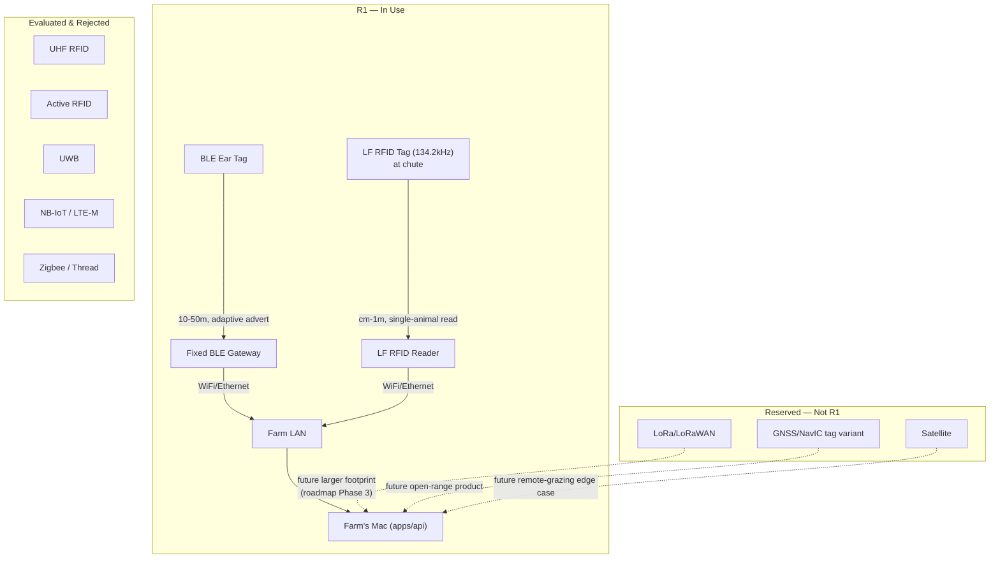

# Pandora IoT Platform — Section 3: Communication Technologies

## 1. Executive Summary

Section 1 §2.2 already fixed the top-level call — BLE ear tags, fixed BLE
gateways, passive RFID at chokepoints — ahead of this section, precisely so
later sections elaborate rather than re-litigate it. This section does that
elaboration: a full comparison of every communication technology named in the
brief against this farm's actual constraints (2.7 acres, <100 goats today,
on-prem backend, no recurring-cost tolerance), and closes two decisions
Section 1/2 left open — the specific RFID frequency band, and the gateway's
own backhaul link. Nothing here overturns the earlier decision; it's the
evidence for it.

## 2. Engineering Decisions

### 2.1 RFID frequency — **LF 134.2 kHz (ISO 11784/11785), not UHF**
- **Why**: at a treatment/weighing chute, animals pass one at a time in close
  proximity to each other and to the reader. LF's short range (cm to ~1 m) is a
  **feature** here, not a limitation — it reads exactly one animal and can't
  accidentally cross-read a neighboring goat still queued at the chute, which a
  multi-meter UHF read zone risks. LF/ISO 11784-11785 is also the internationally
  standardized livestock ID protocol and aligns with the LF RFID approach used in
  India's national livestock identification efforts (e.g. Pashu Aadhaar/INAPH) —
  worth keeping compatible with in case this farm ever participates in that
  ecosystem. It's also spectrum-clean: LF sits nowhere near the 865–867 MHz band
  India allocates (de-licensed, WPC-regulated) to both UHF RFID and LoRa/LoRaWAN,
  so choosing LF now avoids a future coexistence conflict if LoRaWAN is ever
  activated per the roadmap (§16).
- **Rejected**: UHF RFID — longer read range is actively unhelpful at a chute
  (ambiguous multi-tag reads), and it would share spectrum with a future
  LoRaWAN deployment for no benefit gained.

### 2.2 Gateway backhaul — **WiFi or Ethernet to the farm LAN, no cellular**
- **Why**: Section 1 §9 already established the entire pipeline terminates on
  the farm's own Mac with no WAN dependency for core function. Given that, the
  gateway's uplink only needs to reach the farm's existing local network — WiFi
  where an AP already covers the barn, Ethernet where a run is easy (e.g. a
  gateway mounted near existing farm infrastructure). Cellular backhaul (4G/5G
  modem in the gateway) would add a recurring SIM cost and a dependency on
  carrier coverage for a link that only needs to cross 2.7 acres to a Mac that's
  already running the ERP.
- **Rejected**: cellular gateway backhaul — solves a problem (offsite reachability)
  this architecture doesn't have, at a recurring cost this architecture doesn't
  need to carry.

### 2.3 Everything else stays rejected for R1, with reasons documented below (§3)
so the rationale survives independent of who remembers the original discussion —
Active RFID, UWB, NB-IoT, LTE-M, satellite, Zigbee, Thread, and GPS/GNSS on the
tag are all evaluated in the comparison and explicitly not part of R1, each for
a specific, farm-scale reason rather than a blanket "not needed."

## 3. Alternative Options & Trade-offs — Full Technology Comparison

### 3.1 Identity & short-range wearable/fixed radios

| Technology | Advantages | Disadvantages | Power | Range | Cost | Maintenance | Suitability here |
|---|---|---|---|---|---|---|---|
| **Passive RFID (LF, chosen)** | No battery; near-zero cost/tag; proven livestock ID standard | No telemetry, no location beyond "was read here" | None (tag) | cm–1m | Tag ~$0.5–2; reader ~$100–500 | Near zero | **Chosen** — chute/gate positive-ID confirmation |
| **Passive RFID (UHF)** | Longer range than LF, still no battery | Read-zone ambiguity at close quarters (§2.1); shares 865–867MHz with LoRa | None (tag) | 1–8m | Similar to LF, reader pricier | Low | Rejected (§2.1) |
| **Active RFID** | Longer range than passive, battery-powered so periodic broadcast possible | Battery maintenance burden; higher per-tag cost; largely superseded by BLE for this use case | Moderate | 30–100m | Tag $10–50+ | Battery swaps | Rejected — BLE gives equal/better capability with a far bigger, cheaper ecosystem |
| **BLE (chosen)** | Ultra-low power; huge commodity ecosystem; phone-compatible (matters for Section 17's scan feature); carries sensor payloads, unlike RFID | Needs fixed gateway infra for coverage; not wide-area | Very low | 10–50m typical (up to ~100–300m BLE5 Coded PHY, open field) | SoC ~$1–3 at volume | Low; gateway placement tuning | **Chosen** — primary tag radio (Section 1 §2.2, Section 2) |
| **Zigbee** | Mesh networking, low power | Smaller wearable ecosystem than BLE; **not natively readable by a farm manager's phone** (needs a dongle) | Low | 10–30m | Comparable to BLE | Low | Rejected — loses the phone-compatibility Section 17's "scan ear tag" feature depends on |
| **Thread** | IPv6 mesh, growing Matter ecosystem | Needs a border router; mesh benefit doesn't help a sparse handful of fixed nodes | Low | 10–30m | Comparable to BLE | Low | Rejected for R1 — revisit only if fixed environmental-node count grows enough to need mesh routing (§16) |
| **UWB** | Centimeter-level indoor positioning | Short range, higher power/cost than BLE, specialized chips | Moderate | 10–50m | Anchors/tags notably pricier than BLE | Moderate | Rejected — Section 6's need is zone/pen-level presence, not cm-precision asset tracking |

### 3.2 Wide-area / long-range

| Technology | Advantages | Disadvantages | Power | Range | Cost | Maintenance | Suitability here |
|---|---|---|---|---|---|---|---|
| **LoRa (point-to-point)** | Very long range, very low power, license-exempt-class ISM band, cheap module | Very low data rate; India's de-licensed 865–867MHz band carries duty-cycle limits unsuited to frequent per-tag telemetry | Low (but higher per-byte than BLE at short range) | 2–15km rural line-of-sight | Module $3–8; gateway $100–400 | Low | Not needed at 2.7 acres; reserved for a larger-footprint future (§16, matches brief's own roadmap Phase 3) |
| **LoRaWAN** | Standardized network layer over LoRa (join/security/ADR) | Adds a network-server component; still overkill for this footprint | Low | Same as LoRa | Similar + server infra | Moderate (network server upkeep) | Same as LoRa — deferred, not rejected outright |
| **NB-IoT** | Works anywhere with carrier coverage; no farm-built gateway needed | Recurring per-device SIM/data cost; rural India coverage inconsistent; higher module cost and per-transmission power than BLE | Low-moderate | km, via cell tower | Module $5–15 + **recurring SIM cost** | Carrier-dependent | Rejected for on-farm tags (Section 1 already ruled out per-tag cellular); would only matter if animals left the property (edge case, §16) |
| **LTE-M** | Similar to NB-IoT, slightly better throughput/latency | Same recurring-cost problem as NB-IoT | Low-moderate | km | Similar to NB-IoT | Carrier-dependent | Same rejection as NB-IoT |
| **4G / 5G** | High bandwidth | Massive power/cost overkill for a coin-cell tag; irrelevant to a pipeline with no WAN dependency (§2.2) | High | km | High relative to need | Carrier-dependent | Not part of the IoT data path at all — may already be the farm's general internet connection, but that's orthogonal to this design |
| **Satellite (e.g. Iridium/Swarm-class)** | Works with zero terrestrial infrastructure | Expensive per-message, low bandwidth, higher power | High | Global | High (per-device + per-message) | Low, but costly | Rejected — solves a "no connectivity anywhere" problem this farm doesn't have; theoretical future relevance only if animals were ever grazed on genuinely remote, connectivity-free land (§16) |

### 3.3 Positioning

| Technology | Advantages | Disadvantages | Power | Range | Cost | Maintenance | Suitability here |
|---|---|---|---|---|---|---|---|
| **GPS** | Absolute outdoor position, globally standardized, cheap module | High power draw for fix acquisition (tens of mA for seconds+); poor/no fix under cover or indoors (barn) | High (fix acquisition) | Global (outdoor) | Module $2–5, but power is the real cost | Low | Rejected for R1 tags — BLE zone-presence via multiple gateways already answers "which zone" at a fraction of the power cost, on a 2.7-acre property where GPS's advantage (open-range absolute position) doesn't apply |
| **GNSS (multi-constellation incl. India's NavIC)** | Better fix speed/accuracy than GPS-only; NavIC gives strong India-specific regional coverage | Same power/necessity issue as GPS; slightly pricier modules | High | Global (outdoor) | Slightly higher than GPS-only | Low | Same rejection as GPS for R1 — but the **preferred** choice over GPS-only if a future open-range GPS-tag variant is ever built (§16), given NavIC's regional coverage advantage |

## 4. Architecture Diagram

## 5. Hardware Components

- Ear tag BLE radio: covered in Section 2 (Nordic nRF52810-class SoC).
- Fixed BLE gateway radio: BLE 5 (Coded PHY capable for extended range) receiver
  module — full gateway hardware spec in Sections 11/12.
- Chute reader: LF 134.2 kHz ISO 11784/11785 reader module, short antenna coil
  sized for single-animal chute geometry.
- Gateway backhaul: onboard WiFi or a wired Ethernet port — no cellular modem.

## 6. Software Components

- BLE gateway-side scanning/aggregation software (detailed in Section 12).
- LF RFID reader driver posting identity-confirmed read events to the same
  ingestion endpoint as gateway telemetry (Section 1 §9 step 3).
- No new backend software beyond what Section 1 §6 already specified — this
  section is a radio-layer decision, not a new service boundary.

## 7. Database Design

No new tables. `IotDevice.deviceType` gains no new values beyond what Section 1
§7 defined (`ble_gateway`, `rfid_reader` already cover this section's hardware).
`SensorReading`/identity-read events carry `gatewayId?`/`readerId` as already
specified.

## 8. Firmware Design

Tag-side firmware already specified in Section 2 §8/§9. This section adds no
new firmware surface — LF RFID tags are passive (no firmware), and gateway
firmware is Section 12's responsibility.

## 9. Communication Flow

1. **Routine telemetry**: ear tag → BLE advert → nearest fixed gateway →
   batched REST to the farm LAN (Section 1 §9 step 2).
2. **Positive identity confirmation**: goat at chute → LF RFID tag read →
   reader posts a single, unambiguous identity event directly to the LAN
   (Section 1 §9 step 3) — this is the highest-confidence identity signal in
   the whole system, precisely because LF's short range prevents cross-reads.
3. **Gateway uplink**: WiFi/Ethernet only, terminating on the farm's own Mac —
   no hop leaves the property for R1.
4. Nothing in this section changes the transactional ingestion/alerting flow
   already specified in Section 1 §7/§9 — this section only fixes which radios
   carry data up to that point.

## 10. Security Considerations

- **LF RFID**: physically low-risk — read range is too short for remote
  interception to be practical; the reader itself should be physically secured
  at the chute (not left exposed/portable) so it can't be repositioned to
  behave like a longer-range collector.
- **BLE**: allowlist + static-ID trade-off already covered in Section 1 §10 and
  Section 2 §2.8 — not repeated here.
- **Gateway backhaul (WiFi)**: WPA2/WPA3 on the farm AP at minimum; an isolated
  IoT SSID/VLAN is the same future-hardening recommendation already flagged in
  Section 1 §10, not a hard R1 requirement given current farm network reality.
- **Spectrum compliance**: BLE and WiFi operate in globally license-exempt
  2.4 GHz ISM bands — no licensing action needed. If LoRa/LoRaWAN is ever
  activated (§16), it must operate within India's de-licensed 865–867 MHz band
  under WPC's applicable duty-cycle/power limits — a compliance item to revisit
  at that time, not now.

## 11. Scalability Plan

Coverage scales by adding fixed BLE gateways — linear, no protocol change,
consistent with Section 1 §11's "scale by replication, not by redesign"
principle. The LoRa/LoRaWAN option is the actual scale-out lever if this farm
(or a future federated farm, per Section 1 §11) ever needs to cover open range
well beyond what a handful of BLE gateways can reach — that's precisely why
it's *reserved*, not discarded.

## 12. Cost Estimate

- LF RFID: one reader at the chute, on the order of a few hundred dollars,
  one-time; tags effectively free per animal.
- BLE gateway backhaul: no additional cost beyond the gateway hardware itself
  (Section 11/12 BOM) — uses existing farm network.
- **Zero recurring connectivity cost for R1** — no SIM, no satellite airtime,
  no cellular data plan tied to any device in this architecture.

## 13. Risks

| Risk | Mitigation |
|---|---|
| Monsoon-season RF attenuation (heavy rain, wet foliage) affecting BLE range | Gateway placement validated in a wet-season field test, not just dry-season assumptions (§14) |
| RF interference in the 2.4GHz band (WiFi/BLE coexistence) | Standard channel planning during gateway/AP site survey (§14) |
| Future LoRaWAN activation colliding with UHF RFID if that choice were ever revisited | Avoided at the source by choosing LF over UHF now (§2.1) |
| Chute reader read failures from animal movement/positioning | Short LF range is tuned for a stationary chute moment (health/weight handling already pauses the animal) — validated in field pilot, not assumed |

## 14. Testing Strategy

- RF site survey across the 2.7-acre property in **both** dry and monsoon
  conditions before finalizing gateway placement — attenuation differs
  materially between seasons and a dry-season-only survey would understate risk.
- Chute reader reliability test against real animal handling flow (queue
  spacing, movement speed) before relying on it as the primary identity signal.
- Coexistence check between BLE/WiFi devices once gateway count is finalized.

## 15. Future Improvements

- LoRaWAN activation if farm footprint grows beyond BLE-gateway coverage
  economics, or for a future federated farm on more dispersed land (§11,
  matches the brief's own roadmap Phase 3).
- GNSS (NavIC-inclusive) tag variant for a future open-range product line,
  preferred over GPS-only for its India-specific coverage advantage (§3.3).
- Satellite connectivity only if a genuinely remote, connectivity-free grazing
  scenario ever materializes — not anticipated for this farm.

## 16. Approval Gate

- [ ] LF (134.2 kHz, ISO 11784/11785) RFID for chute identity, not UHF
- [ ] BLE remains the sole tag radio (reaffirming Section 1 §2.2 / Section 2)
- [ ] Gateway backhaul is WiFi/Ethernet to the farm LAN — no cellular modem,
      no recurring connectivity cost for R1
- [ ] LoRa/LoRaWAN, NB-IoT/LTE-M, satellite, UWB, Zigbee/Thread, and GPS/GNSS
      all explicitly deferred/rejected for R1, each for the farm-scale reason
      documented in §3, not a blanket exclusion

**On approval → Section 4: Sensors** — full sensor-by-sensor evaluation
(accelerometer, gyroscope, temperature, heart rate, SpO2, microphone, motion,
magnetometer, ambient temp/humidity, GPS, BLE beacon, RFID chip, battery
monitor, shock, light, pressure) against purpose, cost, battery impact,
accuracy, and use case for this ear tag.
