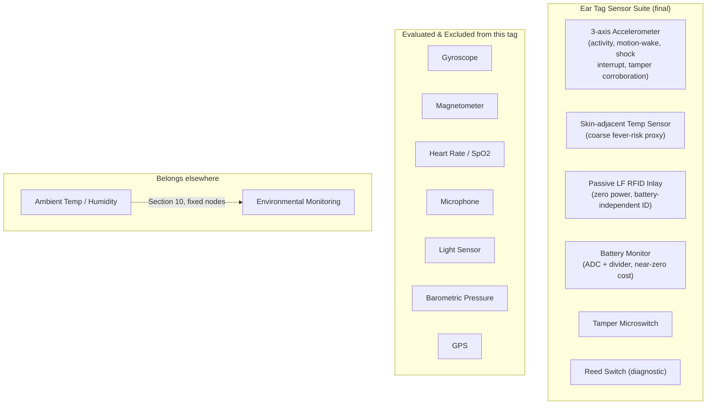

# Pandora IoT Platform — Section 4: Sensors

## 1. Executive Summary

Section 2 already committed the ear tag to an accelerometer, a skin-adjacent
temperature sensor, a tamper switch, and a reed switch, inside a <12 g/CR2450
power-and-weight budget. This section evaluates every sensor named in the brief
against that already-fixed budget, one by one, and holds every candidate to the
same bar: does it answer a need this platform actually has, at a marginal power/
cost/complexity price this specific tag can afford — not "would this be
interesting to have." Several cheap, popular wearable sensors (gyroscope,
magnetometer, light sensor) are excluded not because they're expensive, but
because their marginal value over what's already included is genuinely small
for this farm's use case, and every added sensor is one more firmware path, one
more calibration burden, and one more failure point. One refinement to Section
2 comes out of this review: a passive RFID inlay embedded in the tag itself.

## 2. Engineering Decisions

### 2.1 Inertial sensing stays accelerometer-only — no gyroscope, no magnetometer
- **Why**: published livestock-wearable research and commercial rumination/
  activity collars (the closest proven analogs to this product) classify
  walking/standing/lying/grazing/rumination states from accelerometer signal
  shape alone with good accuracy — a gyroscope's marginal precision gain for
  gait/orientation detail isn't what limits this platform's actual behavior
  classification (Section 8). A gyroscope draws meaningfully more continuous
  current than an interrupt-driven accelerometer, which is a real cost against
  the CR2450 budget Section 2 already fixed. A magnetometer adds cost/power for
  absolute heading that this platform has no specific use for (zone-level BLE
  presence, not heading, answers "where" — Section 6), and magnetic interference
  from farm metal structures (fencing, barn frame) would degrade its reliability
  anyway.
- **Rejected**: 6/9-axis IMU with gyro+mag. Revisit only if Section 5's lameness-
  detection work specifically demonstrates accelerometer-alone accuracy is
  insufficient — a decision made from evidence, not added speculatively now.

### 2.2 Refinement to Section 2 — **embed a passive LF RFID inlay inside the BLE tag enclosure**
- **Why**: reviewing "RFID Chip" as a sensor candidate surfaces something Section
  2 left implicit — should the chute's LF RFID reader (Section 3 §2.1) read a
  *separate* passive tag, or a chip built into the same BLE ear tag? Combining
  both radios in one enclosure is standard practice on commercial dual-technology
  livestock tags, and the case here is strong: a passive LF inlay is tiny
  (gram-fractions), draws **zero power from the tag's battery** (the reader
  supplies read energy inductively), costs under $1 at volume, and gives a
  **battery-independent identity fallback** — if the BLE battery dies in the
  field, the animal is still positively identifiable at the chute via passive
  RFID until the next service visit. This is a genuine capability gain at
  near-zero marginal cost/weight, so it's included despite this section's
  otherwise strict bar. It does not change Section 2's approved weight budget,
  form factor, or battery decision — it's an addition within the existing <12 g
  target, not a revision to it.
- **Rejected**: two separate physical tags (one BLE, one passive RFID) per
  animal — doubles application effort and doubles what can fall off/tear out,
  for no benefit over combining both radios in one enclosure.

### 2.3 No PPG-based sensors (heart rate, blood oxygen) on this tag
- **Why**: pulse oximetry and PPG heart-rate sensing both need stable, well-
  perfused, low-motion skin contact — the reason human SpO2 clips grip a
  fingertip or earlobe tightly and don't move. An ear tag mounted through
  cartilage on a freely grazing, moving goat with hair coverage cannot
  reliably provide that contact; livestock heart-rate monitoring products that
  exist commercially use girth bands or rumen boluses, not ear tags, for
  exactly this reason. Both sensor types are also comparatively power-hungry
  (LED-pulse-based sampling), which compounds a placement problem this tag
  can't solve into a battery problem it also can't afford.
- **Rejected** for this ear-tag product entirely, not just deferred — the
  placement mismatch is fundamental to where an ear tag sits, not something
  R2 firmware or a better chip fixes. A future *different* wearable form
  factor (girth band) could carry this if cardiac/pain monitoring becomes a
  clinical priority, but that would be a new hardware product, not this tag.

### 2.4 No microphone on this tag for R1
- **Why**: acoustic monitoring (distress vocalization, cough/respiratory sound,
  even chewing-sound rumination detection) is a legitimate research direction,
  but continuous or even lightly duty-cycled audio capture is one of the most
  power- and data-hungry sensor classes available, well outside the coin-cell
  budget without significant on-device signal processing this MCU class wasn't
  chosen to do (Section 2 §2.3's nRF52810-class SoC is sized for BLE + low-rate
  sensor sampling, not audio DSP). It also raises an avoidable consideration:
  an "always-on" microphone near farm workers, even one intended only for
  animal sounds, picks up incidental human conversation — worth avoiding when
  it isn't necessary. Accelerometer-based rumination/activity proxies already
  cover much of the same ground this section would otherwise reach for a mic to
  get.
- **Rejected** for R1. Logged as a genuinely interesting future research item
  specifically for cough/respiratory-distress detection (§16), not dismissed —
  but not justified against this tag's power budget today.

### 2.5 Shock detection is a firmware feature of the existing accelerometer, not a new part
- **Why**: the ADXL362-class accelerometer already selected in Section 2
  natively supports a programmable high-g/shock interrupt threshold in
  hardware, distinct from its activity/inactivity interrupt — a sudden impact
  (fall, collision, rough handling) is just a short-duration, high-magnitude
  acceleration spike the same sensor already captures. Adding a discrete
  "shock sensor" component would duplicate a capability already present.
- **Rejected**: a separate shock/impact sensor IC — zero marginal capability
  gain for a nonzero BOM/power cost.

### 2.6 Ambient temperature, humidity, and barometric pressure are not tag sensors at all
- **Why**: these measure the *environment*, not the animal, and a body-worn tag
  is a poor place to measure environment — its own temperature reading is
  dominated by body heat and direct sun exposure on the tag surface, not a
  clean ambient value. Barometric pressure specifically has no meaningful use
  case on this farm's flat, ~2.7-acre property (no elevation variation worth
  measuring), and weather data is explicitly scoped in the brief as sourced
  from an external weather API and/or a small number of fixed farm stations
  (Section 10) — not duplicated on every animal. These three are addressed
  entirely in Section 10 (Environmental Monitoring), not this tag.

### 2.7 "Motion Sensor" and "BLE Beacon" are not separate line items
- **Why**: the brief lists these as distinct sensor candidates, but on a
  body-worn device, "motion sensing" *is* the accelerometer's job (a PIR-style
  presence-motion sensor is a fixed-installation technology relative to a
  static viewpoint — it doesn't apply to something moving with the body it's
  measuring; that use case belongs to Section 10/11's fixed nodes, not this
  tag). "BLE Beacon" describes the tag's core radio function already fixed in
  Sections 1–3, not an additional sensor to evaluate. Both are folded into
  already-approved components rather than treated as new BOM lines.

### 2.8 Light sensor: excluded, held to the same bar as gyroscope/magnetometer
- **Why**: near-zero cost/power isn't sufficient justification on its own — the
  question is whether it answers a real, currently-unmet need. Coarse indoor/
  outdoor (barn vs. pasture) context is already reasonably answered by BLE
  zone presence across multiple gateways (Section 6). A light sensor would be
  a marginal corroborating signal for an edge case (ambiguous zone attribution
  at a barn/pasture boundary), not a core requirement.
- **Rejected** for R1. Concrete reconsideration bar: if Section 6's field pilot
  shows BLE zone attribution is meaningfully ambiguous at the barn/pasture
  fringe, a light sensor becomes a cheap corrective option — but it's added
  from evidence of a real gap, not preemptively.

## 3. Sensor-by-Sensor Evaluation

| Sensor | Purpose | Cost | Battery Impact | Accuracy | Use Cases | Include? |
|---|---|---|---|---|---|---|
| **Accelerometer** | Activity/motion classification, motion-wake, tamper corroboration | Low ($0.5–2) | Very low (interrupt-driven, µA sleep) | Good for coarse activity states (walk/stand/lie/graze); moderate for rumination proxy at ear placement | Activity (§8), lameness/illness (§5), heat/restlessness (§7), tamper (Section 2 §2.6) | **Yes** — already in Section 2 |
| **Gyroscope** | Fine-grained gait/orientation detail | Low-moderate ($1–3) | Meaningfully higher than accel (continuous sampling, mA-class) | Marginal accuracy gain over accel-alone for this behavior set | Would refine gait analysis if accel-alone proves insufficient | **No** (§2.1) |
| **Temperature Sensor (skin-adjacent)** | Fever/heat-stress screening proxy | Very low (often integrated) | Negligible | Coarse — lags and diverges from core body temp; never a solo diagnostic signal | Health screening trend signal (§5), always combined with other indicators | **Yes** — already in Section 2, caveat reaffirmed |
| **Heart Rate (PPG)** | Cardiac/stress/pain indicator | Moderate ($2–5) | High (LED-pulse sampling) | Low confidence at ear placement with motion (§2.3) | Would be valuable if placement/power allowed | **No** (§2.3) |
| **Blood Oxygen (SpO2)** | Respiratory/circulatory distress indicator | Moderate-high | High (multi-wavelength LED) | Lower confidence than HR at this placement — harder problem, same constraint | Would be valuable if placement/power allowed | **No** (§2.3) |
| **Microphone** | Distress vocalization, cough/respiratory sound, chewing-sound rumination | Low ($0.3–1) part cost, high processing cost | High (audio sampling/DSP) | Promising in research, unproven at this power budget | Distress/illness acoustic screening (future) | **No** for R1 (§2.4) — future research item |
| **"Motion Sensor" (PIR-class)** | Presence/motion relative to fixed point | N/A | N/A | N/A | Fixed-installation use case, not wearable | **N/A** — not applicable to a worn device (§2.7); accelerometer already covers wearable motion |
| **Magnetometer** | Heading/orientation | Low ($0.5–1.5) | Moderate | Degraded by farm metal-structure interference | Marginal — no specific unmet need identified | **No** (§2.1) |
| **Ambient Temperature** | Environmental context | — | — | — | Fixed-node use case | **No** — deferred to Section 10 (§2.6) |
| **Humidity** | Environmental context | — | — | — | Fixed-node use case | **No** — deferred to Section 10 (§2.6) |
| **GPS** | Absolute outdoor position | Low module, high power | Very high (fix acquisition) | N/A at this scale | Rejected in Section 3 §3.3 | **No** — see Section 3 |
| **BLE Beacon** | Core telemetry radio | — | — | — | The tag's transmission mechanism, not a sensor | **N/A** — already the tag's core function (§2.7) |
| **RFID Chip (passive LF inlay)** | Battery-independent identity fallback | Very low (<$1) | **Zero** (passive, reader-powered) | Proven, standard | Chute identity confirmation even with a dead BLE battery | **Yes** — new recommendation (§2.2) |
| **Battery Monitor** | Remaining-capacity/low-battery signal | Near-zero (ADC + divider) | Negligible | Coarse for primary lithium (flat discharge curve until near end-of-life) — treat as "healthy/low" not a precise gauge | Low-battery alert (`IotAlert.low_battery`), service scheduling | **Yes** — already implicit, formalized here |
| **Shock Sensor** | Sudden-impact detection | — | — | — | Covered by accelerometer's built-in high-g interrupt | **N/A** — folded into accelerometer (§2.5) |
| **Light Sensor** | Indoor/outdoor context | Very low ($0.2–0.5) | Very low | Coarse corroborating signal | Zone-attribution edge cases at barn/pasture fringe | **No** for R1 — reconsider only from field evidence (§2.8) |
| **Pressure Sensor (barometric)** | Weather/altitude correlation | Low | Low | N/A — no relevant use at this flat, small geography | None identified for this farm | **No** (§2.6) |

## 4. Architecture Diagram

## 5. Hardware Components

Adds one line to Section 2's BOM: a passive LF (134.2 kHz, ISO 11784/11785)
RFID inlay, integrated into the same potted enclosure, sharing the antenna
routing already required for the BLE radio's PCB real estate. No other BOM
change from Section 2.

## 6. Software Components

Firmware gains: a high-g interrupt handler on the existing accelerometer
(shock, §2.5), and a coarse battery-percentage state machine (healthy → low →
critical) rather than a precise fuel-gauge calculation, reflecting §3's
accuracy note. The RFID inlay is passive and needs no tag-side firmware at all.

## 7. Database Design

No new tables. `SensorReading.readingType` enum (Section 1 §7) should include
`accelerometer_activity`, `skin_temp`, `battery_pct`, and `shock_event` as its
concrete values from this tag — finalized here rather than left abstract.

## 8. Firmware Design

Detailed state machine remains Section 20's responsibility. This section's
contribution is the finalized sensor input list that state machine must
service: accelerometer (activity + motion-wake + shock interrupt), skin temp
(periodic low-rate sample), battery ADC (periodic low-rate sample), tamper
switch (debounced interrupt), reed switch (diagnostic interrupt). The RFID
inlay requires no firmware involvement.

## 9. Communication Flow

No change to Section 1/3's flow. The RFID inlay's read event travels the exact
same chute-reader path already specified (Section 3 §9 step 2) — from the
reader's perspective, reading the inlay inside a BLE tag is identical to
reading a standalone passive tag.

## 10. Security Considerations

Passive RFID inlay carries the same low-risk profile already assessed in
Section 3 §10 (short read range, reader physically secured at the chute) — no
new consideration introduced by embedding it in the BLE tag rather than a
separate physical tag.

## 11. Scalability Plan

Nothing in this sensor set assumes or is constrained by herd size — the same
finalized sensor suite applies whether this farm has 50 goats or the federated
model (Section 1 §11) scales to many farms.

## 12. Cost Estimate

Net effect of this section on Section 2's per-tag cost estimate: **+<$1** for
the passive RFID inlay, no other change — the excluded sensors (gyro, HR,
SpO2, mic, magnetometer, light, barometric) simply don't appear in the BOM,
keeping the tag inside Section 2 §12's original $5–15 range rather than
pushing it toward the high end.

## 13. Risks

| Risk | Mitigation |
|---|---|
| Skin temp sensor over-interpreted as clinical-grade fever detection | Explicit design-level caveat carried through to Section 5 — never a solo diagnostic signal |
| Rumination proxy accuracy from ear-mounted accelerometer lower than purpose-built halter/collar systems | Documented honestly as a proxy in Section 8/5, not oversold; revisit only with field evidence |
| Passive RFID inlay antenna interfering with BLE antenna in a small shared enclosure | Antenna placement/isolation validated in Section 2's field pilot testing (Section 2 §14), not assumed to just work |
| Coarse battery gauge (healthy/low/critical) gives less warning lead time than a precise percentage would | Low-battery threshold set conservatively, tied to the farm's existing protocol-due service cadence (Section 2 §2.5) so a coarse signal is still actionable in time |

## 14. Testing Strategy

- Validate the accelerometer's high-g shock interrupt threshold against real
  handling/headbutting/fence-rub scenarios (extends Section 2 §14's mechanical
  testing, not a separate test track).
- Validate passive RFID inlay read reliability once co-located with the BLE
  antenna in the same enclosure — antenna interaction is a real risk (§13) that
  only a built prototype can confirm.
- Field-validate the rumination/activity classification accuracy from
  accelerometer-alone data during the same 5–10 goat pilot already planned
  (Section 1 §14) — this is the evidence gate for reconsidering gyroscope
  (§2.1) or light sensor (§2.8) inclusion later, not a decision made in advance.

## 15. Future Improvements

- Gyroscope, reconsidered only if accelerometer-alone lameness/gait accuracy
  proves insufficient in practice (§2.1).
- Light sensor, reconsidered only if BLE zone attribution proves ambiguous at
  the barn/pasture fringe (§2.8).
- Acoustic (microphone-based) cough/respiratory-distress detection as a
  distinct future research track, likely requiring a different power/
  processing budget than this tag carries (§2.4).
- A separate girth-band wearable product, not this ear tag, if cardiac/pain
  monitoring via PPG ever becomes a clinical priority (§2.3).

## 16. Approval Gate

- [ ] Final tag sensor suite: 3-axis accelerometer, skin-adjacent temperature,
      passive LF RFID inlay (new), battery monitor (ADC), tamper microswitch,
      reed switch — no gyroscope, magnetometer, PPG (HR/SpO2), microphone,
      light, or barometric pressure sensors
- [ ] Embedding a passive LF RFID inlay inside the BLE tag enclosure (refines
      Section 2, does not revise its weight/battery/form-factor decisions)
- [ ] Shock detection via the accelerometer's existing high-g interrupt, no
      discrete shock sensor part
- [ ] Ambient temperature/humidity/barometric pressure fully deferred to
      Section 10 (fixed environmental nodes), not measured per-animal

**On approval → Section 5: Health Monitoring** — algorithms for detecting
reduced activity, lameness, illness, fever, stress, heat, rumination pattern,
abnormal behaviour, isolation, weight loss, reduced feed intake, and mortality
risk from this finalized sensor set, with confidence scoring.
