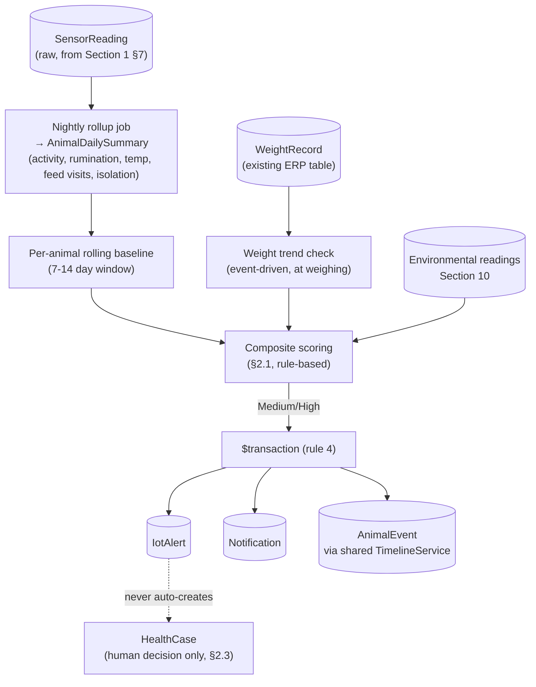

# Pandora IoT Platform — Section 5: Health Monitoring

## 1. Executive Summary

This section designs the detection logic for the twelve conditions in the
brief, working entirely from the sensor set Section 4 actually approved
(accelerometer, skin-adjacent temperature, passive RFID identity, battery,
BLE zone presence) plus what the existing ERP already tracks (`WeightRecord`,
`CaseVital`, `HealthProtocol`). With <100 goats and no labeled illness dataset
yet, R1 uses **transparent, explainable rule-based composite scoring**, not a
trained ML model — every score a vet or manager sees is traceable to the
specific signals that produced it, and the transition to trained models
(Section 15) is deferred until real, field-confirmed outcomes exist to train
against. One clarification up front: **"Heat Detection" in this section means
heat *stress*** (thermal/environmental), distinct from reproductive **heat
cycle** (estrus), which is Section 7's subject — the brief lists both under
different headings and this document keeps that distinction explicit
throughout.

## 2. Engineering Decisions

### 2.1 Rule-based, explainable composite scoring for R1 — not a trained model
- **Why**: a supervised ML model needs labeled outcomes (confirmed illness
  cases matched to sensor history) to be trustworthy, and this farm has zero
  IoT-era labeled data on day one. A transparent weighted/threshold composite
  — where every elevated score is traceable to "activity down 40% vs.
  baseline, rumination down 25%, 2 fewer feed visits today" — is something a
  vet can evaluate and trust immediately, and it *becomes* the labeled
  training set once field-confirmed outcomes accumulate (Section 15).
- **Rejected**: training a model now on synthetic/borrowed data — would produce
  a black box no one on this farm could sanity-check, and CLAUDE.md's override
  discipline (soft signals require human judgment before consequential action)
  fits an explainable score far better than an opaque one.

### 2.2 Personalized per-animal baselines, not population-wide fixed thresholds
- **Why**: individual goats vary meaningfully in normal activity/rumination
  level (age, breed cross, pregnancy stage, temperament). A rolling 7–14 day
  per-animal baseline (mean + spread) is what "abnormal for *this* goat" is
  measured against — a fixed herd-wide threshold would either miss quiet
  animals whose illness looks like "normal for a busy goat" or false-alarm on
  naturally calm ones.
- **Cold-start handling**: an animal with less than ~7 days of history gets
  detection **suppressed, not defaulted to a guess** — newly tagged or newly
  born animals accumulate baseline before any score is trusted. This is a
  direct, deliberate trade against day-one coverage in favor of not crying
  wolf on animals the system doesn't understand yet.

### 2.3 Every composite score is a *nudge to check*, never an automatic clinical record
- **Why**: CLAUDE.md's override discipline (soft rule → warning + human
  confirmation; hard rule → no override path) maps cleanly here. An elevated
  illness/fever/lameness score writes an `IotAlert` + `Notification` +
  `AnimalEvent` (Section 1 §2.6/§7) — it **never** auto-creates a `HealthCase`.
  Opening a `HealthCase`, logging a real `CaseVital` temperature, or recording
  a mortality/exit remains a human (or vet) action every time. This is the
  clearest hard boundary in the whole design: sensors recommend, they don't
  diagnose or record.

### 2.4 Fever detection is ambient-corrected, not a raw threshold
- **Why**: West Bengal summer ambient can exceed 45°C. A naive "skin temp above
  X" threshold would false-alarm on every hot afternoon. The fever signal is
  computed as **animal skin-temp minus a same-time environmental/cohort
  baseline** (from Section 10's fixed environmental sensors where available,
  or the same-zone herd median otherwise) — isolating an animal-intrinsic rise
  from a shared hot day. Even corrected, this stays a screening signal: it
  recommends staff take a real temperature and log it in the existing
  `CaseVital` workflow, never replaces that reading (Section 2 §2.2/§4 §2.3
  caveat carried through).

### 2.5 Mortality detection is deliberately sensitivity-biased, unlike the others
- **Why**: every other detector in this section is tuned to avoid false-alarm
  fatigue (a manager who gets paged for nothing repeatedly starts ignoring
  alerts). Mortality/severe-emergency detection inverts that trade — the cost
  of a missed real event is categorically worse than the cost of walking out
  to check a goat that's just deeply asleep or has a glitched tag. Composite
  signal: **prolonged zero-activity + prolonged no-BLE-contact from any
  gateway + (if available) skin-temp converging toward ambient over time**
  fires an immediate `critical`-severity alert regardless of the confidence
  tiering the rest of this section uses (§4).
- **Rejected**: applying the same confidence-gated suppression used elsewhere
  to mortality alerts — appropriate for illness/lameness, wrong for "possibly
  dead or in acute distress."

### 2.6 Weight loss is measured, not inferred — reuses `WeightRecord`, doesn't invent a sensor proxy
- **Why**: the ear tag has no scale. Rather than build a speculative
  accelerometer-based body-condition estimator (real research exists on this,
  but it's a lower-confidence proxy for a measurement the farm can already get
  directly), weight loss detection runs entirely on the existing
  `WeightRecord` history from chute weighings — a **real measurement**, not an
  inference. The one genuine IoT contribution here: the passive RFID inlay
  (Section 4 §2.2) read at the same chute event lets a weighing auto-associate
  to the correct animal, removing manual tag-number entry error, rather than
  estimating weight from motion data.

### 2.7 Reduced feed intake is visit-pattern, not consumption-weight — an explicit accuracy limit
- **Why**: without individual RFID-gated feeders (expensive, built for
  confinement dairy, not pasture-based goats), the only available signal is
  **feed/water-zone visit frequency and duration** from Section 9's BLE
  presence detection near troughs — a proxy for intake, not a measurement of
  it. An animal near the trough isn't necessarily eating. This is stated
  plainly so the score's actual meaning isn't oversold to a vet reading it.

## 3. Detection Logic — the Twelve Conditions

| Condition | Primary Signals | Approach | Confidence Basis | Feeds Into |
|---|---|---|---|---|
| **Reduced Activity** | Accelerometer activity index (Section 4) | Current window vs. personal rolling baseline, sustained ≥4h drop | Deviation magnitude + baseline sufficiency (§2.2) | Contributes to Illness composite; standalone `warning`-tier if isolated and sustained |
| **Lameness** | Accelerometer gait-irregularity proxy, reduced walking time | Multi-day walking-time trend + head-motion asymmetry proxy | **Lower confidence** — ear-mounted accel is a real placement limitation vs. leg/collar sensors (Section 4 §2.1); explicitly a "flag for visual gait check," not a diagnosis | `warning` alert, human visual confirmation expected |
| **Illness (general)** | Composite: activity, rumination, temp anomaly, feed visits, isolation | Weighted rule-based score across available signals (§2.1) | Rises with number of agreeing signals, not any single one | Primary composite score shown to manager/vet with contributing-factor breakdown |
| **High Fever** | Skin-temp anomaly, ambient-corrected (§2.4) | Sustained deviation above cohort/environmental baseline | Moderate — proxy sensor, always paired with a request to take a real reading | `warning` alert → recommend `CaseVital` entry |
| **Stress** | Restlessness (frequent stand-lie cycling), reduced feeding, isolation | Composite of behavioral indicators only — **no physiological stress signal exists** (HR/cortisol excluded in Section 4 §2.3) | Moderate, multi-signal | Contributes to Illness composite |
| **Heat Stress** | Environmental THI (Section 10) + individual behavioral response (activity drop, increased water visits) | Herd-level THI risk (high confidence, weather-driven) cross-referenced against per-animal outlier response | High for herd-level risk; moderate for flagging individually vulnerable animals | Herd-wide advisory + individual outlier alerts for young/old/pregnant/sick animals showing outsized response |
| **Rumination Pattern** | Accelerometer rumination-bout proxy (Section 4) | Daily rumination minutes/bout count vs. personal baseline | Moderate, **explicitly pending field-pilot validation** given ear-placement limitation (Section 4 §16 evidence gate) | Strong early-illness contributor if pilot confirms accuracy; one of the pilot's primary validation targets |
| **Abnormal Behaviour** | All available features, combined | Multivariate deviation from personal/cohort baseline (statistical outlier, not ML) — catches patterns the named detectors don't have a label for | Scales with how many features deviate together | Catch-all `warning`, detailed model evolution is Section 15 |
| **Isolation** | BLE zone/gateway co-location vs. herd cohort | Fraction of time in a different zone than the herd majority, sustained beyond baseline | Moderate-high — directly measured behavior, but zone-level (coarse), not precise inter-animal distance (Section 3/6 zone-level design) | Strong early-illness contributor (self-isolation is a classic sickness behavior) |
| **Weight Loss** | Existing `WeightRecord` history | Trend/threshold on real chute-scale measurements, auto-associated via RFID (§2.6) | **High** — measured, not inferred | Direct signal, independent cadence (event-driven at weighing, not continuous) |
| **Reduced Feed Intake** | Feed/water-zone visit frequency & duration (Section 9) | Visit pattern vs. personal baseline | Moderate — proxy for intake, not a measurement (§2.7) | Contributes to Illness composite |
| **Mortality** | Zero activity + no BLE contact + temp-ambient convergence | Sensitivity-biased composite, bypasses normal confidence gating (§2.5) | Deliberately biased toward alerting, not precision | Immediate `critical` alert, urgent human verification required — never auto-recorded |

## 4. Confidence Scoring Framework

A shared framework applies across all twelve detectors, not a bespoke scheme
per condition:

1. **Signal directness** — a real measurement (weight) outranks a proxy
   (skin temp for fever, visit-time for intake).
2. **Corroboration count** — a single deviating signal is weak; multiple
   independently-deviating signals agreeing (e.g., activity down *and*
   rumination down *and* isolation flagged) raise confidence multiplicatively,
   not additively — this is the core mechanism turning several individually
   weak proxies into a trustworthy composite.
3. **Baseline sufficiency** — suppressed entirely below the cold-start
   threshold (§2.2), regardless of how extreme a raw reading looks.
4. **Deviation magnitude and duration** — brief blips (a nap, a startled
   sprint) are filtered by requiring sustained deviation over a minimum
   window per detector, not instantaneous threshold-crossing.

Scores render as three tiers — **Low** (logged, feeds trend history, no
alert), **Medium** (`warning` `Notification` + `AnimalEvent`, recommend a
check), **High** (`warning`/`critical` per §2.5's mortality exception,
recommend urgent action) — always shown with the specific contributing
factors (§2.1), never a bare number.

## 5. Architecture Diagram

## 6. Hardware Components

None new — this section is entirely backend logic over Section 4's already-
approved sensor set and the existing ERP's `WeightRecord`/`CaseVital` data.

## 7. Software Components

- A `health-signals` module (inside `src/modules/iot/`, per Section 1 §2.1)
  running the nightly rollup and composite scoring — **not** on the gateway or
  tag, since baseline computation needs multi-day history that only the
  backend's Postgres holds (the gateway is a relay, not a stateful compute
  node, consistent with Section 1's edge-computing boundary).
- Reuses the shared `TimelineService` (Section 1 §2.6) for `AnimalEvent`
  writes, and the existing `Notification` pipeline for alerts.

## 8. Database Design

New table: **`AnimalDailySummary`** — one row per animal per day:
`animalId`, `date`, `activityIndex`, `ruminationMinutes`, `feedVisitCount`,
`feedVisitMinutes`, `isolationScore`, `avgSkinTemp`, `tempAnomaly`,
`illnessRiskScore`, `contributingFactors Json`. This is a deliberate rollup
rather than recomputing from raw `SensorReading` on every score check — it
also directly serves Section 8's "generate daily activity scores" requirement,
so this table is shared infrastructure between the two sections, not
Section-5-specific. `WeightRecord` and `CaseVital` are read, not modified, by
this section — consistent with §2.6's "measure, don't infer" principle.

## 9. Firmware Design

None — no tag/gateway firmware change from this section.

## 10. Communication Flow

1. Raw `SensorReading` rows accumulate through the day via Section 1's normal
   ingestion path.
2. A nightly scheduled job (existing pg-boss pattern referenced in this repo's
   architecture — see Phase-2 §3.8) rolls raw readings into
   `AnimalDailySummary` and recomputes each animal's rolling baseline.
3. Composite scores are evaluated against baselines; Medium/High results
   commit `IotAlert` + `Notification` + `AnimalEvent` in one `$transaction`
   (rule 4), exactly like every other mutation in this system.
4. Mortality-tier detection (§2.5) is **not** limited to the nightly batch —
   it evaluates in near-real-time off the same no-BLE-contact/zero-activity
   signals the real-time alert path (Section 1 §2.3) already carries, since
   waiting for a nightly job on a possible-death signal defeats the purpose.

## 11. Security Considerations

Health-derived data is accessed under the existing `health` and `iot`
permission modules (RBAC, rule 3) — no new external exposure; this is
entirely internal computation over data already flowing through the approved
ingestion pipeline.

## 12. Scalability Plan

Nightly rollup cost scales linearly with animal count and is trivial at this
farm's scale (a few hundred animals × a handful of summary fields/day). At the
federated multi-farm model (Section 1 §11), each farm computes its own
baselines independently — no cross-farm computation, consistent with the
"replicate, don't centralize" scaling principle already established.

## 13. Cost Estimate

No hardware cost. Compute cost is a nightly batch job plus incremental
real-time mortality-signal evaluation — negligible against this Mac's existing
headroom (Phase-2 §8's documented RAM budget already has room for the API
process this logic runs inside).

## 14. Risks

| Risk | Mitigation |
|---|---|
| Lameness/rumination detection accuracy limited by ear-tag placement | Explicitly lower-confidence tier (§3); field pilot is the evidence gate for a future collar/leg sensor (Section 4 §16) |
| Alert fatigue from over-sensitive Medium-tier thresholds | Composite/multi-signal requirement (§4) and personal-baseline cold-start suppression (§2.2) both exist specifically to keep false-positive rate manageable |
| Fever proxy misread as diagnostic-grade | Ambient correction (§2.4) plus explicit "go take a real reading" framing rather than a bare fever claim |
| Mortality false positives from dead battery vs. actual death | Framed as "urgent verification required," not "animal is dead" — sensitivity-biased by design, cost of the trip is deliberately accepted (§2.5) |
| Composite score becomes a black box as it grows more sophisticated | Contributing-factor breakdown stays a hard requirement even as Section 15 introduces trained models later — explainability isn't traded away for accuracy |

## 15. Testing Strategy

- The 5–10 goat field pilot (Section 1 §14) is this section's primary
  validation instrument: rumination-proxy accuracy and lameness-proxy
  usefulness specifically need field evidence before their confidence tiers
  are trusted further (§2.1, §16).
- Any historical `HealthCase` records already in the ERP (pre-dating IoT) can
  be used as a rough sanity check by backtesting whether the composite scoring
  logic *would have* flagged those known-sick animals, given whatever
  retrospective activity/weight data exists — a cheap, real signal before
  live field data accumulates.
- Backend: unit tests for the scoring rules (DB-free, pure logic, per this
  repo's `test/unit` convention) and e2e tests for the rollup job + alert
  transaction (real Postgres, per `test/e2e` convention) — shipped with the
  business rules in the same commit, per CLAUDE.md's test expectations.

## 16. Future Improvements

- Transition specific detectors to trained models once field-confirmed
  outcomes accumulate (Section 15) — rumination and lameness are the first
  candidates, since they're where the rule-based proxy is weakest today.
- A collar/leg-mounted lameness sensor as a complementary future device,
  contingent on field evidence that ear-mounted accuracy is insufficient
  (Section 4 §16).
- RFID-gated individual feeders for true per-animal intake measurement, if
  ever justified by farm scale/economics (§2.7) — not anticipated soon.

## 17. Approval Gate

- [ ] Rule-based, explainable composite scoring for R1 — ML deferred to
      Section 15 until real labeled outcomes exist
- [ ] Personalized per-animal baselines with cold-start suppression, not
      population-wide fixed thresholds
- [ ] Hard boundary: IoT signals only ever create `IotAlert`/`Notification`/
      `AnimalEvent` — never an automatic `HealthCase` or mortality record
- [ ] Fever detection is ambient-corrected against Section 10 environmental
      data, always paired with a request for a real `CaseVital` reading
- [ ] Mortality detection is deliberately sensitivity-biased and evaluated
      near-real-time, bypassing the confidence gating used elsewhere
- [ ] New `AnimalDailySummary` rollup table, shared with Section 8's daily
      activity score requirement
- [ ] Weight loss uses existing `WeightRecord` (measured), not an
      accelerometer-based estimate; feed intake uses visit-pattern proxy with
      its accuracy limit stated plainly

**On approval → Section 6: Location Tracking** — GPS/BLE/LoRa/RFID gate
positioning methods, geofencing, pen/pasture/indoor/outdoor tracking, movement
history, and escape detection.
