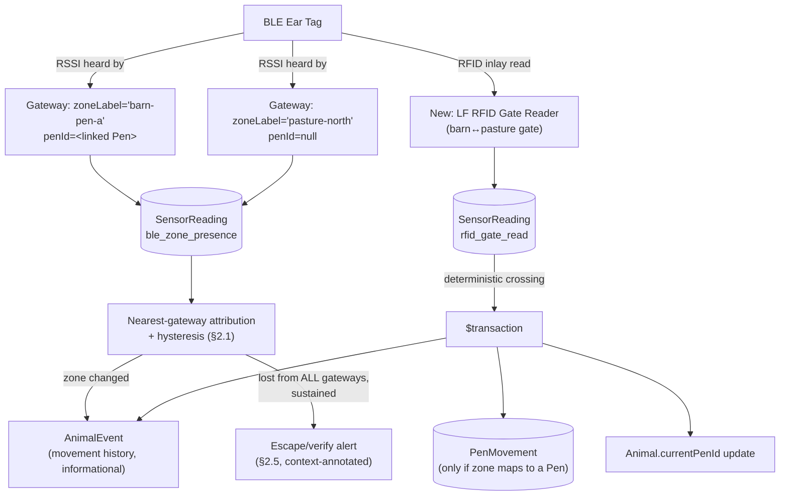

# Pandora IoT Platform — Section 6: Location Tracking

## 1. Executive Summary

Positioning here means **zone-level presence**, not coordinates — Section 1
§2.2 already ruled out GPS for R1 (power cost, unnecessary precision at 2.7
acres) and Section 3 fixed BLE gateways + LF RFID as the physical mechanism.
This section designs what that actually produces: which zone an animal is in,
when it moved, and whether it's gone missing — using the fixed BLE gateway
network for continuous coarse tracking and a **second RFID reader at the
primary barn↔pasture gate** (new in this section) for high-confidence,
moment-of-crossing transition events. A key finding from checking the existing
schema: `Pen`/`PenMovement` are **shed-based indoor concepts only** — pasture
isn't represented as a Pen at all today. That shapes this section's design
directly: BLE-derived location is a new, lighter-weight "zone" concept that
*can* map onto an existing Pen when relevant, but doesn't force pasture
tracking into a data model built for indoor pens.

## 2. Engineering Decisions

### 2.1 Zone-level nearest-gateway attribution, not trilateration
- **Why**: with a handful of fixed BLE gateways covering 2.7 acres, true
  multilateration (combining RSSI from 3+ gateways to estimate a coordinate)
  is exactly the kind of precision Section 3 §3.1 already rejected UWB for —
  BLE RSSI-to-distance is notoriously noisy even before animal-body
  attenuation is added, and this farm's actual needs (which pen, which
  pasture, near the herd or isolated, near the boundary or not) are all
  answered by "which gateway hears this tag strongest," not a coordinate. A
  hysteresis window (require the new gateway to out-hear the current one by a
  margin, sustained over a short period) prevents zone-flapping for a tag
  sitting near two gateways' overlapping range.
- **Rejected**: coordinate-based trilateration — more engineering complexity
  for precision this farm's use cases (pen detection, isolation, escape) don't
  need.

### 2.2 A lightweight "zone" concept lives on the gateway device record, not a new master-data table
- **Why**: each fixed BLE gateway (an `IotDevice` with `deviceType =
  'ble_gateway'`, Section 1 §7) gets two new fields: `zoneLabel` (e.g.
  `"barn-pen-a"`, `"pasture-north"`) and an optional `penId` link **only** when
  that zone corresponds to a real `Pen`. This avoids inventing a full `Zone`
  master-data table for what is, at this farm's scale, a handful of fixed
  physical locations already defined by where a gateway is mounted — adding a
  whole new entity type would be ceremony CLAUDE.md's lean-codebase rule
  doesn't support at this size.
- **Rejected**: a dedicated `Zone` table with its own CRUD, geometry, etc. —
  revisit only if a future federated farm (Section 1 §11) has pasture
  geography complex enough that gateway-record fields stop being enough.

### 2.3 Two confidence tiers for location data — BLE is informational, RFID gate reads are authoritative
- **Why**: this mirrors the confidence-tiering principle Section 5 already
  established for health signals. A BLE zone change is a **proxy** (RSSI
  noise, attenuation) and only ever writes a lightweight zone-transition
  `AnimalEvent` for movement history (§6) — it never touches `Animal.
  currentPenId` or writes a `PenMovement` row. A **new LF RFID reader at the
  primary barn↔pasture gate** (distinct from the treatment-chute reader,
  Section 3 §2.1) gives a deterministic, single-animal, moment-of-crossing
  read — the same class of authoritative signal as the chute reader's weight
  auto-association (Section 5 §2.6) — and **is** trusted to auto-write a
  `PenMovement` row and update `Animal.currentPenId` when the crossing maps to
  a real Pen, exactly like a staff member logging the move today, just
  automatic.
- **Rejected**: auto-writing `PenMovement` from BLE zone attribution alone —
  `PenMovement.reason` already defaults to `"routine"` for staff-entered
  moves; silently overwriting that record from a noisy RF proxy risks
  corrupting an operational record staff rely on for pen-based feed/group
  management, which is a meaningfully different risk than a mis-attributed
  informational timeline entry.

### 2.4 "Geofencing" is a coverage-boundary proxy, not polygon math — stated honestly
- **Why**: without GPS coordinates, there's no polygon to test a point
  against. What the fixed-gateway network *can* do, if gateways are placed to
  cover the property including near the fence line (a requirement this
  section adds to Section 3 §14's already-planned RF site survey): treat
  **total loss of signal from every known gateway**, especially when the
  animal's last-known zone was a boundary-adjacent one, as the practical
  escape signal. This is a real, working proxy for this farm's scale — but
  it's not the polygon-crossing geofence the term usually implies, and this
  document says so rather than overselling it.

### 2.5 Escape detection does not try to distinguish itself from mortality/device-fault — it just alerts, with context
- **Why**: "signal lost from all gateways" has three possible causes — escape,
  the animal is down/deceased (Section 5 §2.5), or the tag/battery failed.
  Precisely disambiguating these from the remaining signal is a nice-to-have
  refinement, not a blocker: **the human action is the same in all three
  cases — go check.** So this section doesn't build a classifier to guess
  which one happened; it raises one urgent "verify animal" alert, and uses
  last-known-zone and pre-loss activity pattern only to **prioritize/annotate**
  the alert message (e.g. "last seen near pasture boundary" vs. "last seen in
  barn with no prior activity drop"), not to gate whether it fires.

## 3. Positioning Methods — Coverage of the Brief's List

| Method | Status here | Notes |
|---|---|---|
| **GPS** | Rejected for R1 tags | Section 1 §2.2 / Section 3 §3.3 — zone-level BLE answers this farm's need at a fraction of the power cost; reserved for a future open-range product |
| **BLE Gateway** | **Primary mechanism** | §2.1 — nearest-gateway zone attribution with hysteresis |
| **LoRa Gateway** | Reserved, not used | Section 3 §3.2 — this farm's 2.7 acres is fully covered by BLE gateway zones; LoRa becomes relevant only at a footprint BLE can't economically cover |
| **RFID Gate Readers** | **New in this section** | Second LF reader at the primary barn↔pasture gate, authoritative crossing events (§2.3) — in addition to the treatment-chute reader (Section 3 §2.1) |
| **Geofencing** | Coverage-boundary proxy | §2.4 — not polygon math, stated honestly |
| **Pen Detection** | Via RFID gate reads → `PenMovement` | §2.3 — reuses existing shed-based Pen model, doesn't reinvent it |
| **Pasture Tracking** | Via BLE zone attribution | Pasture zones are gateway-record labels (§2.2), not Pens — the schema check confirmed Pens are shed-scoped |
| **Indoor Tracking** | Via BLE zone attribution + RFID gate reads | Same mechanism as pasture, plus the authoritative gate-read tier when crossing into/out of a shed |
| **Outdoor Tracking** | Via BLE zone attribution | Same mechanism, pasture-zone-labeled gateways |
| **Movement History** | Zone-transition `AnimalEvent`s | §5 — queryable per-animal timeline, informational tier only unless corroborated by an RFID gate read |
| **Escape Detection** | Total signal loss + last-zone context | §2.4, §2.5 |

## 4. Architecture Diagram

## 5. Hardware Components

Adds one item to the farm infrastructure BOM beyond Section 3's chute reader:
a **second LF RFID reader at the primary barn↔pasture gate** (§2.3), same
technology/spec as the chute reader. No change to the ear tag itself — this
section's location-tracking capability rides entirely on the passive RFID
inlay already added in Section 4 §2.2 and the BLE radio already in the tag.

## 6. Software Components

- Zone attribution logic (nearest-gateway + hysteresis) — runs backend-side
  (`src/modules/iot/`, Section 1 §2.1), same architectural placement as
  Section 5's health-signal scoring, for the same reason: it needs the
  current/recent state across gateways, which only the backend holds.
- Gate-read handler that, on an authoritative RFID gate read, resolves the
  crossing to a `PenMovement` (when applicable) inside the same `$transaction`
  pattern used everywhere else in this system (rule 4).

## 7. Database Design

- **`IotDevice`** (Section 1 §7) gains `zoneLabel: String?` and `penId:
  String? (FK → Pen)` for `deviceType = 'ble_gateway'` rows (§2.2) — no new
  table.
- **`SensorReading.readingType`** enum (incrementally finalized across
  sections, per Section 4 §7/Section 5 §8) gains `ble_zone_presence` and
  `rfid_gate_read`.
- **No new table for movement history** — zone-transition events reuse
  `AnimalEvent` via the shared `TimelineService` (Section 1 §2.6), with a new
  `eventType` (`iot_zone_change`).
- **`PenMovement`/`Animal.currentPenId`** — reused exactly as they exist
  today; an RFID-gate-triggered write looks identical to a staff-entered move,
  just with `createdBy` reflecting the automated actor and `reason` set to
  something like `"iot_gate_read"` rather than the default `"routine"`, so the
  provenance is visible in the existing audit trail without changing the
  table's shape.

## 8. Firmware Design

None — no tag/gateway firmware change beyond what Sections 2/3/12 already
specify. The gate reader is the same hardware class as the chute reader
(Section 3 §5).

## 9. Communication Flow

1. Continuous: tags advertise, gateways report heard RSSI as
   `ble_zone_presence` readings via the normal batched ingestion path
   (Section 1 §9).
2. Backend attributes each animal's current zone from the freshest readings
   across gateways, with hysteresis; a changed attribution writes an
   informational `AnimalEvent` (§2.3).
3. Event-driven: an animal crosses the barn↔pasture gate, the RFID inlay is
   read, and — because this signal is authoritative — the backend resolves and
   commits `PenMovement` + `Animal.currentPenId` + `AnimalEvent` in one
   `$transaction`, the same pattern as every other mutation in this system.
4. If an animal's zone attribution goes stale (no reading from any gateway
   beyond a threshold), the escape/verify alert path fires (§2.5), sharing
   infrastructure with — but logically distinct from — Section 5's mortality
   detection, since both start from "no signal" but mean different things to
   staff.

## 10. Security Considerations

No new considerations beyond what Section 3 §10 already covers for BLE and
RFID — the gate reader carries the same physical-security recommendation
(fixed, not portable) as the chute reader.

## 11. Scalability Plan

Adding pasture/pen coverage is adding gateways with a `zoneLabel`, not a
schema or protocol change — consistent with Section 1 §11's "scale by
replication" principle. A future federated farm with more sheds/pastures
simply registers more zone-labeled gateways; nothing here assumes a specific
zone count.

## 12. Cost Estimate

One additional LF RFID reader (a few hundred dollars, one-time, same class as
Section 3 §12's chute reader estimate) — no other new cost. Zone attribution
and gate-read handling are backend logic, not new hardware.

## 13. Risks

| Risk | Mitigation |
|---|---|
| BLE zone-flapping at gateway coverage boundaries | Hysteresis window before attributing a zone change (§2.1) |
| RFID gate reader missed reads during fast/crowded gate crossings | Field-validated during the pilot (§14); a missed read simply means the zone-transition falls back to the informational BLE tier rather than corrupting `PenMovement` — no silent wrong-data risk |
| Escape/mortality/device-fault ambiguity causing wasted verification trips | Accepted by design (§2.5) — same trade-off Section 5 §2.5 already made, cost of checking is deliberately favored over cost of missing a real escape |
| Gateway coverage gaps near the property boundary undermining the escape proxy | Explicit boundary-coverage requirement added to Section 3 §14's RF site survey (§2.4), not assumed |

## 14. Testing Strategy

- Extends Section 3 §14's RF site survey with an explicit boundary-coverage
  check — verify gateway placement actually loses signal at the property edge
  in a way that's usable as the escape proxy, in both dry and monsoon
  conditions.
- Field-validate the new gate reader's single-crossing read reliability
  against real animal movement speed/spacing at that specific gate, same
  method as Section 3 §14's chute validation.
- Validate hysteresis tuning against real zone-boundary dwelling behavior
  (goats grazing near a zone edge) during the 5–10 goat pilot (Section 1 §14).

## 15. Future Improvements

- Multiple pasture sub-zones if this farm's land use gets more subdivided —
  no design change needed, just more zone-labeled gateways (§11).
- Reconsider coordinate-based positioning only if a future federated farm
  (Section 1 §11) has pasture geography large/complex enough that zone-level
  attribution stops being sufficient — evidence-gated, same discipline as
  Section 4 §16's sensor-reconsideration bars.
- GNSS-based open-range tracking as a distinct future product line (Section 3
  §3.3, Section 4 §15) for a very different deployment context than this farm.

## 16. Approval Gate

- [ ] Zone-level nearest-gateway BLE attribution with hysteresis — no
      trilateration/coordinates for R1
- [ ] `zoneLabel`/`penId` fields on `IotDevice` gateway rows — no new `Zone`
      master-data table
- [ ] New LF RFID reader at the primary barn↔pasture gate, authoritative for
      `PenMovement`/`currentPenId` writes; BLE zone data stays informational
      (`AnimalEvent` only, never touches the formal Pen record)
- [ ] "Geofencing"/escape detection is a coverage-boundary + total-signal-loss
      proxy, explicitly not polygon geofencing — documented as such, not
      oversold
- [ ] Escape detection does not attempt to disambiguate escape vs. mortality
      vs. device fault — one alert, context-annotated, matching Section 5
      §2.5's sensitivity-biased philosophy

**On approval → Section 7: Fertility Tracking** — heat cycle detection,
mounting behaviour, restlessness, pregnancy indicators, expected/actual
kidding detection, postpartum recovery, and AI-based breeding recommendations,
building on the existing `HeatRecord`/`Pregnancy`/`Kidding` tables and this
section's activity/behavioral signal pipeline.
