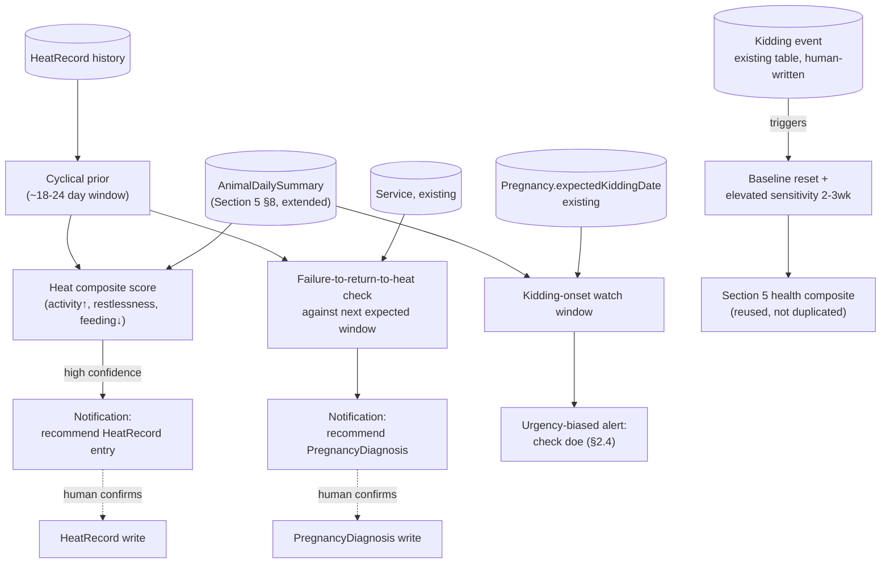

# Pandora IoT Platform — Section 7: Fertility Tracking

## 1. Executive Summary

This is the third section applying the override-discipline pattern first
established in Section 5 §2.3 (sensors nudge, humans record) — and checking
the existing schema shows the breeding module already lives by it:
`Service.overrideReason`/`inbreedingFlag` prove this farm's ERP already treats
breeding decisions as human calls that soft signals can warn about, never
auto-execute. Every fertility detector in this section follows that precedent
exactly: heat detection recommends a `HeatRecord` entry, pregnancy indicators
recommend scheduling a `PregnancyDiagnosis`, kidding-onset detection raises
staff awareness — none of them write to `HeatRecord`, `Pregnancy`, or
`Kidding` automatically. This section also reuses more existing infrastructure
than any prior one: `AnimalDailySummary` (Section 5 §8) supplies most of the
raw signal, and the doe's own `HeatRecord` history becomes a Bayesian-style
prior that makes heat detection more accurate the longer the system runs.

## 2. Engineering Decisions

### 2.1 Heat detection is a *pattern*, not a threshold — activity increase + restlessness + ~18–24 day cyclicity
- **Why**: Section 5's illness detection looks for *decreased* activity from
  baseline; heat is the opposite signature — an activity and restlessness
  *increase*, typically lasting 24–36 hours, recurring roughly every 18–24
  days in a cycling doe. That recurrence is the key disambiguator: a
  same-shape activity spike that lands inside the doe's own historical
  inter-heat interval (computed from her `HeatRecord` history) is far more
  likely to be heat than an isolated spike with no such pattern. This turns
  existing manually-logged heat history into a genuine accuracy improvement
  for the sensor-driven detector — the more heats a doe has had recorded, the
  tighter her expected next-window prior gets, and the fewer false positives
  the detector produces outside it.
- **Rejected**: a fixed-threshold activity-spike detector with no cyclical
  prior — would flag any elevated-activity day (a startled sprint, a hot
  afternoon change in behavior) as candidate heat with no way to
  weight likelihood by timing.

### 2.2 Mounting-behavior detection is an explicit, lower-confidence, cross-animal signal
- **Why**: mounting/standing-to-be-mounted is detectable, in principle, as
  sustained close BLE proximity between two tagged does correlated with a
  brief high-magnitude accelerometer burst on both — this is the first
  detector in this document series that correlates *two* animals' sensor
  streams rather than one. It's flagged as genuinely lower confidence than
  the rest: BLE proximity alone can't distinguish mounting from two goats
  simply standing close together, and even with accelerometer corroboration
  this is a proxy pattern, not a certain identification. It contributes to
  the heat composite score (§3) as one input among several, never a
  standalone trigger.
- No new table for this — a candidate mounting observation is logged as an
  `AnimalEvent` (via the shared `TimelineService`) with the other animal's ID
  in `summaryParams`, not a bespoke cross-animal schema (§7).

### 2.3 "Failure to return to heat" is the primary non-invasive pregnancy indicator
- **Why**: after a `Service` record exists, the doe's own cyclical heat
  baseline (§2.1) predicts her next expected heat window. If that window
  passes with no heat detected, that's a well-established, low-tech livestock
  pregnancy indicator — and it's built entirely from infrastructure this
  section already has (the heat-cycle prior), not a new sensor capability.
  This recommendation prompts staff to schedule an actual
  `PregnancyDiagnosis` at the appropriate time rather than guessing when to
  check — it doesn't replace diagnosis, it times it.
- Later-stage indicators reuse existing measured data rather than inventing
  new proxies: gradual weight gain from `WeightRecord` (Section 5 §2.6's
  "measure, don't infer" principle applies here too) and a documented,
  genuine late-gestation activity decline as a secondary corroborating signal.

### 2.4 Kidding-onset detection: two confidence tiers, and a welfare-driven urgency bias
- **Why**: pre-kidding restlessness, nesting/isolation-seeking behavior in the
  hours before labor is a well-documented pattern and reuses Section 6's
  isolation signal plus Section 5's restlessness signal at **moderate-to-high
  confidence** — these are already-validated signals viewed through a
  pregnancy-stage context. The specific *parturition* accelerometer signature
  (labor/pushing producing a motion pattern distinct from walking, grazing,
  or resting) is stated as an explicit **hypothesis pending field
  validation** — the same intellectual honesty Section 5 §2.1 applied to
  rumination detection, not claimed as reliable before evidence exists. Given
  a difficult kidding (dystocia) is a genuine veterinary emergency, and most
  goats kid fine unattended, the value here isn't diagnosing labor — it's
  making sure staff *know* it's happening near the expected date, the same
  urgency-biased philosophy Section 5 §2.5 applied to mortality (favor a
  possibly-unnecessary check over a missed emergency).
- Successful kidding detection triggers a task reminder to tag/register the
  new kid promptly (existing `KidRecord` workflow) — a genuine operational
  assist, not a new record type.

### 2.5 Postpartum recovery reuses Section 5's health-monitoring composite wholesale, with two adjustments
- **Why**: building a separate postpartum-monitoring subsystem would
  duplicate infrastructure that already exists and already works. Two
  changes are enough: (a) the `Kidding` event triggers a **fresh baseline
  window** for that doe (her pre-pregnancy baseline no longer describes
  normal postpartum behavior — same cold-start discipline as Section 5 §2.2,
  just re-triggered rather than first-time), and (b) alert **sensitivity is
  temporarily elevated** for roughly the first 2–3 weeks postpartum, since
  metritis/mastitis/retained-placenta risk is genuinely concentrated in that
  window and Section 5's fever detection in particular deserves heightened
  priority there. Reduced feeding right after kidding is watched carefully
  but not immediately alarmed on — it can be normal early adjustment or a
  real complication signal, which is exactly why the composite (not a single
  signal) still governs the decision.
- **Rejected**: a parallel postpartum-specific scoring engine — Section 5's
  existing composite plus a baseline reset and a sensitivity dial covers this
  correctly without new machinery.

### 2.6 Breeding recommendations: transparent, rule-based, over existing data — not a new ML model
- **Why**: same philosophy as Section 5 §2.1 — no trained recommendation
  model on day one with no outcome data to train on. What R1 can do
  immediately, entirely from existing ERP data: (a) flag the optimal service
  timing window once heat onset is detected (goat AI/natural service is
  typically recommended roughly 12–24 hours after standing-heat onset — a
  practical, well-established guideline, surfaced as a recommendation, not
  auto-scheduled), and (b) rank eligible buck candidates for a doe in heat
  using data that already exists — lineage (`damId`/`sireId`, feeding the
  same inbreeding check `Service.inbreedingFlag` already performs) and past
  reproductive performance trends from `KidRecord` history (litter size,
  kidding interval). This *complements* the existing inbreeding-flag logic
  rather than duplicating it — R1 surfaces a ranked candidate list; it
  doesn't replace the override-guarded check already in place.
- **Rejected**: a trained breeding-optimization model now — deferred to
  Section 15, once real service-outcome data (successful pregnancies matched
  to timing/pairing decisions) accumulates to train against.

## 3. Detection Logic Summary

| Condition | Primary Signals | Confidence | Writes To (only on human confirmation) |
|---|---|---|---|
| Heat Cycle | Activity increase + restlessness (from `AnimalDailySummary`) + cyclical prior from `HeatRecord` history | Rises with cycle-history depth (§2.1) | `HeatRecord` (pre-filled `signs`/`detectedOn` from sensor pattern) |
| Mounting Behaviour | Cross-animal BLE proximity + correlated accelerometer burst | Lower — proxy, cross-animal (§2.2) | Contributes to heat composite only; logged as `AnimalEvent` |
| Restlessness | Reuses Section 5 stress signal, reinterpreted in cycle-timing context | Moderate | Contributes to heat composite |
| Reduced Feeding | Reuses Section 5 §2.7 visit-pattern proxy | Moderate (same limitation as Section 5) | Contributes to heat and postpartum composites |
| Pregnancy Indicators | Failure to return to heat (primary) + weight gain trend + late-gestation activity decline | Moderate-high for "failure to return to heat" | Recommends scheduling `PregnancyDiagnosis` |
| Expected Kidding | `Pregnancy.expectedKiddingDate` (existing, date-driven) | High — reuses an existing computed field | No write — informs alert timing for onset detection |
| Kidding Detection | Restlessness/isolation-seeking (moderate-high) + parturition accelerometer signature (hypothesis, §2.4) | Split — behavioral tier trusted, motion-signature tier pending field validation | Recommends staff check + prompts `KidRecord` tagging workflow; never auto-writes `Kidding` |
| Postpartum Recovery | Section 5 composite, fresh baseline, elevated sensitivity 2–3 weeks (§2.5) | Same tiering as Section 5 | Same alert pipeline as Section 5 |

## 4. Architecture Diagram

## 5. Hardware Components

None new — entirely backend logic over Section 4's sensor set and the
existing breeding-module tables.

## 6. Software Components

Extends the `health-signals` module (Section 5 §7) with a `fertility-signals`
sub-area in the same `src/modules/iot/` boundary — reuses the same nightly
rollup + real-time evaluation split, not a separate service.

## 7. Database Design

- **`AnimalDailySummary`** (Section 5 §8) gains `restlessnessIndex` — a field
  general enough to serve both Section 5's stress detection and this
  section's heat detection, rather than duplicating the underlying computation
  under two different names.
- **No new tables.** Mounting-behavior candidates are logged as
  `AnimalEvent`s via the shared `TimelineService` with the correlated
  animal's ID in `summaryParams` (§2.2) — consistent with this document
  series' standing principle of not building bespoke schema for low-volume,
  low-confidence signals.
- All authoritative writes (`HeatRecord`, `Service`, `PregnancyDiagnosis`,
  `Pregnancy`, `Kidding`, `KidRecord`) are **read-only inputs** to this
  section's logic and are only ever written by the existing manual flows,
  now optionally pre-filled from a sensor-recommended notification (§2.1) —
  no schema change to any of them.

## 8. Firmware Design

None — no tag/gateway change from this section.

## 9. Communication Flow

1. Nightly rollup (Section 5 §10) computes `restlessnessIndex` alongside the
   existing summary fields.
2. Heat composite scoring runs against each cycling doe's own `HeatRecord`-
   derived expected window; a high-confidence hit produces a `Notification` +
   `AnimalEvent`, pre-filled `HeatRecord` draft data included in the
   notification payload for one-tap confirmation.
3. Pregnancy/kidding-onset checks run on the same nightly cadence, except
   kidding-onset watch, which — like Section 5's mortality detection — runs
   near-real-time once a doe enters her expected-kidding window, since
   waiting for a nightly batch defeats the purpose of an urgency-biased
   welfare alert (§2.4).
4. `Kidding` write (human-entered, existing flow) triggers the baseline-reset
   signal into the health-signals module (§2.5) — an existing-table write
   causing a new computation to re-key itself, not a new mutation path.

## 10. Security Considerations

No new considerations — accessed under the existing `breeding`/`iot`
permission modules (RBAC, rule 3), same access boundary as the tables it
reads and recommends into.

## 11. Scalability Plan

Per-doe cyclical priors and composite scores scale linearly with breeding-age
doe count, trivial at this farm's scale, and computed independently per
animal — no cross-animal computation beyond the explicitly-scoped mounting-
proximity check (§2.2), which is itself bounded to nearby tags, not
herd-wide. Consistent with the federated, replicate-not-centralize scaling
principle (Section 1 §11).

## 12. Cost Estimate

No new hardware. Compute cost is additional nightly-rollup fields plus
event-driven checks — negligible against existing headroom (Section 5 §13).

## 13. Risks

| Risk | Mitigation |
|---|---|
| Heat detection false positives before enough cycle history exists for a tight prior | Confidence explicitly rises with history depth (§2.1) — new/young does get wider, lower-confidence windows, not false certainty |
| Mounting-behavior cross-animal signal misread as confirmed heat | Deliberately kept as one composite input, never a standalone trigger (§2.2) |
| Parturition accelerometer signature unproven | Explicitly labeled hypothesis pending field validation (§2.4) — not relied on alone; behavioral pre-kidding signals carry the primary confidence |
| Postpartum reduced feeding misclassified as normal adjustment when it's actually a complication | Composite scoring (not single-signal) plus temporarily elevated sensitivity governs this, consistent with Section 5's general false-negative-averse design for genuinely risky windows |
| Breeding recommendation ranking treated as authoritative pairing advice | Presented as a ranked candidate list for a human decision, explicitly not auto-executed — same override discipline as the rest of this section |

## 14. Testing Strategy

- The field pilot's does are the direct evidence source for validating the
  heat-cycle activity/restlessness pattern against real, staff-observed heat
  signs — this is where the cyclical prior actually gets calibrated against
  ground truth for the first time.
- Any kiddings occurring during or shortly after the pilot window are the
  validation opportunity for the parturition accelerometer hypothesis (§2.4)
  — explicitly not claimed reliable until this evidence exists.
- Backend: unit tests for the cyclical-prior computation and composite scoring
  (DB-free, pure logic), e2e tests for the notification-to-confirmed-record
  flow (real Postgres), per this repo's existing test conventions.

## 15. Future Improvements

- Trained breeding-recommendation model once real outcome data accumulates
  (§2.6, Section 15).
- Higher-confidence mounting-behavior detection if a future sensor addition
  (e.g., closer-range proximity sensing) becomes justified by field evidence
  — not pursued speculatively now (§2.2).
- Confirmed parturition accelerometer signature could, if field-validated,
  become a standalone high-confidence kidding-onset trigger rather than a
  secondary hypothesis-tier signal (§2.4).

## 16. Approval Gate

- [ ] Heat detection as an activity-increase + restlessness pattern with a
      cyclical prior from `HeatRecord` history — not a fixed threshold
- [ ] Mounting-behavior detection is an explicit lower-confidence,
      cross-animal composite input, never a standalone trigger
- [ ] "Failure to return to heat" as the primary non-invasive pregnancy
      indicator, timing (not replacing) `PregnancyDiagnosis`
- [ ] Kidding-onset detection: behavioral tier trusted, parturition
      accelerometer signature explicitly hypothesis-stage pending field
      validation; urgency-biased alerting matching Section 5 §2.5's philosophy
- [ ] Postpartum recovery reuses Section 5's composite with a baseline reset
      and temporary elevated sensitivity — no parallel subsystem
- [ ] Breeding recommendations are transparent/rule-based over existing data
      (timing guidance + candidate ranking complementing the existing
      `inbreedingFlag` check) — no trained model until Section 15
- [ ] No new tables — `AnimalDailySummary` gains `restlessnessIndex`;
      `HeatRecord`/`Pregnancy`/`Kidding`/`KidRecord` remain human-written,
      only ever pre-filled/recommended into

**On approval → Section 8: Activity Monitoring** — walking, running, sleeping,
standing, eating, drinking, rumination, jumping, social interaction, and
restlessness classification, generating the daily activity scores this
section and Section 5 already depend on.
