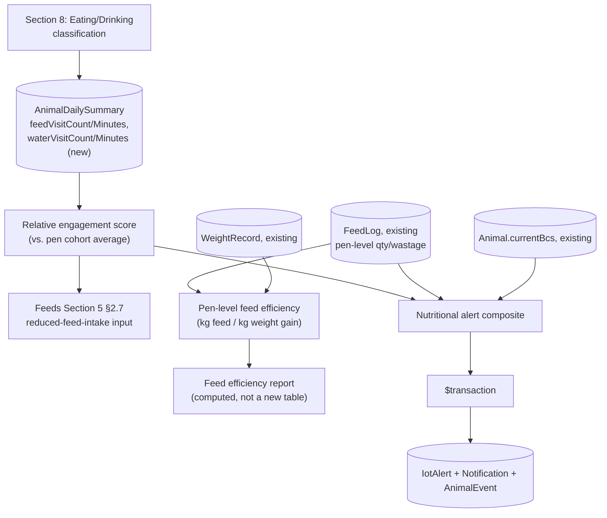

# Pandora IoT Platform — Section 9: Feed Management

## 1. Executive Summary

Checking the existing schema before designing this section changed its shape:
**`FeedLog` already tracks feed at the pen level** (`fedOn, penId, itemId,
qty, wastageQty`) — this farm feeds pens of goats collectively, not
individual animals, and there's no per-animal feeder infrastructure (Section
5 §2.7 already rejected building one — too expensive for a pasture-based goat
operation). There's also **no existing water-tracking table at all**. Given
that, this section is honest about what's genuinely new versus what already
exists: individual **visit-pattern** detection (via Section 8's eating/
drinking classification) is the real new IoT capability; true per-animal
intake volume is not achievable with this sensor set and this section says so
plainly, the same discipline Section 5 §2.7 already established. What IS
achievable and valuable: relative visit-engagement (spotting animals
possibly losing out in competitive group feeding) and **pen-level feed
efficiency**, computed from data that's already real — `FeedLog` quantities
and `WeightRecord` weight trends — not fabricated per-animal estimates.

## 2. Engineering Decisions

### 2.1 Per-animal intake is not measured — only relative visit-pattern engagement
- **Why**: Section 5 §2.7 already established this limit for feed; this
  section is where the actual visit-detection mechanism referenced there gets
  built. Without individual RFID-gated feeders (rejected on cost/fit grounds
  in Section 5 §2.7), there's no way to measure grams consumed by a specific
  animal — only how much time it spends engaged at a feed/water zone
  (Section 8's Eating/Drinking classification). What that visit pattern *can*
  honestly support: a **relative engagement score** — this animal's daily
  feed-zone minutes as a fraction of its pen cohort's average — which is a
  genuine, useful proxy for competitive disadvantage (goats have real
  dominance hierarchies at a shared trough) without pretending to be a
  volume measurement.
- **Rejected**: presenting visit duration as "feed intake" in kg or any
  volume unit — it isn't one, and labeling it that way would mislead a vet
  or manager into treating a proxy as a measurement.

### 2.2 Feed efficiency is a pen-level metric, computed from existing `FeedLog` and `WeightRecord` data — not a new per-animal estimate
- **Why**: `FeedLog.qty` and `wastageQty` are already real, staff-recorded
  measurements at the pen level; `WeightRecord` already gives real per-animal
  weight history that aggregates cleanly to a pen. Feed conversion (kg feed
  dispensed, net of wastage, per kg of pen weight gain over a period) is a
  standard livestock metric computable entirely from data this farm already
  captures — this section's contribution is the aggregation/reporting logic,
  not a new sensor or a new measurement. This keeps the metric honest: it's
  exactly as accurate as the underlying `FeedLog`/`WeightRecord` entries
  already are, no IoT-introduced estimation error layered on top.
- **Rejected**: a per-animal feed-efficiency estimate derived from visit-time
  proxy data — would compound two proxies (visit-time-as-intake,
  intake-as-efficiency) into a number with no real accuracy basis.

### 2.3 Pen/pasture zone gateways should be sited at feed and water points specifically — no dedicated per-station beacon
- **Why**: Section 6's zone gateways are already being placed per pen/pasture
  area; this section adds a **siting requirement**, not new hardware — mount
  each zone gateway near that pen's feed/water infrastructure specifically,
  so RSSI strength itself functions as trough/water-point proximity, rather
  than adding a second dedicated beacon per station. This is the cheaper,
  already-planned option doing double duty, consistent with this document
  series' general bias against adding hardware where existing infrastructure
  can be sited to cover the need.
- **Rejected**: a dedicated low-power beacon at every trough and water
  point — real capability gain, but not justified against the cost/complexity
  when careful gateway siting achieves the same result for pens where feed
  and water are reasonably close together.

### 2.4 Eating vs. drinking within a shared feed/water zone is disambiguated by accelerometer bout pattern, not additional hardware
- **Why**: Section 8 already notes drinking bouts are typically shorter and
  rhythmically distinct from eating bouts. Where a single zone gateway covers
  both a trough and a water point (§2.3), that accelerometer-level
  distinction — not zone granularity — is what separates "eating" from
  "drinking" within the same detected visit. This is a direct reuse of
  Section 8's classification work, not a new technique.

### 2.5 Nutritional alerts are a composite of existing data plus new visit-engagement data — not a new invented signal
- **Why**: consistent with this document series' lean-reuse principle
  (Section 5 §2.1 onward), nutritional risk is assessed from what already
  exists wherever possible: `FeedLog` wastage trend at the pen level (a spike
  can indicate feed quality or overfeeding issues staff should already see,
  now surfaced proactively), the animal's real `currentBcs`/`WeightRecord`
  trend (the actual physical outcome that matters), and this section's new
  relative feed/water engagement score as an early behavioral indicator
  before a BCS/weight change would show up. None of these is invented for
  this section — it orchestrates existing and Section-8-derived signals into
  one alert, feeding the same `IotAlert`/`Notification` pipeline every other
  section uses.

### 2.6 Water-visit detection accuracy is coverage-dependent — stated as a real limitation, not assumed solved
- **Why**: unlike feed troughs (typically fixed, near where a gateway would
  already be sited per §2.3), pasture water access may or may not fall
  within any gateway's range, depending on where it physically sits relative
  to the RF site survey's gateway placement (Section 3 §14, Section 6 §14).
  Where it isn't covered, water-visit detection for animals on pasture simply
  degrades to accelerometer-only (ambiguous, per Section 8 §2.3) or is
  unavailable — this is flagged honestly as a site-survey-dependent gap, not
  papered over.

## 3. Coverage of the Brief's List

| Item | Achievable here | Basis |
|---|---|---|
| Feed Visits | Yes | Section 8 Eating classification, aggregated as `feedVisitCount` (Section 5 §8) |
| Water Visits | Yes, coverage-dependent | Section 8 Drinking classification, new `waterVisitCount` (§7); limited by §2.6 |
| Feed Duration | Yes | `feedVisitMinutes` (Section 5 §8) |
| Feed Intake Estimation | **No** — relative engagement only, not volume | §2.1 |
| Water Intake Estimation | **No** — relative engagement only, not volume | §2.1 |
| Feed Efficiency | Yes — pen-level, from existing data | §2.2 |
| Nutritional Alerts | Yes — composite of existing + new signals | §2.5 |

## 4. Architecture Diagram

## 5. Hardware Components

None new. Adds a **siting requirement** (§2.3) to the already-planned Section
6 zone gateways — feed/water proximity — not a new hardware line item.

## 6. Software Components

Extends the same `health-signals`/classification compute boundary already
established (Sections 5, 6, 8) — no new module.

## 7. Database Design

- **`AnimalDailySummary`** gains `waterVisitCount`, `waterVisitMinutes`, and
  a computed `relativeFeedEngagement` (ratio vs. pen-cohort average) —
  `feedVisitCount`/`feedVisitMinutes` already existed (Section 5 §8) and are
  reused, not duplicated.
- **No new table for feed efficiency** — it's a reporting query over existing
  `FeedLog` and `WeightRecord`, grouped by pen and period, computed on demand
  (or cached in a lightweight report view) rather than persisted as new
  telemetry, since the underlying source data already exists and doesn't need
  re-storing (§2.2).
- `FeedLog` itself is unchanged — this section reads it, never writes it.

## 8. Firmware Design

None — no tag/gateway change beyond what Sections 2, 8, and this section's
gateway-siting recommendation (§2.3, an installation detail, not firmware).

## 9. Communication Flow

1. Section 8's classification pipeline produces eating/drinking-bout data as
   part of its normal nightly aggregation into `AnimalDailySummary`.
2. Relative engagement is computed per animal against its pen cohort's same-
   day average, as part of the same nightly job.
3. Feed efficiency is computed on-demand as a report (or a lightweight
   scheduled cache refresh) over `FeedLog` + `WeightRecord` — a read-only
   aggregation, not part of the alert-generating transactional pipeline.
4. Nutritional alerts evaluate the composite (§2.5) in the same nightly cycle
   as Section 5's illness scoring, committing `IotAlert`/`Notification`/
   `AnimalEvent` in one `$transaction` when triggered — the standard pattern.

## 10. Security Considerations

No new considerations — reads existing `FeedLog`/`WeightRecord`/`Animal` data
under existing RBAC (`fodder`/`ops`/`iot` permission modules as applicable),
writes nothing to those tables.

## 11. Scalability Plan

Relative-engagement computation scales per pen cohort (small groups), not
herd-wide — cheap regardless of farm size. Feed efficiency reporting scales
with `FeedLog` volume, already bounded by this farm's existing pen/feeding
cadence. Consistent with the federated per-farm scaling model (Section 1
§11) — nothing here assumes or requires a specific herd size.

## 12. Cost Estimate

No new hardware cost — the gateway-siting requirement (§2.3) is a placement
decision within infrastructure Section 6/11 already budgets for.

## 13. Risks

| Risk | Mitigation |
|---|---|
| Relative engagement score misread as an intake measurement | Explicit unit-less, ratio-based framing (§2.1), never presented in kg or volume |
| Pen-level feed efficiency masking a genuinely underfed individual within an otherwise-efficient pen | This is exactly why relative engagement (§2.1) exists as a separate, individual-level signal alongside the pen-level metric — not relied on alone |
| Water-visit detection gaps at uncovered pasture water points | Stated honestly as coverage-dependent (§2.6); addressed by explicit site-survey attention, not silently assumed complete |
| Dominance-hierarchy effects at a shared trough misclassified as illness rather than social competition | Nutritional composite (§2.5) cross-references BCS/weight trend specifically so competitive-but-otherwise-healthy animals aren't flagged as sick from visit-pattern alone |

## 14. Testing Strategy

- Validate feed/water-zone visit detection accuracy against real observed
  feeding behavior during the same field pilot already planned (Section 1
  §14, Section 8 §14) — this is the same pilot, not a separate test track.
- Spot-check pen-level feed efficiency numbers against a period of known
  `FeedLog`/`WeightRecord` history (if available) before trusting the report
  for new decisions — a sanity check against real historical data, similar to
  Section 5 §15's `HealthCase` backtesting approach.

## 15. Future Improvements

- Individual RFID-gated feeders for true per-animal intake measurement,
  explicitly not pursued now (Section 5 §2.7) — revisit only if farm scale/
  economics change materially.
- Dedicated per-station beacons if a future pen layout separates feed and
  water points too far apart for one gateway's siting to cover both (§2.3) —
  an evidence-gated addition, not built preemptively.

## 16. Approval Gate

- [ ] Feed/water intake is reported as relative visit-engagement, never as a
      volume/kg estimate — explicit limitation stated, not papered over
- [ ] Feed efficiency computed pen-level from existing `FeedLog` +
      `WeightRecord` data — no new per-animal estimation layered on top
- [ ] Zone gateways sited at feed/water points per pen/pasture (siting
      requirement, not new hardware); eating/drinking disambiguated by
      accelerometer bout pattern within a shared zone
- [ ] Nutritional alerts are a composite of existing `FeedLog`/BCS/
      `WeightRecord` data plus new relative-engagement data — feeds the
      standard `IotAlert`/`Notification`/`AnimalEvent` transaction pattern
- [ ] `AnimalDailySummary` gains water-visit fields and relative engagement;
      no new table for feed efficiency — computed as a report over existing
      data

**On approval → Section 10: Environmental Monitoring** — barn temperature,
humidity, ammonia, CO₂, air quality, dust, noise, light, rain, wind, heat
index, and weather API integration — the fixed sensor layer this section and
Section 5's heat-stress/fever-correction logic already depend on.
