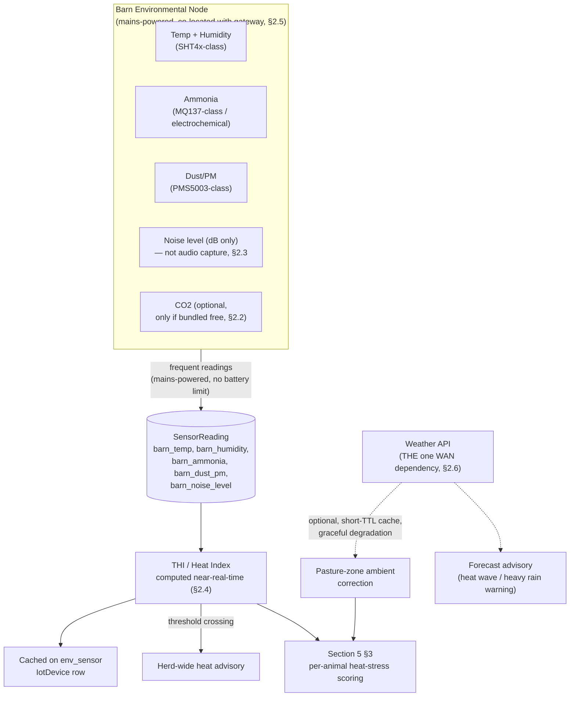

# Pandora IoT Platform — Section 10: Environmental Monitoring

## 1. Executive Summary

Four earlier sections already pointed here: Section 2 §2.6 and Section 4 §2.6
deferred ambient temperature/humidity/pressure to this section rather than
measuring them on the wearable tag; Section 5 §2.4 and §3 built fever
correction and heat-stress detection on an environmental baseline this
section now formally defines. This section designs one fixed, **mains-powered
barn sensor node** — freed from the ear tag's coin-cell power budget, so the
sensor-inclusion bar shifts from "power-justified" to "genuinely useful" — and
deliberately does **not** build a dedicated outdoor pasture weather station:
rain, wind, and pasture-zone ambient conditions are sourced from an external
weather API instead, since a 2.7-acre flat property doesn't have a
microclimate a regional forecast can't already describe. That weather API is
also the **one designed external/WAN dependency in this entire system** —
flagged explicitly, and built to degrade gracefully, not silently assumed
always-available.

## 2. Engineering Decisions

### 2.1 One fixed barn node for R1 — no dedicated pasture station
- **Why**: ammonia, CO₂, and dust are indoor-confinement concerns — they
  don't meaningfully apply to open pasture, so there's nothing pasture-side
  for a dedicated station to measure that the barn node doesn't already cover
  for the metrics that matter indoors. For temperature/humidity/heat-index on
  pasture, this farm's small, flat footprint means a regional weather API
  already gives adequate resolution — building and maintaining a second
  outdoor station would duplicate that for no material accuracy gain.
- **Rejected**: matching pasture zone coverage 1:1 with a dedicated weather
  station — solves a resolution problem this farm's geography doesn't have.

### 2.2 Sensor selection, held to the same "real need, not just cheap" bar as Section 4
- Temperature, humidity (SHT4x-class digital sensor), ammonia (electrochemical
  or MOS NH3 sensor, MQ137-class), dust/PM (PMS5003-class laser particulate
  sensor), and noise **level** (dB only) are **included** — each answers a
  concrete welfare/safety question for a Bengal-style naturally-ventilated
  shed: heat stress (temp/humidity), respiratory irritation from manure/
  bedding buildup especially in monsoon (ammonia), dry-season/fodder-handling
  particulate (dust), and mass-distress or disturbance events (noise level).
- **CO₂ is included only if bundled at near-zero marginal cost** on a combined
  gas-sensor board alongside ammonia — as a standalone purchase it's not
  independently justified, because this farm's open-sided sheds are far less
  prone to CO₂ buildup than sealed, high-density confinement barns the
  textbook CO₂ recommendation usually targets.
- **Rain and wind are sourced from the weather API, not local hardware** — a
  mechanical/ultrasonic anemometer and a rain gauge both add cost and
  maintenance burden (dust, monsoon exposure) for data a regional forecast
  already provides adequately at this property's scale.
- **Light is not a dedicated sensor** — day/night context for behavior
  interpretation (Section 5, Section 8) comes from computed sunrise/sunset
  times, which need no hardware at all. Held to the exact bar Section 4 §2.8
  applied to the tag-mounted light sensor: no sensor without a concrete unmet
  need, and none exists here.
- **"Air Quality" and "Heat Index" are not separate sensors** — Air Quality is
  the combination of dust/ammonia/CO₂ readings already covered above (same
  "not a separate line item" treatment Section 4 §2.7 gave "Motion Sensor"/
  "BLE Beacon"); Heat Index is a **derived value** from temperature + humidity
  — formalized in §3 as the THI computation Section 5 §3 already referenced.

### 2.3 Noise is level-only telemetry — explicitly distinct from the tag-microphone rejection in Section 4 §2.4
- **Why**: Section 4 rejected a microphone on the ear tag for two reasons —
  power cost on a coin cell, and incidental capture of human conversation
  near workers. Neither applies here: this node is mains-powered (no battery
  budget to protect), and it reports a **sound-pressure level number only**,
  never recording or transmitting intelligible audio — there's no
  conversation-capture concern because no audio content ever leaves the
  sensor. This is worth stating explicitly so the two decisions don't read as
  contradictory; they're actually consistent once the underlying reasons are
  compared side by side.

### 2.4 THI/heat-index is computed near-real-time, not on Section 5's nightly cadence
- **Why**: acute heat events can develop within a single afternoon — waiting
  for the next nightly rollup (Section 5 §10) to notice a dangerous THI
  reading would defeat the purpose of an early-warning signal. Each new barn
  reading recomputes a cached current-THI value (§7), and a threshold
  crossing into a livestock heat-stress-risk band fires an immediate
  herd-wide advisory, independent of and faster than the per-animal nightly
  scoring Section 5 §3 layers on top of it.

### 2.5 Environmental node is physically co-located with the barn's BLE gateway, but logically a distinct device registration
- **Why**: both are mains-powered, fixed, barn-installed hardware — sharing
  one physical enclosure/MCU for BLE-gateway-relay duty and environmental
  sensing avoids a third separate box, cabling, and network connection for no
  functional benefit. It stays a **distinct `IotDevice` row**
  (`deviceType = 'env_sensor'`, already anticipated in Section 1 §7) rather
  than folding its readings into the gateway's own record, so status,
  permissions, and data provenance stay clean — the same physical-vs-logical
  separation Section 4 §2.2 already applied to combining BLE + passive RFID
  in one ear tag enclosure.

### 2.6 The weather API is the system's one external dependency — explicitly optional, never blocking
- **Why**: Section 1 §9 established no-WAN-dependency for core function
  across the whole platform; this is the single, deliberate exception,
  because forecast data (advance warning of an incoming heat wave or heavy
  rain — genuinely useful for proactive shed/feeding prep) and pasture-zone
  ambient correction (§2.1) aren't obtainable any other way. It's built to
  **degrade gracefully**: if the connection is down, the system falls back to
  barn-node-only data with no pasture ambient correction and no forecast —
  reduced capability, not failure. Fetched data is cached with a short TTL,
  not persisted as historical telemetry — the weather provider is already the
  historical source of truth if that's ever needed, so duplicating it into
  this system's own storage adds no value.

## 3. THI / Heat Index Definition

A standard livestock Temperature-Humidity Index computed from barn
temperature and humidity (or, for pasture zones, weather-API ambient data per
§2.1), banded into the same tiered risk categories (mild/moderate/severe/
danger) commonly used in livestock heat-stress frameworks generally, rather
than claiming goat-specific certified thresholds this document can't fully
verify — the bands should be reviewed with the farm's vet before going live,
consistent with this whole series' pattern of treating veterinary specifics
as something to confirm with a human expert, not assert unilaterally. This
value feeds Section 5 §3's per-animal heat-stress detection directly.

## 4. Architecture Diagram

## 5. Hardware Components

Barn node: temp/humidity sensor, ammonia sensor, dust/PM sensor, sound-level
sensor, all mains-powered, co-located in the same enclosure as the barn's BLE
gateway (Section 1 §5, Section 11/12). No pasture hardware — rain/wind/pasture
ambient sourced from the weather API (§2.1, §2.2).

## 6. Software Components

Weather API client with short-TTL caching and explicit non-blocking failure
handling (§2.6) — the only component in this system designed to reach outside
the farm LAN. THI computation runs inside the same `src/modules/iot/`
compute boundary already established for every other cross-section signal.

## 7. Database Design

- **`IotDevice`** gains `deviceType = 'env_sensor'` rows (already anticipated,
  Section 1 §7), plus cached fields `currentThi` and `lastEnvReadingAt` for
  near-real-time access without querying raw `SensorReading` history on every
  check (§2.4) — the same current-state-caching pattern Section 6 §2.2/§7
  already applied to zone gateways.
- **`SensorReading.readingType`** gains `barn_temp`, `barn_humidity`,
  `barn_ammonia`, `barn_dust_pm`, `barn_noise_level`, and optionally
  `barn_co2` (§2.2).
- **No table for weather API data** — fetched and cached in-process with a
  short TTL, not persisted (§2.6).

## 8. Firmware Design

Barn node firmware is simple periodic sampling (no battery-driven adaptive
duty-cycling needed, unlike the ear tag) — full embedded design detail
belongs to Section 12 alongside the gateway hardware it's co-located with.

## 9. Communication Flow

1. Barn node samples frequently (mains-powered, no power constraint driving
   sample rate the way Section 2's tag design required) and reports via the
   same batched ingestion path as any other `IotDevice`.
2. Each new reading recomputes cached `currentThi`; a threshold crossing
   fires an immediate herd-wide advisory, independent of the nightly cycle.
3. Weather API is polled on its own schedule (e.g. hourly), cached briefly,
   and consulted by Section 5 §3's heat-stress scoring for pasture-zone
   animals and by a forecast-advisory feature — never blocking any other
   flow if unreachable (§2.6).

## 10. Security Considerations

The weather API call is the one point in this system that reaches outside
the farm LAN — it should use TLS and, since it's read-only forecast data with
no farm-specific payload sent beyond coordinates, carries minimal exposure
risk; still worth noting as the one deliberate exception to Section 1 §10's
otherwise fully on-prem security posture.

## 11. Scalability Plan

One barn node per shed scales the same way gateways do (Section 1 §11,
Section 6 §11) — a future federated farm with multiple sheds adds one
`env_sensor` device per shed, no protocol or schema change. Weather API usage
scales trivially (one farm-level location query, not per-animal).

## 12. Cost Estimate

Barn node sensor set (temp/humidity, ammonia, dust, noise) is a modest
addition to the shared gateway enclosure's BOM — individually low-cost
components (each in the low single-to-double-digit dollar range), no
recurring cost for R1 assuming a free-tier or low-volume weather API usage
appropriate to a single farm-level location query on an hourly cadence.

## 13. Risks

| Risk | Mitigation |
|---|---|
| Weather API unavailability during exactly the event it would have warned about | Graceful degradation to barn-only data (§2.6) — the system still functions, just with reduced pasture/forecast coverage, not a hard failure |
| MOS-class ammonia/gas sensors drift and need periodic recalibration | Flagged as a maintenance item for Section 12/19's service planning, not assumed maintenance-free |
| THI thresholds not yet vet-reviewed for goat-specific accuracy | Explicitly flagged in §3 as needing sign-off before going live, not asserted as certified |
| Noise-level sensor triggering false distress advisories from ordinary farm activity (machinery, traffic) | Threshold tuning and sustained-duration requirement (not a single spike) during field validation, same discipline as every other alert in this series |

## 14. Testing Strategy

- Field-validate ammonia/dust readings against known conditions (e.g. post-
  mucking-out vs. before) to sanity-check sensor response before trusting
  alert thresholds.
- Validate THI-driven heat advisories against real West Bengal summer
  afternoon conditions during the same pilot window already planned
  (Section 1 §14) — this is where the vet-review flagged in §3 should happen,
  against real local data rather than generic literature values alone.
- Confirm weather-API graceful degradation actually works by testing with
  the connection deliberately disabled, not just assuming the failure path
  is correct.

## 15. Future Improvements

- A dedicated pasture station only if a future federated farm (Section 1
  §11) has geography where a regional weather API genuinely stops being
  representative — evidence-gated, not built speculatively (§2.1).
- CO₂ as a standalone sensor if a future shed design moves toward higher-
  density/enclosed housing where the open-shed assumption in §2.2 no longer
  holds.

## 16. Approval Gate

- [ ] One fixed, mains-powered barn environmental node for R1 — no dedicated
      pasture weather station; pasture ambient sourced from the weather API
- [ ] Temp/humidity, ammonia, dust, and noise-level (dB only, not audio
      capture) included; CO₂ only if bundled free; rain/wind not built as
      local hardware; light not a dedicated sensor (day/night computed)
- [ ] THI/heat-index computed near-real-time, cached on the `env_sensor`
      `IotDevice` row, feeding both an immediate herd-wide advisory and
      Section 5 §3's per-animal scoring
- [ ] Weather API is the system's one explicit external dependency —
      short-TTL cached, never blocking, graceful degradation confirmed by test
- [ ] Environmental node co-located physically with the barn's BLE gateway,
      logically distinct as its own `IotDevice` (`deviceType='env_sensor'`)

**On approval → Section 11: Farm Infrastructure** — LoRa/BLE gateway
placement, RFID readers, edge gateway hardware, solar backup, UPS, network
switch, internet connectivity, power backup, and coverage maps, bringing
together the physical infrastructure every prior section has assumed.
