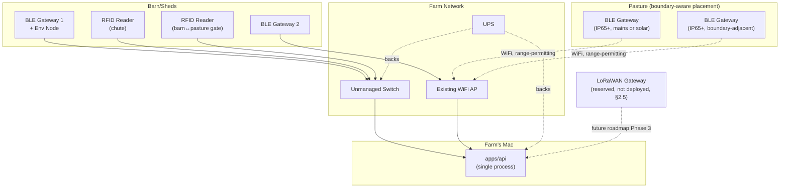

# Pandora IoT Platform — Section 11: Farm Infrastructure

## 1. Executive Summary

This section assembles the physical hardware every prior section has
referenced but not fully inventoried: how many BLE gateways, where they go,
what powers them, and how they reach the farm's Mac. Two terms need
reconciling with the brief up front. **"Edge Gateway"** in this document
means the fixed BLE gateway relay hardware itself (Section 1 §2.1 already
decided there's no separate, more powerful edge-server tier — the farm's Mac
is the one compute node everything reports to); this section covers that
hardware's physical form, Section 12 covers what it's capable of doing.
**"LoRa Gateway"** stays what Section 3 §3.2 already called it — reserved,
not deployed, for R1; this section describes what it would look like if
activated, without pretending it's needed now. Gateway count and exact
placement are presented as an **informed estimate pending the RF site survey**
already required by Sections 3 §14 and 6 §14, not asserted as final — this
document doesn't have this farm's real building/fence layout to place
hardware on a map with certainty.

## 2. Engineering Decisions

### 2.1 Gateway count/placement is an estimate, explicitly pending the RF site survey
- **Why**: a starting point — roughly 2–3 gateways covering barn/pen areas
  (Section 6's `Pen`/`Shed` structure suggests a small farm typically has a
  handful of pens, not dozens, so one gateway may cover several adjacent
  pens depending on BLE range and shed layout) and 1–2 gateways covering
  pasture zones, including explicit boundary-adjacent placement for the
  escape-detection proxy (Section 6 §2.4) — roughly 4–5 units total. This is
  a reasonable starting estimate for a 2.7-acre property, not a final count —
  the actual number and exact positions are determined by the RF site
  survey's real dry-season and monsoon-season measurements (Section 3 §14),
  which this document cannot substitute for without walking the actual
  property.
- **Rejected**: asserting a precise, final gateway count and map now — would
  be false precision this document has no basis for.

### 2.2 Indoor and outdoor gateways have different enclosure requirements
- **Why**: barn-mounted gateways sit under cover and don't need the
  environmental rating a pasture-mounted unit does. Pasture gateways face
  the same monsoon/UV exposure the ear tag was designed against (Section 2
  §2.2) — **IP65+ weatherproof enclosure, UV-stabilized housing** — while
  indoor barn gateways can use a simpler, cheaper enclosure. Treating both
  the same would either over-spec (and over-cost) indoor units or
  under-spec outdoor ones.

### 2.3 Solar backup is conditional on mains access, not blanket-deferred to "future"
- **Why**: prior sections (Section 1 §15, Section 4 §15) flagged solar as a
  future item, but that was written without certainty about this farm's
  actual electrical layout at every planned pasture gateway location. The
  honest position: **barn-based hardware has mains access and needs no
  solar for R1.** A pasture gateway post that turns out to be inconveniently
  far from existing wiring needs a small solar-plus-battery supply
  *immediately*, as a normal installation solution for that specific node —
  not deferred as a speculative upgrade. Which case applies is a site-survey
  question (§2.1), not something to decide from this document alone.

### 2.4 UPS for the Mac and critical network gear is a genuine R1 recommendation
- **Why**: Section 1 §13 already flagged rural power interruption (monsoon-
  prone West Bengal) as a risk, mitigated there by gateway-side buffering.
  A UPS on the farm's Mac and any network switch/WiFi AP the gateways depend
  on **reduces how often that buffering path is even exercised** — cheap,
  standard reliability practice, not a novel IoT-specific requirement. It
  complements the buffering mitigation rather than replacing it (a UPS
  covers minutes-to-an-hour outages; multi-hour outages still rely on
  gateway-side local buffering and resync).

### 2.5 LoRa gateway hardware is designed on paper here, not deployed for R1
- **Why**: consistent with Section 3 §3.2's "reserved, not rejected"
  framing — if/when a future footprint (a larger farm, or the federated
  multi-farm model, Section 1 §11) needs LoRaWAN's range, the hardware
  answer is a standard multi-channel LoRaWAN gateway unit (e.g. an 8-channel
  gateway) covering the property and beyond, paired with a lightweight
  LoRaWAN network-server component. Describing this now, without building
  it, keeps the roadmap (Section 22, matching the brief's own Phase 3)
  concrete without spending R1 budget on unused hardware.

### 2.6 Internet connectivity is reused, not new — and stays non-core to IoT function
- **Why**: the farm's existing internet connection (already serving the
  broader ERP) is reused as-is. Its only IoT-specific roles are the weather
  API (Section 10 §2.6, already the system's one flagged external
  dependency), future OTA firmware delivery (Section 19), and remote support
  access — never core sensor-to-alert data flow, which stays entirely on the
  farm LAN per Section 1 §9. Nothing in this section adds a second internet
  connection or a new ISP relationship.

### 2.7 A small unmanaged network switch is sufficient — no enterprise networking gear
- **Why**: at 4–5 gateways, 2 RFID readers, one env node, and the Mac, this
  is a handful of wired/wireless endpoints on one small farm's LAN — a basic
  unmanaged switch plus the existing WiFi AP covers it. Enterprise-grade
  managed switching, VLAN hardware, or redundant networking gear would be
  ceremony this scale doesn't call for, consistent with CLAUDE.md's lean
  bias applied to physical infrastructure, not just code.

## 3. Farm Hardware Inventory (Section — Estimated, Pending Site Survey)

| Item | Quantity (estimate) | Placement | Notes |
|---|---|---|---|
| Fixed BLE gateway (indoor) | 2–3 | Barn/pen areas | Standard enclosure; one may be co-located with the env node (Section 10 §2.5) |
| Fixed BLE gateway (outdoor) | 1–2 | Pasture zones, incl. boundary-adjacent placement | IP65+ enclosure (§2.2); solar if mains-inconvenient (§2.3) |
| LF RFID reader | 2 | Treatment/weighing chute (Section 3 §2.1) + barn↔pasture gate (Section 6 §2.3) | Fixed, physically secured (Section 3 §10) |
| Environmental sensor node | 1 | Co-located with barn gateway (Section 10 §2.5) | Mains-powered |
| Network switch | 1 (small, unmanaged) | Wherever wired runs converge | §2.7 |
| UPS | 1–2 | Mac + switch/AP | §2.4 |
| LoRaWAN gateway | 0 (reserved, not deployed) | N/A for R1 | §2.5 |

## 4. Architecture Diagram

## 5. Hardware Components

Covered in the inventory table (§3) — no component here is new relative to
what Sections 1, 3, 6, and 10 already specified for gateways, RFID readers,
and the environmental node. This section's contribution is quantity,
placement rationale, enclosure differentiation (§2.2), and power/network
backbone (§2.3, §2.4, §2.7).

## 6. Software Components

None new — this is a hardware/infrastructure section. Gateway-side software
capability is Section 12's subject.

## 7. Database Design

`IotDevice` gains an `installLocation: String?` free-text field (e.g. "Barn
Pen A, north wall") — a documentation aid for maintenance staff, not a
geometry/coordinate system, consistent with Section 6 §2.2's decision not to
build precise positioning infrastructure this farm doesn't need.

## 8. Firmware Design

None — covered per-device-type in Sections 2, 3, 10, 12.

## 9. Communication Flow

No change to the flows already established in Sections 1, 3, 6, 9, and 10 —
this section fixes the physical topology those flows run over.

## 10. Security Considerations

Physical security of fixed infrastructure (RFID readers already flagged in
Section 3 §10; gateways should similarly be mounted, not left portable) —
theft/tamper of a $30–80 gateway is a cost nuisance, not a data-integrity
risk, since the allowlist/authoritative-signal design (Sections 1, 3, 6)
already assumes untrusted network conditions at the radio layer.

## 11. Scalability Plan

Adding coverage is adding gateway units with a `zoneLabel` (Section 6 §2.2)
and, for a future federated farm, an `installLocation` — no protocol,
schema, or architecture change, consistent with the "scale by replication"
principle running through this entire document series (Section 1 §11).

## 12. Cost Estimate

Per-unit costs already estimated in Sections 1 §12, 3 §12, and 6 §12
($30–80/gateway, low-hundreds/RFID reader) — this section's addition is a
small unmanaged switch (low tens of dollars) and one or two UPS units
(moderate one-time cost, sized to the Mac + network gear's actual load, not
estimated precisely here without knowing that load). No new recurring cost.

## 13. Risks

| Risk | Mitigation |
|---|---|
| Estimated gateway count (§2.1) turns out insufficient for real coverage | RF site survey (Section 3 §14) is the authoritative validation step before final purchase/installation, not this document |
| Pasture gateway mains access assumption wrong, discovered only during installation | §2.3's conditional solar plan exists precisely for this — not a project blocker, a known contingency |
| Multi-hour power outage exceeds gateway local-buffer capacity | Accepted residual risk, same as Section 1 §13 — UPS (§2.4) reduces frequency, doesn't eliminate the tail case |
| Unmanaged switch becomes a single point of failure for wired gateways | Wireless-backhaul gateways (§4 diagram) provide a fallback path not dependent on the switch |

## 14. Testing Strategy

- The RF site survey (Section 3 §14, Section 6 §14) *is* this section's
  primary validation step — this document's gateway count/placement is a
  starting hypothesis for that survey to confirm or revise, not a
  conclusion to build from unchecked.
- Confirm UPS runtime is adequate for realistic outage durations observed at
  this farm (or regionally typical monsoon outage patterns), not assumed
  from a generic UPS spec sheet.

## 15. Future Improvements

- LoRaWAN gateway deployment if/when a larger footprint or federated
  multi-farm need materializes (§2.5, matches the brief's own roadmap
  Phase 3).
- Broader solar adoption if grid reliability at this farm proves worse than
  the UPS-plus-buffering mitigation (§2.4) comfortably handles — evidence-
  gated, not built preemptively beyond the conditional pasture case (§2.3).

## 16. Approval Gate

- [ ] Gateway count/placement (~4–5 units, barn + boundary-aware pasture
      coverage) is an estimate explicitly pending the RF site survey, not a
      final map
- [ ] Indoor vs. outdoor gateway enclosure differentiation (IP65+ only where
      exposed to weather)
- [ ] Solar backup is conditional on actual mains access at each pasture
      location, decided during installation — not blanket-deferred nor
      blanket-required
- [ ] UPS for the Mac and critical network gear, complementing (not
      replacing) gateway-side local buffering
- [ ] LoRaWAN gateway hardware specified on paper as a reserved future
      option, not purchased/deployed for R1
- [ ] Small unmanaged switch is sufficient — no enterprise networking gear
- [ ] Internet connectivity reused from the farm's existing connection,
      limited to weather API/OTA/remote-support roles, never core data flow

**On approval → Section 12: Edge Computing** — what the gateway hardware
specified here is actually capable of: offline storage, local processing
boundaries, alert generation at the edge vs. backend, automatic sync, data
compression, MQTT specifics, and OTA firmware update delivery.
