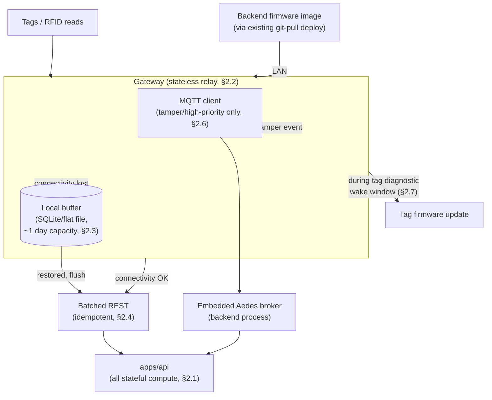

# Pandora IoT Platform — Section 12: Edge Computing

## 1. Executive Summary

Five prior sections have called the gateway "a relay, not a stateful compute
node" (Section 1 §2.1, reinforced in Sections 5, 6, 8, and 11) — this section
has to reconcile that with the brief's explicit ask for "Local AI" at the
edge, without quietly contradicting eight sections of prior decisions. The
resolution: **this architecture already has no cloud tier** (Section 1 §2.1).
"Local AI" in a typical enterprise IoT platform means *edge-tier inference
distinct from a distant cloud* — but here, the backend itself is already
local (the farm's own Mac, not a remote service). The locality the brief is
really asking for — intelligence and data staying on the farm, never phoning
home — is already satisfied by the whole system's architecture, not something
that additionally needs pushing onto resource-constrained gateway hardware.
What the gateway *does* do, and does well: buffer, batch, compress by
omission (not algorithm), and forward the handful of events that genuinely
need sub-second latency.

## 2. Engineering Decisions

### 2.1 "Local AI" is satisfied by this system's architecture, not by gateway-side inference
- **Why**: composite scoring, baselines, and zone attribution all need
  multi-day history or cross-device state (Sections 5, 6, 7, 8) that a
  gateway — a cheap, stateless relay by design (Section 1 §2.1) — was never
  meant to hold. Running real inference there would mean either duplicating
  that state on every gateway (real complexity, real cost, no benefit) or
  running a shrunk-down, less capable model there for no reason, since the
  "real" backend is one hop away on the same LAN, not across the internet.
  The brief's underlying goal — farm data and intelligence never leaving the
  property — is already true of this whole design; restating it as "the
  gateway must also think" would be solving a problem (latency to a distant
  cloud) this architecture doesn't have.
- **Rejected**: shipping any trained/rule-based model to gateway firmware —
  no capability gained, real maintenance cost (every model update becomes a
  fleet-wide gateway firmware rollout instead of one backend deploy).

### 2.2 The gateway performs only lightweight, stateless tasks
- **Why**: relay BLE advertisements and RFID reads, buffer during
  connectivity loss (§2.3), batch outgoing data, and immediately forward the
  narrow set of events that are already fully determined at the tag itself —
  tamper (Section 2 §2.6), the confirmed-debounced version, not raw switch
  noise — via the low-latency MQTT path (Section 1 §2.3). This is genuine
  "edge alerting" in the sense the brief asks for, but it's fast relay of an
  already-tag-detected event, not gateway-side judgment. Nothing requiring
  a baseline, a history window, or another device's data runs here.

### 2.3 Offline storage is modest — a full day's buffer fits in megabytes, not a storage subsystem
- **Why**: Section 1 §2.4 already established this farm's telemetry volume
  is small (tens of millions of rows/year across the whole herd, comfortably
  handled by plain Postgres partitioning) — a single gateway's share of that,
  buffered locally for even a full day of a connectivity gap, is a modest
  amount of simple numeric/event data. A local append-only queue (SQLite on
  an SBC-class gateway, or a simple flat buffer file on an ESP32-class one,
  depending on which hardware tier Section 11 ultimately specifies) is
  sufficient — no dedicated storage hardware or exotic embedded database is
  justified by this data volume.

### 2.4 Automatic sync reuses the existing idempotent-batch ingestion path — no new protocol
- **Why**: Section 1 §9 already established batched REST ingestion with one
  `Idempotency-Key` per sync batch. A gateway resuming after a connectivity
  gap simply flushes its buffered queue through that same path — if a sync
  attempt partially succeeds and retries, the idempotency key already
  prevents double-counted readings. Building a second, gateway-specific sync
  protocol would duplicate a mechanism that already does exactly this job.

### 2.5 Data compression is unnecessary ceremony at this scale — the real constraint it solves doesn't exist here
- **Why**: dedicated compression (gzip-class algorithms, delta-encoding
  schemes) earns its cost when bandwidth is expensive or metered — a
  cellular uplink to a distant cloud, for instance. This architecture's
  gateway-to-backend hop is a farm LAN (Section 1 §9) with no bandwidth cost
  and no meaningful volume constraint. The practical compression that
  matters here already happened upstream: the tag sends compact per-interval
  summaries, not raw waveform data (Section 8 §2.1), and readings are
  batched rather than sent one-per-request. Adding a compression layer on
  top solves a bandwidth problem this design doesn't have.
- **Rejected**: building compression infrastructure now. **Reconsidered**
  only if LoRaWAN activates (Section 3 §3.2, Section 11 §2.5) — that's a
  genuinely bandwidth/duty-cycle-constrained channel where compression would
  actually earn its keep, unlike the LAN hop this farm uses today.

### 2.6 MQTT stays scoped to the narrow low-latency path already defined — not a general transport
- **Why**: reaffirming Section 1 §2.3 rather than expanding it — the
  gateway's MQTT client publishes only the tamper/high-priority event class
  to the backend's embedded Aedes broker; routine telemetry stays on the
  batched REST path (§2.4). Using MQTT for everything would be reaching for
  pub/sub generality this system's actual traffic pattern (mostly batch,
  occasionally urgent) doesn't need.

### 2.7 OTA firmware updates: gateway firmware over the existing LAN deploy pattern; tag firmware relayed by the gateway during scheduled pairing windows
- **Why**: gateway firmware updates are delivered from the backend over the
  farm LAN — the backend itself receives new firmware images through
  whatever update mechanism the broader ERP already uses (this repo's
  existing git-pull deploy pattern), so no separate OTA delivery
  infrastructure is needed for gateways specifically, just a LAN-local
  file transfer once the backend has the new image. Tag firmware is
  different: tags are BLE-only and battery-constrained, so they can't poll
  for updates continuously — the gateway acts as a BLE relay, pushing a new
  tag firmware image only during the tag's existing magnet-swipe diagnostic
  wake window (Section 2 §2.5/§10), which is already the tag's one
  OTA-receptive moment without burning extra battery listening for it. Full
  signing/integrity requirements for both paths are Section 19's
  responsibility — this section only fixes the delivery mechanism.

## 3. Coverage of the Brief's List

| Item | Design | Section |
|---|---|---|
| Offline Storage | Modest local buffer (MBs, not a subsystem) | §2.3 |
| Local AI | Satisfied by the whole system's on-prem architecture, not gateway inference | §2.1 |
| Alert Generation | Fast relay of tag-determined events only (tamper), never gateway-side judgment | §2.2 |
| Automatic Sync | Reuses existing idempotent-batch REST path | §2.4 |
| Data Compression | Unnecessary at LAN scale; upstream summarization already does the real work | §2.5 |
| MQTT | Scoped to the narrow low-latency alert path already defined | §2.6 |
| OTA Firmware Updates | Gateway: LAN deploy pattern. Tag: gateway-relayed during diagnostic wake window | §2.7 |

## 4. Architecture Diagram

## 5. Hardware Components

No new hardware — this section specifies software/firmware behavior on the
gateway hardware Section 11 already inventoried.

## 6. Software Components

Gateway firmware/software: local buffer/queue implementation, batched-REST
client with idempotency-key generation per batch, narrow-scope MQTT
publisher, and an OTA receiver for both its own firmware and tag-relay
firmware images.

## 7. Database Design

No new tables. `IotDevice.firmwareVersion` (Section 1 §7) already covers OTA
status tracking for both gateways and tags — no additional schema needed.

## 8. Firmware Design

Detailed in §2 above — this section *is* the gateway's firmware design at the
architecture level; line-level implementation is out of scope for a design
document.

## 9. Communication Flow

Reaffirms, rather than changes, the flows established in Section 1 §9 and
Section 3 §9 — this section's contribution is what happens **during a
connectivity gap** (buffer, §2.3) and **on restoration** (flush via the
existing idempotent path, §2.4), plus the OTA delivery paths (§2.7).

## 10. Security Considerations

OTA integrity/signing is explicitly Section 19's responsibility, not
re-derived here. The local buffer holds the same class of low-sensitivity
telemetry already assessed in Section 1 §10 — no new exposure from storing
it briefly on the gateway rather than transmitting immediately.

## 11. Scalability Plan

Buffer sizing and batch behavior are per-gateway and don't grow with total
farm animal count beyond that gateway's own local reading volume — consistent
with the federated, replicate-not-centralize scaling model (Section 1 §11)
already applied throughout.

## 12. Cost Estimate

No new hardware cost. Local buffer storage (SD card or onboard flash) is
already part of Section 11's gateway hardware estimate — this section adds
no incremental BOM line.

## 13. Risks

| Risk | Mitigation |
|---|---|
| Gateway local buffer fills during an unusually long outage | Sized generously (§2.3) against Section 11's UPS mitigation reducing outage frequency; a full buffer degrades to oldest-data-drop rather than a crash, a defined failure mode rather than an undefined one |
| Tag OTA relay window (magnet-swipe wake) is too infrequent for timely firmware fixes | Acceptable trade-off given the alternative (continuous OTA listening) burns battery life this design has already budgeted carefully (Section 2) — firmware updates are not expected to be a frequent operation |
| MQTT scope creep over time (more event types routed through it "since it's already there") | §2.6 states the boundary explicitly so future sections/implementers have a documented line to check against, not just an implicit norm |

## 14. Testing Strategy

- Simulate a connectivity gap (disconnect the gateway from the LAN
  deliberately) and confirm buffering, then restoration and idempotent
  flush, actually behaves as designed — not assumed from the architecture
  alone, the same standard Section 10 §14 applied to weather-API
  degradation.
- Validate tag OTA relay against a real magnet-swipe wake cycle during the
  field pilot, confirming the window is long enough for a realistic
  firmware image size at BLE transfer speeds.

## 15. Future Improvements

- Gateway-side compression/downsampling if LoRaWAN activates (§2.5) — a
  genuinely different bandwidth environment where it would earn its cost.
- Reconsidering gateway-side lightweight inference only if a future
  federated farm's connectivity to its own backend becomes unreliable enough
  that some local judgment during extended outages has real value — not
  anticipated for this farm's LAN-only, single-Mac deployment.

## 16. Approval Gate

- [ ] "Local AI" satisfied by this system's on-prem, no-cloud architecture —
      no inference model shipped to gateway firmware
- [ ] Gateway performs only stateless tasks: relay, buffer, batch, forward
      already-determined tamper events — no baseline/composite computation
      at the edge
- [ ] Offline buffer is a modest local queue (SQLite/flat file), not a
      dedicated storage subsystem
- [ ] Automatic sync reuses the existing idempotent-batch REST path — no new
      sync protocol
- [ ] No dedicated compression infrastructure for R1 — reconsidered only if
      LoRaWAN activates
- [ ] MQTT stays scoped to the narrow tamper/high-priority alert path
- [ ] Gateway OTA via the existing LAN deploy pattern; tag OTA relayed by
      the gateway during the tag's existing diagnostic wake window; signing
      detail deferred to Section 19

**On approval → Section 13: Backend** — microservices vs. monolith
resolution (already decided, formalized here), MQTT broker, REST APIs,
authentication, encryption, audit logs, device management/provisioning, and
telemetry processing inside `apps/api`.
