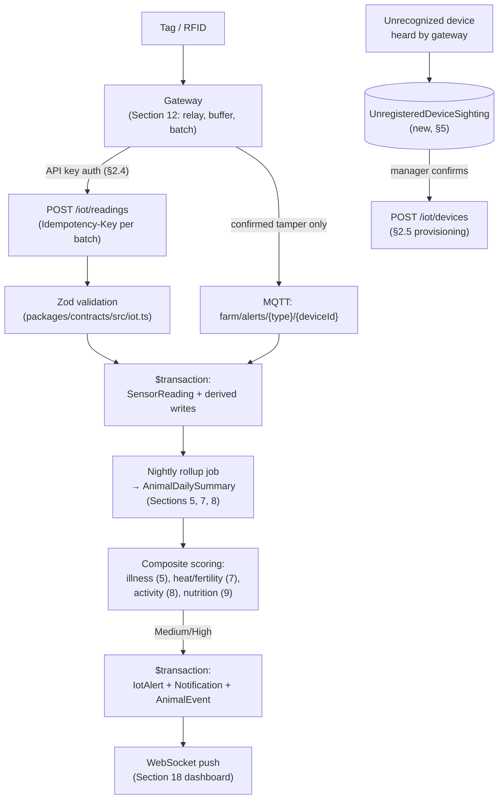

# Pandora IoT Platform — Section 13: Backend

## 1. Executive Summary

Microservices, GraphQL, and gateway-side inference were all settled in
Sections 1 and 12 — this section doesn't re-argue them, it formalizes what's
genuinely still undesigned: concrete REST endpoint shapes, an MQTT topic
scheme, device authentication, and — the biggest gap so far — **device
provisioning**, which no prior section has actually specified. It also draws
the telemetry pipeline that's been described piecemeal since Section 1 §9
into one coherent diagram, since "the backend" is the natural place for that
synthesis.

## 2. Engineering Decisions

### 2.1 Microservices and GraphQL stay rejected — formal restatement, not a re-argument
- Section 1 §2.1/§2.3 already decided this: `src/modules/iot/` inside the
  existing `apps/api` monolith, Zod/REST over GraphQL. Restated once more
  here because this is the section a reader would expect to look for the
  decision, with a pointer back rather than a duplicated argument.

### 2.2 MQTT topic scheme, formalized for the first time
- **Why**: Section 1 §2.3/Section 12 §2.6 scoped MQTT to tamper/high-priority
  events but never specified topic naming. Proposed scheme:
  `farm/alerts/{alertType}/{deviceId}` for gateway-published high-priority
  events (e.g. `farm/alerts/tamper/01H...`), and `farm/devices/{deviceId}/
  status` for gateway liveness/heartbeat. Namespacing by `alertType` lets the
  backend subscriber pattern-match on severity class without parsing payload
  first — a small, genuinely useful design detail this document hadn't fixed
  yet.

### 2.3 REST endpoints follow the existing plural-kebab-case + sub-post-action convention exactly
- **Why**: CLAUDE.md's naming rule already governs every other module in
  this ERP — no reason for IoT to be the exception. Concrete shape:
  - `POST /iot/devices` — register (provisioning, §2.5)
  - `GET /iot/devices`, `GET /iot/devices/:id`
  - `POST /iot/devices/:id/reassign` — override-guarded (§2.6)
  - `POST /iot/devices/:id/retire`
  - `POST /iot/readings` — batched telemetry ingestion (already referenced
    since Section 1 §9), machine-authenticated (§2.4)
  - `GET /iot/alerts`, `POST /iot/alerts/:id/acknowledge`
  - `GET /iot/devices/:id/readings` — historical query for a given device
  Every mutating one carries the `Idempotency-Key` header per existing
  convention (rule already established repo-wide, reaffirmed for batched
  reading posts in Section 1 §9).

### 2.4 Device authentication: gateways carry a per-device API key; tags never authenticate directly
- **Why**: only gateways and RFID readers are IP-addressable, LAN-connected
  devices capable of holding and presenting credentials — a tag is BLE-only
  and was deliberately kept power-cheap by not doing per-message crypto
  (Section 2 §2.8's static-ID decision). So the trust boundary sits at the
  gateway: each gateway/reader gets an API key (hashed with Argon2id at
  rest, reusing this repo's existing session-security approach — Phase-2
  §3.6 — rather than inventing a second hashing scheme) issued at
  provisioning (§2.5), sent via a header on every request, validated by a
  guard modeled on the existing `@Public()` ops-token pattern
  (`notifications.controller.ts`) rather than the human session-cookie auth
  used elsewhere. A tag's "identity" is validated at the allowlist level
  (Section 1 §10) — known serial numbers only — not cryptographically.
- **Rejected**: per-tag cryptographic authentication — the same power-cost
  argument that ruled out rotating BLE identifiers (Section 2 §2.8) applies
  here even more directly.

### 2.5 Device provisioning: manual one-by-one for fixed infrastructure; self-reporting discovery for ear tags
- **Why**: fixed infrastructure (4–5 gateways, 2 RFID readers, 1 env node —
  Section 11 §3) is a small enough count that manual registration through the
  admin UI (serial number, `deviceType`, `zoneLabel`, `installLocation`) is
  simply not a problem worth automating. Ear tags are a different story —
  up to ~100 at initial rollout, plus ongoing additions as kids are tagged
  (Section 7 §2.4). Rather than building separate bulk-provisioning tooling,
  this reuses a mechanism that already exists for a different reason:
  Section 1 §10's gateway-side allowlist already logs unrecognized
  broadcasts (without linking them to an animal, for security). That log
  **is** the provisioning discovery feed — a manager sees a list of
  "unregistered devices recently heard" and, standing next to the goat they
  just tagged, taps to confirm registration and assign it to that animal.
  One security mechanism, two jobs — not a coincidence, a deliberate reuse.
- **Rejected**: a separate bulk-CSV-import provisioning tool — more
  machinery than either the fixed-infrastructure count or the tag rollout's
  natural "apply tag, stand near a gateway" workflow actually needs.

### 2.6 Device lifecycle and reassignment reaffirm the override-discipline pattern already established
- Status values (`active`/`inactive`/`lost`/`retired`, Section 1 §7) with a
  defined transition set: `active → lost/retired` (routine), and
  `reassign` — moving a tag to a different animal — requiring the `approve`
  permission tier already flagged in Section 1 §2.7, with a 422
  `RULE_OVERRIDE_REQUIRED` path if the tag is still linked to an animal
  whose status is active (rule 10's soft-rule-override pattern), exactly
  matching how the rest of this ERP already handles consequential-but-not-
  catastrophic mutations.

### 2.7 Audit logging: device lifecycle mutations are audited; individual readings are not
- Reaffirms Section 2 §10 explicitly rather than leaving it implicit:
  `audit.log`/`audit.version` calls on register/reassign/retire and on alert
  acknowledgment (a human decision worth a record) — never on individual
  `SensorReading` inserts, which are high-volume telemetry, not master-record
  changes (rule 11's own distinction, applied consistently here).

### 2.8 Data encryption: TLS in transit (already decided); at-rest follows whatever the rest of the ERP already does
- **Why**: Section 3 §10 already fixed TLS for gateway↔backend traffic even
  on LAN. At-rest encryption for IoT tables specifically isn't a new
  requirement this section invents — animal telemetry doesn't carry human
  PII, and inventing a separate encryption scheme for just the `iot` tables
  while the rest of the database uses whatever this repo's existing disk/DB
  security posture is would be inconsistent ceremony, not a real security
  improvement. IoT data rides the same posture as everything else in this
  Postgres instance.

## 3. Coverage of the Brief's List

| Item | Design | Section |
|---|---|---|
| Microservices | Rejected, formalized once more | §2.1 |
| MQTT Broker | Topic scheme fixed | §2.2 |
| REST APIs | Endpoint shapes fixed, following existing convention | §2.3 |
| GraphQL | Rejected | §2.1 |
| WebSockets | Existing NestJS gateway (Section 1 §2.3), reused for live alert push — consumed by Section 18's dashboard | — |
| Authentication | Per-device API key for gateways; allowlist-only for tags | §2.4 |
| Data Encryption | TLS in transit (existing); at-rest matches repo-wide posture | §2.8 |
| Audit Logs | Device lifecycle + alert ack audited; readings not | §2.7 |
| Device Management | Lifecycle state machine + override-guarded reassignment | §2.6 |
| Device Provisioning | Manual (fixed infra) + self-reporting discovery (tags) | §2.5 |
| Telemetry Processing | Unified pipeline, §4 | §4 |

## 4. Telemetry Processing — the Unified Pipeline

## 5. Hardware Components

None — this is a pure backend software section.

## 6. Software Components

- `src/modules/iot/iot.controller.ts` / `iot.service.ts` — endpoints per §2.3.
- `packages/contracts/src/iot.ts` — `RegisterDeviceInput`,
  `ReassignDeviceInput`, `SensorReadingBatchInput`, `AcknowledgeAlertInput`
  (Section 1 §6, now with concrete field shapes implied by §2.3's endpoints).
- A device-API-key guard, modeled on the existing ops-token `@Public()`
  pattern, distinct from the session-cookie guard used by human-facing routes.

## 7. Database Design

- New, small table: **`UnregisteredDeviceSighting`** —
  `id, serialNumber, gatewayId, firstSeenAt, lastSeenAt, sightingCount` — no
  FK to `IotDevice` (that's the point — it holds sightings *not yet*
  registered), removed once promoted to a real `IotDevice` row or auto-expired
  after a reasonable window if never claimed, so it doesn't accumulate as
  permanent noise.
- **`IotDevice`** gains `apiKeyHash: String?` (gateways/readers/env nodes
  only — ear tags never populate this, per §2.4).
- No change to `SensorReading`, `IotAlert`, `AnimalDailySummary` beyond what
  prior sections already specified — this section is about access/transport,
  not new telemetry shape.

## 8. Firmware Design

None — covered per-device-type in Sections 2, 3, 10, 12.

## 9. Communication Flow

Diagrammed in full in §4 — this section's contribution over prior ones is
naming the concrete endpoints/topics that flow carries and the
authentication gate each hop passes through.

## 10. Security Considerations

Device API keys are the one new credential type this section introduces —
hashed at rest (§2.4), transmitted only over TLS (§2.8), scoped per-device
(a compromised gateway key doesn't expose others). The
`UnregisteredDeviceSighting` table intentionally holds no animal linkage,
consistent with Section 1 §10's original allowlist design — provisioning
convenience doesn't weaken that boundary.

## 11. Scalability Plan

Endpoint/topic design doesn't change with device count — more gateways or
tags means more rows and more requests, not new endpoints or a different
auth model, consistent with this document series' standing federated,
replicate-not-centralize scaling principle (Section 1 §11).

## 12. Cost Estimate

No new hardware or infrastructure cost — this section is software design
over infrastructure Sections 1–12 already specified and costed.

## 13. Risks

| Risk | Mitigation |
|---|---|
| `UnregisteredDeviceSighting` accumulating stale entries from noise/interference | Auto-expiry window (§7) rather than indefinite retention |
| Device API key leakage exposing a gateway's ingestion access | Hashed at rest, TLS in transit, per-device scoping limits blast radius to one gateway's worth of write access (§10) |
| Reassignment override-path bypassed by directly manipulating `IotDevice.animalId` | Same protection every other override-guarded mutation in this ERP already relies on — service-layer enforcement, not a new concern specific to IoT |

## 14. Testing Strategy

- e2e tests for the full ingestion → transaction → alert pipeline (real
  Postgres, per this repo's existing `test/e2e` convention) — the
  idempotent-batch-replay test already flagged in Section 1 §14 belongs here
  concretely.
- Unit tests for the reassignment override-guard logic and the
  provisioning-from-sighting flow (DB-free where possible, per `test/unit`
  convention).

## 15. Future Improvements

- If a future federated multi-farm model (Section 1 §11) ever needs
  cross-farm device provisioning tooling, bulk-import could be revisited
  then — not built now against a single farm's ~100-tag scale (§2.5).

## 16. Approval Gate

- [ ] Microservices/GraphQL formally reaffirmed rejected; REST endpoint
      shapes and MQTT topic scheme fixed per §2.2/§2.3
- [ ] Gateway API-key authentication (Argon2id-hashed, TLS-transmitted);
      tags remain allowlist-only, no per-tag crypto
- [ ] Device provisioning: manual for fixed infrastructure, self-reporting
      discovery (reusing the existing security allowlist log) for ear tags —
      no separate bulk-import tooling built for R1
- [ ] Device lifecycle state machine with override-guarded reassignment
      (422 `RULE_OVERRIDE_REQUIRED` when reassigning a tag off an active
      animal)
- [ ] Audit logging on device lifecycle + alert acknowledgment; not on
      individual readings
- [ ] At-rest encryption matches the ERP's existing repo-wide posture — no
      new IoT-specific encryption scheme
- [ ] New `UnregisteredDeviceSighting` table (no FK to `IotDevice`,
      auto-expiring); `IotDevice.apiKeyHash` added for gateway-class devices

**On approval → Section 14: Database** — full DDL consolidating every
schema addition proposed across Sections 1–13 (`IotDevice`, `SensorReading`,
`IotAlert`, `AnimalDailySummary`, `UnregisteredDeviceSighting`) into one
authoritative migration-ready design, cross-checked against the live
`prisma/schema.prisma`.
