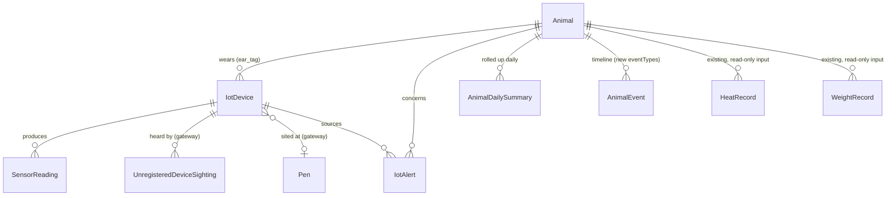

# Pandora IoT Platform — Section 14: Database

## 1. Executive Summary

Eleven prior sections each added a field or two to a running schema —
`IotDevice`, `SensorReading`, `IotAlert`, and `AnimalDailySummary` have all
been built incrementally since Section 1. This section is the consolidation:
every field from Sections 1, 5, 6, 7, 8, 9, 10, 11, and 13 collected into one
complete, migration-ready schema, plus the details that only become visible
once the whole picture is on the table — how `readingType` should actually be
typed, how partitioning gets implemented at the SQL level, and what a
retention policy for raw telemetry should look like now that
`AnimalDailySummary` clearly exists as the long-term analytics layer.

## 2. Engineering Decisions

### 2.1 `readingType` and `alertType` stay plain documented Strings, not Prisma enums — matching existing repo precedent
- **Why**: checking the existing schema shows this repo already uses *both*
  patterns deliberately — `PregnancyDiagnosis.method`/`AnimalExit.exitType`
  are real Prisma enums (small, stable sets), while
  `Notification.type`/`severity`/`channel` are plain, comment-documented
  Strings (`type String // 'daily_digest' | 'alert' | …`). `readingType` has
  already accumulated 11+ distinct values across this document series
  (`accelerometer_activity`, `skin_temp`, `barn_ammonia`, `ble_zone_presence`,
  …) and will keep growing as future sections/phases add sensor types — a
  Prisma enum would mean a schema migration every time. Following the
  `Notification` precedent for this specific field, rather than the
  `AnimalExit` precedent, is a decision grounded in what this repo already
  does for exactly this shape of problem, not an arbitrary choice.
- `deviceType` and `status` fields **do** use real enums (`IotDeviceType`,
  `IotDeviceStatus`) — small, stable sets, matching the `AnimalExit`-style
  precedent instead.

### 2.2 `SensorReading` partitioning is hand-written SQL, with an automated job pre-creating each month's partition
- **Why**: Prisma's schema DSL has no native `PARTITION BY` support — per
  CLAUDE.md rule 12, this means `prisma migrate dev --create-only` produces
  the base migration, and the range-partitioning DDL (`PARTITION BY RANGE
  (captured_at)`) is hand-appended to the draft before `migrate deploy`,
  exactly the documented workflow for this repo's other hand-written SQL
  (CHECKs, triggers, partial indexes). A partition must exist *before* data
  targeting it arrives — a small scheduled job (extending the existing
  pg-boss pattern, Phase-2 §3.8) creates next month's partition a few days
  ahead of month-end, avoiding a runtime insert failure from a missing
  partition.

### 2.3 Raw `SensorReading` gets a retention/archival policy — it does not need to live forever the way `stock_movements`/`audit_log` do
- **Why**: CLAUDE.md rule 6's append-only guarantee exists for
  `stock_movements` and `audit_log` because those are compliance/integrity
  records — corrections must be counter-rows, never silently lost. Raw
  sensor telemetry doesn't carry that same permanence requirement once it's
  been rolled into `AnimalDailySummary` (Section 5 §8), which already
  preserves every signal actually consumed by scoring, alerting, and
  dashboards. Dropping old partitions (e.g., beyond 12–18 months) after
  their data is safely summarized keeps storage bounded indefinitely instead
  of growing forever — a genuine, lean policy decision, not a violation of
  the append-only principle rule 6 protects, which is about preventing
  silent mutation within the retention window, not an eternal-storage promise.
- **Rejected**: keeping raw readings forever "to be safe" — real storage
  cost for data that's already been distilled into the table that actually
  gets queried.

### 2.4 `AnimalDailySummary` is the historical analytics layer; raw `SensorReading` is drill-down only
- **Why**: the brief's "Historical Analytics" requirement is best answered
  by the table that's *already* small, indexed by `(animalId, date)`, and
  designed for trend queries (Section 5 §8 onward) — not by querying
  hundreds of millions of raw partitioned rows for a dashboard chart. This
  section states explicitly what was implicit before: dashboards and reports
  (Section 18) query `AnimalDailySummary`; raw `SensorReading` is for
  detailed investigation of a specific alert or a specific short window, a
  much rarer access pattern that can tolerate partition-scan cost.

### 2.5 `serialNumber` uniqueness follows the existing partial-index pattern, not a naive `@unique`
- **Why**: `Animal.tagNumber`'s existing comment (`// partial-unique via SQL
  (deleted_at IS NULL)`) is the precedent — a soft-deleted/retired device's
  serial number should be reusable (e.g., a damaged tag returned and later
  reissued), which a bare Prisma `@unique` on `serialNumber` would prevent.
  The hand-written migration SQL creates `UNIQUE INDEX ... WHERE deleted_at
  IS NULL`, exactly matching rule 7's stated pattern.

### 2.6 Time-series database question reaffirmed at full schema detail: native partitioning, not TimescaleDB
- Section 1 §2.4 made this call in the abstract; seeing it worked through to
  concrete DDL here (§2.2) confirms it holds up — no extension dependency,
  no unverified Postgres.app capability assumption, and the retention policy
  (§2.3) further reduces how much partitioned data needs to exist at any
  given time, reinforcing that plain Postgres is enough at this scale.

## 3. Consolidated Schema

```prisma
enum IotDeviceType {
  ear_tag
  ble_gateway
  rfid_reader
  env_sensor
}

enum IotDeviceStatus {
  active
  inactive
  lost
  retired
}

model IotDevice {
  id               String          @id @db.Char(26)
  deviceType       IotDeviceType   @map("device_type")
  serialNumber     String          @map("serial_number") // partial-unique via SQL (deleted_at IS NULL), §2.5
  animalId         String?         @map("animal_id") @db.Char(26)          // ear_tag only
  status           IotDeviceStatus @default(active)
  firmwareVersion  String?         @map("firmware_version")
  lastSeenAt       DateTime?       @map("last_seen_at")
  batteryPct       Int?            @map("battery_pct")
  installedAt      DateTime?       @map("installed_at")
  installLocation  String?         @map("install_location")               // Section 11
  zoneLabel        String?         @map("zone_label")                      // Section 6, ble_gateway rows
  penId            String?         @map("pen_id") @db.Char(26)             // Section 6, ble_gateway rows
  currentThi       Decimal?        @map("current_thi") @db.Decimal(5, 2)   // Section 10, env_sensor rows
  lastEnvReadingAt DateTime?       @map("last_env_reading_at")             // Section 10
  apiKeyHash       String?         @map("api_key_hash")                    // Section 13, gateway/reader/env_sensor
  deletedAt        DateTime?       @map("deleted_at")
  animal           Animal?         @relation(fields: [animalId], references: [id])
  pen              Pen?            @relation(fields: [penId], references: [id])
  readings         SensorReading[]
  sightings        UnregisteredDeviceSighting[]

  @@index([deviceType, status])
  @@index([animalId])
  @@map("iot_devices")
}

model SensorReading {
  id          String    @id @db.Char(26)
  deviceId    String    @map("device_id") @db.Char(26)
  readingType String    @map("reading_type") // plain String, extensible — §2.1
  // 'accelerometer_activity' | 'skin_temp' | 'battery_pct' | 'shock_event' |
  // 'ble_zone_presence' | 'rfid_gate_read' | 'barn_temp' | 'barn_humidity' |
  // 'barn_ammonia' | 'barn_dust_pm' | 'barn_noise_level' | 'barn_co2'
  capturedAt  DateTime  @map("captured_at")
  value       Decimal?  @db.Decimal(10, 4)      // primary numeric value
  valueJson   Json?     @map("value_json")      // multi-field readings (e.g. zone presence: gatewayId+rssi)
  gatewayId   String?   @map("gateway_id") @db.Char(26)
  receivedAt  DateTime  @default(now()) @map("received_at")
  device      IotDevice @relation(fields: [deviceId], references: [id])

  @@index([deviceId, capturedAt(sort: Desc)])
  @@index([readingType, capturedAt])
  @@map("sensor_readings")
  // PARTITION BY RANGE (captured_at), monthly — hand-written SQL, §2.2
  // Retention: partitions dropped after 12-18 months, §2.3
}

enum IotAlertSeverity {
  info
  warning
  critical
}

enum IotAlertStatus {
  open
  ack
  resolved
}

model IotAlert {
  id              String           @id @db.Char(26)
  deviceId        String?          @map("device_id") @db.Char(26)
  animalId        String?          @map("animal_id") @db.Char(26)
  alertType       String           @map("alert_type") // plain String, extensible — §2.1
  // 'tamper' | 'low_battery' | 'no_comm' | 'inactivity' | 'escape' | ...
  severity        IotAlertSeverity @default(warning)
  status          IotAlertStatus   @default(open)
  triggeredAt     DateTime         @map("triggered_at")
  resolvedAt      DateTime?        @map("resolved_at")
  sourceReadingId String?          @map("source_reading_id") @db.Char(26)
  notificationId  String?          @map("notification_id") @db.Char(26)
  device          IotDevice?       @relation(fields: [deviceId], references: [id])
  animal          Animal?          @relation(fields: [animalId], references: [id])

  @@index([animalId, status])
  @@index([severity, status, triggeredAt(sort: Desc)])
  @@map("iot_alerts")
}

model AnimalDailySummary {
  animalId               String   @map("animal_id") @db.Char(26)
  date                    DateTime @db.Date
  activityIndex           Decimal? @map("activity_index") @db.Decimal(6, 2)
  walkingMinutes           Int?     @map("walking_minutes")
  standingMinutes          Int?     @map("standing_minutes")
  lyingMinutes             Int?     @map("lying_minutes")
  grazingMinutes           Int?     @map("grazing_minutes")
  eatingMinutes            Int?     @map("eating_minutes")
  drinkingMinutes          Int?     @map("drinking_minutes")
  ruminationMinutes        Int?     @map("rumination_minutes")
  jumpCount                Int?     @map("jump_count")
  socialInteractionScore   Decimal? @map("social_interaction_score") @db.Decimal(5, 2)
  restlessnessIndex        Decimal? @map("restlessness_index") @db.Decimal(5, 2)
  isolationScore           Decimal? @map("isolation_score") @db.Decimal(5, 2)
  feedVisitCount           Int?     @map("feed_visit_count")
  feedVisitMinutes         Int?     @map("feed_visit_minutes")
  waterVisitCount          Int?     @map("water_visit_count")
  waterVisitMinutes        Int?     @map("water_visit_minutes")
  relativeFeedEngagement   Decimal? @map("relative_feed_engagement") @db.Decimal(5, 2)
  avgSkinTemp              Decimal? @map("avg_skin_temp") @db.Decimal(4, 1)
  tempAnomaly              Decimal? @map("temp_anomaly") @db.Decimal(4, 1)
  illnessRiskScore         Decimal? @map("illness_risk_score") @db.Decimal(5, 2)
  dailyActivityScore       Decimal? @map("daily_activity_score") @db.Decimal(5, 2)
  contributingFactors      Json?    @map("contributing_factors")
  animal                   Animal   @relation(fields: [animalId], references: [id])

  @@id([animalId, date])
  @@index([date])
  @@map("animal_daily_summaries")
}

model UnregisteredDeviceSighting {
  id            String    @id @db.Char(26)
  serialNumber  String    @map("serial_number")
  gatewayId     String    @map("gateway_id") @db.Char(26)
  firstSeenAt   DateTime  @map("first_seen_at")
  lastSeenAt    DateTime  @map("last_seen_at")
  sightingCount Int       @default(1) @map("sighting_count")
  gateway       IotDevice @relation(fields: [gatewayId], references: [id])

  @@unique([serialNumber, gatewayId])
  @@map("unregistered_device_sightings")
}
```

`AnimalEvent.eventType` (existing table, Section 1 §7) gains new values
across this series: `iot_heat_detected`, `iot_escape_alert`,
`iot_low_activity`, `iot_zone_change`, plus whatever the shared
`TimelineService` (Section 1 §2.6) needs for mounting-behavior candidates
(Section 7 §2.2) — no schema change to `AnimalEvent` itself, just new
documented `eventType` string values, following the same plain-String
extensibility rationale as `readingType` (§2.1).

## 4. Coverage of the Brief's List

| Item | Table(s) |
|---|---|
| Animals | Existing `Animal` (unchanged), linked via `IotDevice.animalId` |
| Devices | `IotDevice` |
| Sensor Data / Telemetry | `SensorReading` (partitioned, §2.2) |
| Alerts | `IotAlert` |
| Battery Health | `IotDevice.batteryPct` + `SensorReading` (`battery_pct` readings) — trend query, no new table |
| Locations | `IotDevice.zoneLabel`/`penId` + `SensorReading` (`ble_zone_presence`/`rfid_gate_read`) |
| Events | Existing `AnimalEvent`, extended `eventType` vocabulary |
| Breeding | Existing `HeatRecord`/`Service`/`Pregnancy`/`Kidding`/`KidRecord` — read-only inputs, unchanged (Section 7) |
| Health | Existing `HealthCase`/`CaseVital` — read-only inputs, unchanged (Section 5) |
| Historical Analytics | `AnimalDailySummary` — the analytics layer, §2.4 |

## 5. Alternative Options & Trade-offs

| Decision | Chosen | Alternative | Why not chosen |
|---|---|---|---|
| `readingType`/`alertType` typing | Plain String (Notification precedent) | Prisma enum (AnimalExit precedent) | Field grows too often for enum migrations to be worth it (§2.1) |
| Telemetry storage | Native partitioning, retention policy | TimescaleDB | Unverified extension dependency (Section 1 §2.4); reaffirmed here at DDL detail (§2.6) |
| Raw reading retention | 12–18 month drop after rollup | Keep forever | No compliance/integrity requirement like `stock_movements`/`audit_log` carries (§2.3) |
| Analytics query target | `AnimalDailySummary` | Raw `SensorReading` | Smaller, indexed, purpose-built; raw table is for rare drill-down only (§2.4) |

## 6. Architecture Diagram



## 7. Hardware Components

None — this is a pure schema/database design section.

## 8. Software Components

The partition-management scheduled job (§2.2) and the retention/archival job
(§2.3) — both extend the existing pg-boss scheduling pattern this repo
already uses, not new infrastructure.

## 9. Database Design

This entire section *is* the database design — §3 is the authoritative
consolidated schema.

## 10. Firmware Design

None.

## 11. Communication Flow

No change — this section is the storage layer the flows described in
Sections 1, 12, and 13 write to and read from.

## 12. Security Considerations

No new considerations beyond Section 13 §10 — `apiKeyHash` and TLS already
cover this schema's access path.

## 13. Scalability Plan

Partitioning (§2.2) plus retention (§2.3) together are this schema's
scalability answer: bounded, predictable storage growth regardless of how
long the system runs, and query performance that doesn't degrade as
historical data accumulates, because the tables actually queried for
dashboards/scoring (`AnimalDailySummary`, `IotAlert`) stay small by design.
Consistent with the federated per-farm scaling model (Section 1 §11) — each
farm's partitions and retention window are independent.

## 14. Cost Estimate

No hardware cost. Storage cost is bounded and predictable given the
retention policy (§2.3) — not an open-ended growth liability.

## 15. Risks

| Risk | Mitigation |
|---|---|
| Partition-creation job fails silently, causing an insert error when a new month arrives | Job creates partitions several days ahead of need (§2.2), giving a buffer to catch and fix a failure before it's user-visible |
| Retention policy drops data someone later wishes they'd kept | 12–18 month window is generous relative to what `AnimalDailySummary` already preserves (§2.3); revisit the window from real usage patterns, not guessed in advance |
| Plain-String `readingType`/`alertType` allowing typos with no DB-level enforcement | Zod contract validation (`packages/contracts/src/iot.ts`, Section 13) is the actual enforcement point, consistent with rule 2's "validation lives in one place" — not a DB-level gap, a deliberate layering |

## 16. Testing Strategy

- Migration testing: confirm the hand-written partitioning SQL applies
  cleanly via `prisma migrate deploy` against a real test Postgres instance,
  per this repo's e2e convention (real Postgres, no mocking).
- Partition-management job: unit/e2e test that it correctly pre-creates the
  next month's partition and that inserts targeting it succeed.
- Retention job: e2e test that old partitions are dropped only after
  confirming their data exists in `AnimalDailySummary`, not on a blind
  age-based schedule that could race a delayed rollup.

## 17. Future Improvements

- Revisit the retention window once real usage data exists (§15) — not
  pre-optimized against a guess.
- If a future federated farm's raw telemetry volume genuinely outgrows
  native partitioning's comfortable range, TimescaleDB becomes a real
  reconsideration at that point, with actual numbers to justify it (§2.6) —
  not before.

## 18. Approval Gate

- [ ] Consolidated schema (§3) — `IotDevice`, `SensorReading`, `IotAlert`,
      `AnimalDailySummary`, `UnregisteredDeviceSighting`, plus
      `AnimalEvent.eventType` vocabulary additions
- [ ] `readingType`/`alertType` as plain documented Strings (Notification
      precedent), not Prisma enums; `deviceType`/status fields as real enums
- [ ] `SensorReading` partitioned by month (hand-written SQL + automated
      pre-creation job), with a 12–18 month retention/drop policy after
      rollup into `AnimalDailySummary`
- [ ] `AnimalDailySummary` confirmed as the historical-analytics query
      target; raw `SensorReading` reserved for rare drill-down
- [ ] `serialNumber` uniqueness via partial index (`WHERE deleted_at IS
      NULL`), matching the existing `tagNumber` precedent

**On approval → Section 15: AI Features** — disease/mortality/heat/pregnancy
prediction, weight prediction, feed optimization, health risk scoring,
behaviour classification, anomaly detection, and battery-failure prediction —
the roadmap for evolving Sections 5, 7, and 8's rule-based scoring into
trained models once real field-confirmed outcome data exists.
