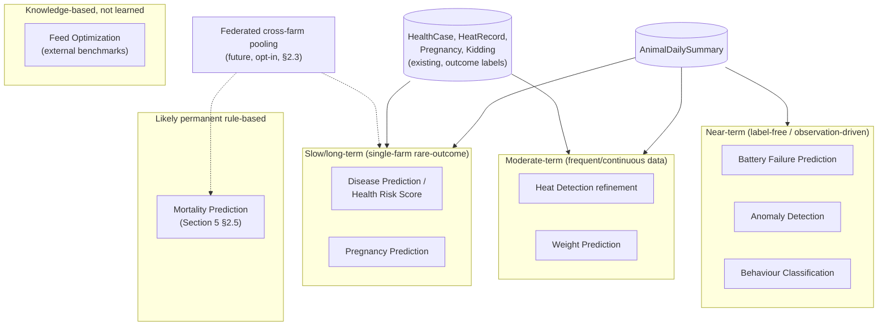

# Pandora IoT Platform — Section 15: AI Features

## 1. Executive Summary

Sections 5, 7, 8, and 9 all deferred their "real" AI model to this section
with the same promise: rule-based scoring for R1, trained models once real
labeled outcome data exists. This section keeps that promise honestly rather
than treating the ten items in the brief as one uniform "add ML" list. The
central finding: **these ten features sit at wildly different points on a
data-availability timeline**, because they depend on fundamentally different
kinds of evidence — some accumulate labels every few weeks regardless of
farm health, some need a rare bad outcome that a well-run farm hopes stays
rare, and some need no outcome labels at all. Sorting them by that reality,
rather than by the brief's list order, is what makes this section's roadmap
actually usable instead of aspirational.

## 2. Engineering Decisions

### 2.1 Two distinct labeling strategies govern everything in this section
- **Outcome-driven labeling** (passive, slow): a label only exists once
  something actually happened later — an animal got sick, got pregnant, or
  didn't survive — matched back against its sensor history. This accumulates
  at whatever rate real events occur, which for a well-run farm with hopefully
  low illness/mortality incidence, is genuinely slow.
- **Observation-driven labeling** (deliberate, fast): a label comes from
  staff directly observing and timestamp-logging behavior (e.g. "goat #3
  walking, 2:15–2:20pm") matched against simultaneous sensor data — this can
  be collected in a focused pilot exercise over weeks, not years, because it
  doesn't wait for anything to happen naturally.
- A third case needs **no labels at all**: unsupervised methods that improve
  purely from accumulated feature-history volume. Which category a given
  brief item falls into determines its realistic timeline far more than how
  interesting or valuable the feature would be.

### 2.2 The ten features, sorted by data-availability reality, not brief order

| Category | Features | Why this timeline |
|---|---|---|
| **Near-term — abundant/label-free data** | Battery Failure Prediction, Anomaly Detection | Battery data accumulates continuously from every device regardless of animal outcomes, and discharge physics is externally well-understood (§2.5); anomaly detection is unsupervised — it improves from feature-history volume alone, no outcome needed |
| **Near-term — observation-driven** | Behaviour Classification | Labels come from a deliberate pilot data-collection exercise (§2.1), not waiting for natural events — already the plan for validating Section 8's rule-based classifier |
| **Moderate-term — frequent/continuous data** | Heat Detection refinement, Weight Prediction | Heats recur every ~18–24 days per doe (Section 7 §2.1) — one of the fastest-accumulating outcome signals available; weight is continuously measured (`WeightRecord`), not rare-outcome-dependent, and growth curves are externally documented (§2.5) |
| **Slow / long-term, single-farm scale** | Disease Prediction, Health Risk Score, Pregnancy Prediction | Depend on real illness/pregnancy outcomes at a <100-goat farm — meaningful sample sizes are a multi-year proposition at this scale alone (§2.3) |
| **May remain rule-based indefinitely** | Mortality Prediction | The rarest possible outcome at a well-run farm — good news for the farm, but it means this is the least likely feature in the whole list to ever accumulate enough labeled data from this farm alone to outperform Section 5 §2.5's sensitivity-biased rule (§2.4) |
| **Knowledge-based, not learned from this farm's data** | Feed Optimization | Reframed in §2.6 — not a from-scratch trained model at all |

### 2.3 Single-farm data scarcity is real — federated pooling (Section 1 §11) is the honest long-term answer, explicitly future/opt-in
- **Why**: rather than pretending disease/pregnancy/mortality prediction will
  arrive quickly, or quietly dropping the ambition, the honest path is
  acknowledging that a *network* of farms running this platform (Section 1
  §11's federated model) could pool anonymized feature-vector-plus-outcome
  pairs — not raw animal data — to reach a useful training set size far
  faster than any single farm alone, while each farm still runs inference
  entirely on-prem with no operational cloud dependency (Section 1 §9).
  This is explicitly a **future, opt-in** direction (§16), not something
  built or assumed now — Pandora Farm is one farm, and this document
  doesn't get to assume a network exists.

### 2.4 Not every detector is expected to "graduate" to a trained model — some rule-based approaches are the permanent answer
- **Why**: Section 5 §2.5's sensitivity-biased mortality detection was
  designed to be *right* about its trade-off (favor an unnecessary check over
  a missed emergency), not just a placeholder awaiting an ML upgrade. Given
  §2.2's data-scarcity reality for mortality specifically, the honest
  statement is that this rule may remain the primary approach indefinitely
  for a farm this size — stated plainly rather than implying every
  Section 5/7/8 rule is just waiting its turn.

### 2.5 Trained models stay lightweight and interpretable — no deep learning
- **Why**: this farm's data volume will never justify deep learning, and the
  single-Mac, no-cloud compute budget (Section 1 §2.1, Section 12 §2.1)
  shouldn't be spent on it regardless. Classical, interpretable model classes
  — logistic regression, gradient-boosted tree ensembles, simple statistical/
  survival models — are preferred specifically because they preserve the
  "contributing factors" explainability requirement Section 5 §2.1/§2.3
  established as non-negotiable: a vet needs to see *why* a score is
  elevated, and tree-based feature importance or linear coefficients can
  still answer that after a rule gets replaced by a trained model, where a
  black-box deep net could not.
- Battery-failure and weight prediction specifically benefit from
  **externally-documented physics/biology** (primary-lithium discharge
  curves, breed-standard growth curves) rather than needing to learn those
  relationships from this farm's own limited data — the model's job there is
  fitting this farm's specific conditions to an already-known curve shape,
  a much easier problem than learning a relationship from scratch.

### 2.6 Feed Optimization is a benchmark-deviation system, not a trained-from-scratch model
- **Why**: livestock nutrition optimization is an established agronomic/
  veterinary science domain — this farm's own limited feed-efficiency history
  (Section 9 §2.2) isn't enough data to rediscover that science from scratch,
  and shouldn't need to. The realistic, valuable R1-appropriate version:
  compare this farm's measured pen-level feed efficiency against established
  external livestock feed-conversion benchmarks for the relevant life stage/
  breed, and alert on meaningful deviation — a knowledge-based comparison, not
  a model trained on this farm's own outcomes. This keeps the same
  recommend-don't-auto-decide discipline as every other section: a deviation
  alert prompts a vet/nutritionist decision, it doesn't auto-adjust rations.
- **Rejected**: an autonomous ration-optimization model — both infeasible
  from this farm's data alone and inconsistent with this entire series'
  human-in-the-loop principle for consequential decisions.

### 2.7 No new persisted "training dataset" table for R1 — assembled on-demand when a training run actually happens
- **Why**: training data for any of the near/moderate-term candidates (§2.2)
  is a query over `AnimalDailySummary` joined against existing outcome tables
  (`HealthCase`, `HeatRecord`, `Pregnancy`, `Kidding`) — building a dedicated,
  persisted training-data table before any model exists to consume it would
  be speculative infrastructure, against this document series' consistent
  bias against building ahead of a real, current need. A lightweight model-
  version-tracking field becomes a genuine (and genuinely small) addition
  once the first Tier-1 model is actually trained and deployed — not
  designed here in advance of that.

## 3. Where Inference Runs

No change from what's already established: entirely backend-side on the
farm's own Mac (Section 1 §2.1, Section 12 §2.1) — a trained model is still
just a computation `src/modules/iot/`'s scoring logic runs, replacing (or
running alongside, during validation, §4) a rule-based function, not a new
architectural tier.

## 4. Model Validation Discipline Before Any Rule Is Replaced

Even a Tier-1 candidate (§2.2) doesn't silently replace its rule-based
predecessor: a trained model is validated against a hold-out set of real
farm outcomes and run **alongside** the existing rule for a period,
comparing agreement and disagreement cases, before it takes over as the
primary score — basic train/validate/compare-before-switch discipline
appropriate to this scale, not full MLOps infrastructure this farm doesn't
need. The rule-based version stays available as a documented fallback, not
deleted the moment a trained model ships.

## 5. Architecture Diagram

## 6. Hardware Components

None — this is a pure software/modeling roadmap section.

## 7. Software Components

Training/validation runs as an offline, periodic backend process (not
continuous, not real-time) — distinct from the real-time/nightly scoring
pipeline (Sections 5, 7, 8) it eventually feeds a trained model into.

## 8. Database Design

No new tables for R1 (§2.7) — a small model-version field is deferred until
a first trained model actually ships.

## 9. Firmware Design

None.

## 10. Communication Flow

No change — a trained model, once validated (§4), simply replaces a function
call inside the existing scoring pipelines already diagrammed in Sections 5,
7, 8, and 13 — not a new data flow.

## 11. Security Considerations

Federated pooling (§2.3), if it's ever built, would need explicit farm
consent and genuinely anonymized feature-outcome pairs, not raw animal
records — flagged as a requirement for that future work, not designed in
detail now since it isn't being built.

## 12. Scalability Plan

Each farm trains/validates its own models against its own data by default
(federated, per Section 1 §11) — the pooled-training future direction (§2.3)
is additive, not a dependency this design requires to function at single-farm
scale.

## 13. Cost Estimate

No new hardware. Training/validation compute is periodic and offline, not a
continuous load on the Mac's resources the way real-time scoring is.

## 14. Risks

| Risk | Mitigation |
|---|---|
| Pressure to "ship AI" before enough data exists, producing an overfit or unreliable model | §4's validate/compare-before-switch discipline is a hard gate, not a suggestion |
| Mortality prediction's rule-based-forever reality read as this project "failing" to deliver AI there | Stated plainly as an honest, evidence-grounded expectation (§2.4), not a shortfall — a farm where mortality prediction never gets enough training data is a farm with a healthy herd, which is the actual goal |
| Federated pooling built prematurely without real farm consent/privacy design | Explicitly deferred and flagged as needing its own security design work when actually pursued (§11), not built speculatively |

## 15. Testing Strategy

- Behaviour Classification's observation-driven labeling (§2.1) is collected
  during the same field pilot already planned across this series (Section 1
  §14) — not a separate data-collection effort.
- Any trained model follows the hold-out validation and shadow-comparison
  process in §4 before replacing a rule-based score in production — this is
  itself the testing strategy for every Tier-1/2 candidate.

## 16. Future Improvements

- Federated cross-farm training data pooling (§2.3), explicitly opt-in and
  privacy-designed, once a genuine multi-farm deployment exists — not before.
- Revisit the Tier categorization (§2.2) periodically as real data
  accumulates — a feature's tier is a current estimate, not a permanent
  classification.

## 17. Approval Gate

- [ ] Ten AI features categorized by data-availability reality (§2.2), not
      treated as a uniform "build AI for everything" backlog
- [ ] Outcome-driven vs. observation-driven vs. label-free labeling as the
      governing framework for timeline expectations (§2.1)
- [ ] Feed Optimization reframed as benchmark-deviation against external
      standards, not a from-scratch trained model (§2.6)
- [ ] Mortality Prediction explicitly acknowledged as likely permanently
      rule-based at this farm's scale (§2.4) — not framed as a gap
- [ ] Trained models stay lightweight/interpretable (no deep learning),
      validated and shadow-compared before replacing any rule-based score
      (§2.5, §4)
- [ ] No new persisted training-data infrastructure built for R1 (§2.7)
- [ ] Federated cross-farm pooling logged as an explicit future/opt-in
      direction tied to Section 1 §11, not built now (§2.3)

**On approval → Section 16: Alert Engine** — the unified alert taxonomy
(animal-not-moving, escaped, low battery, high temperature, disease risk,
heat cycle, delivery due, medicine due, vaccination due, gateway offline,
sensor failure, no communication) consolidating every alert type this series
has introduced since Section 1 into one coherent engine design.
