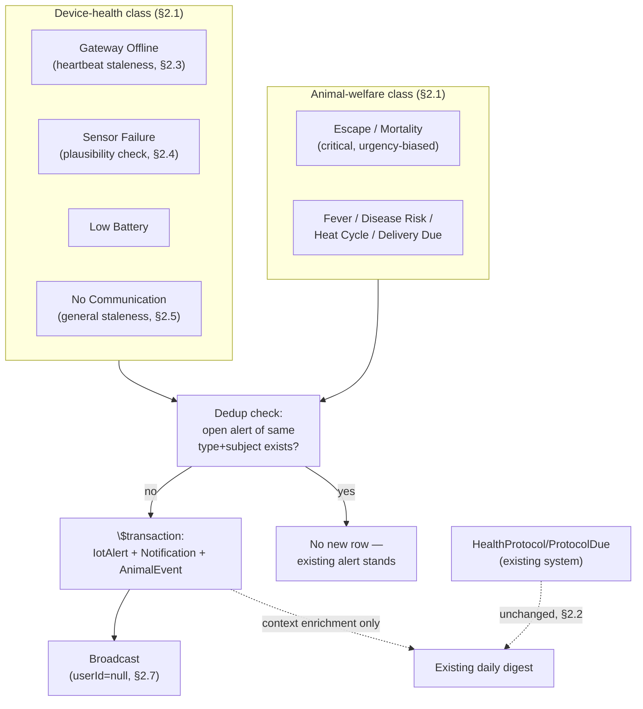

# Pandora IoT Platform — Section 16: Alert Engine

## 1. Executive Summary

Most of the brief's twelve alert types were already designed piecemeal across
Sections 1–15 — this section's job is consolidation into one taxonomy, plus
designing the handful of genuinely new pieces that fell through the cracks:
**gateway offline**, **sensor failure** (data looks broken, not that the
device stopped talking), and a generalized **no communication** staleness
check. One important finding: **"Medicine Due" and "Vaccination Due" are
already fully solved** by the existing `HealthProtocol`/`ProtocolDue` system
and the existing daily digest notification (confirmed during Section 1's
initial exploration) — this section builds zero new logic for them, and says
so plainly rather than reinventing something that already works.

## 2. Engineering Decisions

### 2.1 Two alert classes govern the taxonomy: device-health vs. animal-welfare
- **Why**: gateway offline, sensor failure, low battery, and no-communication
  are fundamentally about hardware/infrastructure state — the concern is
  "is this equipment working," and the response is a maintenance action.
  Escape, fever, disease risk, heat cycle, and not-moving are about the
  *animal* — the concern is welfare, and the response is checking on a goat.
  Both classes feed the same `IotAlert`/`Notification` pipeline (no separate
  infrastructure), but this distinction organizes the taxonomy (§3) and
  matters for future triage even if routing stays unified for R1 (§2.7).

### 2.2 Medicine Due / Vaccination Due: confirmed already solved, zero new logic built
- **Why**: `HealthProtocol`/`ProtocolDue`/`ProtocolAdministration` already
  track vaccination/deworming schedules, and the existing daily digest
  (`notifications.service.ts`) already surfaces overdue protocols and
  expiring medications. Building a parallel IoT-driven due-date system would
  directly violate this document series' consistent reuse-over-reinvention
  principle (Section 5 §2.1 onward). The one legitimate, small enrichment:
  when a protocol is due for an animal *and* that animal currently has an
  elevated Section 5 illness/isolation score, the existing due-notification
  can carry that context (e.g. "vaccination due — also showing reduced
  activity") — a read-only addition to an existing notification payload, not
  new alerting infrastructure.

### 2.3 Gateway Offline: new design, built on the heartbeat topic Section 13 already specified but didn't yet consume
- **Why**: Section 13 §2.2 defined `farm/devices/{deviceId}/status` as a
  gateway liveness topic but didn't say what acts on it. This section closes
  that gap: gateways publish a periodic heartbeat there (mains-powered,
  always-on — no battery-driven duty-cycling concern the way tag reporting
  has), and a simple staleness check — no heartbeat within an expected
  interval — fires a `gateway_offline` alert. This is a device-health-class
  alert (§2.1): the concern is "check the hardware/network," not "check an
  animal."

### 2.4 Sensor Failure: a data-plausibility check, independent of communication status
- **Why**: a device can be online and reporting on schedule while its actual
  sensor data is broken — a stuck ADC reading, a temperature sensor reporting
  a physically implausible value, or the exact same value repeating far more
  consistently than any real sensor would produce. This is genuinely
  different from "no communication" (§2.5) and wasn't designed anywhere
  else in this series. A lightweight plausibility check on incoming
  `SensorReading` values — bounds check against physically reasonable ranges
  per `readingType`, plus a stuck-value heuristic (identical value repeated
  beyond a threshold count/duration) — flags `sensor_failure`, distinct from
  device-offline.

### 2.5 No Communication is a generalized per-deviceType staleness check; Section 6 §2.5's escape alert is its most urgent instantiation, not a separate mechanism
- **Why**: different device types have very different expected check-in
  cadences — a tag advertises frequently but adaptively (Section 2/20), a
  gateway heartbeats steadily (§2.3), an RFID reader reports only when an
  animal passes it. A single staleness threshold across all device types
  would be wrong for all of them. The general mechanism: each `deviceType`
  has its own expected-silence threshold; exceeding it fires `no_comm`.
  Section 6 §2.5's escape/mortality-ambiguous alert for ear tags **is** this
  general mechanism, at its highest urgency, for the one device type where
  silence has the most serious possible meaning — not a separate, redundant
  alert path.

### 2.6 Alert deduplication: an open alert of the same type/subject suppresses new duplicates until resolved
- **Why**: an ongoing condition (low battery staying low, a gateway staying
  offline) shouldn't refire a new alert on every subsequent reading that
  confirms the same state — that would flood the notification feed with
  noise, undermining the alert-fatigue discipline this series has cared
  about since Section 5 §4. Before creating a new `IotAlert`, the engine
  checks for an existing `open`-status row of the same `alertType` +
  `animalId`/`deviceId` — if found, no duplicate is created (the existing
  row's `triggeredAt` may update, but staff see one actionable item, not a
  flood).

### 2.7 No auto-escalation and no alert-routing rules engine for R1
- **Why**: mortality and escape alerts are already `critical` from the
  moment they fire (Section 5 §2.5, Section 6 §2.5) — there's little for
  escalation logic to add there. Lower-severity alerts sitting open longer
  (low battery, gateway offline) are "get to it eventually" items, not
  emergencies that need automated urgency-ramping. Similarly, this farm's
  small staff doesn't need per-alert-type routing rules (e.g. routing
  device-health alerts to one person, welfare alerts to another) — every
  alert broadcasts the same way the existing `Notification.userId = null`
  digest pattern already works. Both are real features a larger, more
  differentiated operation might eventually want — not built now, against
  no observed need at this farm's scale.

## 3. Consolidated Alert Taxonomy

| Brief Item | Class | `alertType` | Severity | Already Designed In |
|---|---|---|---|---|
| Animal Not Moving | Welfare | `inactivity` (warning) / mortality composite (critical) | Two tiers — reduced activity feeds the illness composite; prolonged zero-activity is part of mortality detection | Section 5 §3, §2.5 |
| Animal Escaped | Welfare | `escape` | Critical, urgency-biased | Section 6 §2.4/§2.5 |
| Low Battery | Device-health | `low_battery` | Warning | Section 4 §3, Section 1 §7 |
| High Temperature | Welfare (individual) **or** Herd advisory (environmental) — disambiguated, both exist | `fever` (individual, ambient-corrected) / herd-wide THI advisory | Warning (individual) / advisory (herd) | Section 5 §2.4 (individual) / Section 10 §2.4 (herd) |
| Disease Risk | Welfare | Illness composite score | Medium/High tier | Section 5 §3, §4 |
| Heat Cycle | Welfare (recommendation) | Heat detection composite | High confidence → recommend `HeatRecord` | Section 7 §2.1, §3 |
| Delivery Due | Welfare | Kidding-onset watch | Urgency-biased near expected date | Section 7 §2.4 |
| Medicine Due | Operational | *(existing system)* | *(existing)* | Already solved (§2.2) — zero new logic |
| Vaccination Due | Operational | *(existing system)* | *(existing)* | Already solved (§2.2) — zero new logic |
| Gateway Offline | Device-health | `gateway_offline` | Warning | **New — §2.3** |
| Sensor Failure | Device-health | `sensor_failure` | Warning | **New — §2.4** |
| No Communication | Device-health (general) / Welfare (tag-specific, urgent) | `no_comm` | Warning (general) / Critical (tag, via escape/mortality path) | Generalized here — §2.5; tag case already in Section 6 §2.5 |

## 4. Architecture Diagram

## 5. Hardware Components

None — this section is entirely backend alert-generation logic over
telemetry already flowing through the pipeline established in prior sections.

## 6. Software Components

A `gateway_offline` heartbeat-staleness checker and a `sensor_failure`
plausibility checker, both new (§2.3, §2.4); the dedup check (§2.6) wraps
every alert-creation path already established across Sections 5, 6, 7, 9, 10.

## 7. Database Design

No new tables — `IotAlert.alertType` (Section 14 §3) gains `gateway_offline`
and `sensor_failure` as documented String values, consistent with §2.1 of
Section 14's rationale for keeping this field extensible rather than a
Prisma enum.

## 8. Firmware Design

None new — gateway heartbeat publishing reuses the MQTT client already
specified in Section 12/13.

## 9. Communication Flow

Every alert path already diagrammed in Sections 5, 6, 7, 9, and 10 now
passes through the dedup check (§2.6) before committing its
`$transaction` — the one structural addition this section makes to flows
already designed, plus the two genuinely new checks (§2.3, §2.4) feeding
into the same shared path.

## 10. Security Considerations

No new considerations — this section adds alert-generation logic over
already-assessed data paths (Sections 1, 3, 13).

## 11. Scalability Plan

Dedup and staleness checks are per-device/per-animal, scaling linearly with
device/animal count — consistent with the federated, per-farm scaling model
used throughout (Section 1 §11).

## 12. Cost Estimate

No new hardware or infrastructure cost — pure backend logic.

## 13. Risks

| Risk | Mitigation |
|---|---|
| Sensor plausibility bounds too tight, flagging real extreme-but-valid readings as failures | Bounds set generously (e.g., wider than West Bengal's actual extreme range, Section 2 §2.2's +65°C margin as a reference point) and validated during the field pilot, not guessed |
| Gateway heartbeat interval too short, causing false offline alerts from normal brief network blips | Threshold tuned with margin during installation testing (Section 11 §14), not set to the theoretical minimum |
| Dedup logic masking a *worsening* condition because an open alert already exists | `triggeredAt`/severity can still update on the existing open row (§2.6) — dedup prevents duplicate *rows*, not silence about worsening state; dashboard (Section 18) should surface severity changes on existing alerts, not just new ones |

## 14. Testing Strategy

- Unit tests for the dedup logic (DB-free, pure rule) and the sensor
  plausibility bounds per `readingType`, per this repo's `test/unit`
  convention.
- e2e test simulating a gateway going silent and confirming `gateway_offline`
  fires within the expected window, not before and not much after.
- Confirm the Medicine/Vaccination Due enrichment (§2.2) doesn't alter the
  existing digest's core behavior — an additive change validated against
  the existing notification tests, not a rewrite.

## 15. Future Improvements

- Auto-escalation and role-based alert routing (§2.7) if this farm's staff
  structure or alert volume ever justifies it — evidence-gated, not built
  speculatively.
- Richer device-health dashboards distinguishing the two alert classes
  (§2.1) visually, once Section 18 designs the actual dashboard.

## 16. Approval Gate

- [ ] Alert taxonomy consolidated (§3) — device-health vs. animal-welfare
      classes, mapping every brief item to its already-designed source or
      flagging it as newly designed here
- [ ] Medicine Due / Vaccination Due confirmed already solved by the
      existing `HealthProtocol`/`ProtocolDue`/digest system — no new
      logic built, only an optional context-enrichment addition
- [ ] Gateway Offline (heartbeat staleness) and Sensor Failure (data
      plausibility check) newly designed and added to `IotAlert.alertType`
- [ ] No Communication generalized as a per-deviceType staleness check,
      with the tag-specific case reaffirmed as Section 6 §2.5's existing
      escape/mortality path, not a duplicate mechanism
- [ ] Alert deduplication (open-alert-of-same-type-suppresses-duplicate) as
      a hard rule across every alert path
- [ ] No auto-escalation or alert-routing engine for R1

**On approval → Section 17: Mobile App** — animal dashboard, map, health
timeline, alerts, scan ear tag, pair device, battery status, location
history, medical history, and offline mode for the farm manager's phone.
