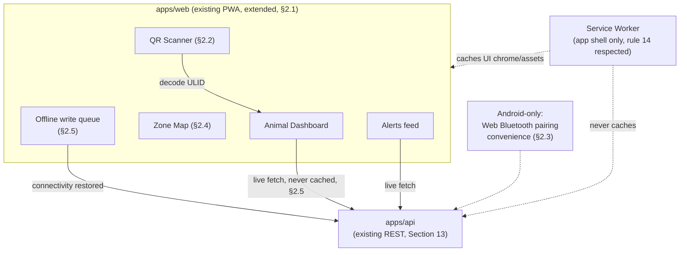

# Pandora IoT Platform — Section 17: Mobile App

## 1. Executive Summary

This is the first UI-focused section, and the first decision it has to make
is whether "Mobile App" means something new at all. It doesn't: Phase-2
§3.5 of this ERP's own architecture already locked in **PWA over native app**
as an approval-gated decision — this section extends `apps/web` with
IoT-specific, mobile-optimized pages, not a second application. Two brief
items needed real technical scrutiny rather than a straightforward design:
**"Scan Ear Tag"** turns out to conflict with two different pieces of
hardware reality (inconsistent Web Bluetooth support across iOS/Android, and
a genuine frequency mismatch between phone NFC and the tag's LF RFID inlay),
resolved by adding a QR code to the tag's printed face instead. And
**"Offline Mode"** runs directly into this repo's own explicit rule 14
("service worker never caches `/api/` — livestock data is live-or-fail,
never silently stale") — resolved by scoping offline support to queued
writes and the app shell, never cached reads of live animal data.

## 2. Engineering Decisions

### 2.1 "Mobile App" is the existing PWA, extended — not a new application
- **Why**: Phase-2 §3.5 already decided this for the whole ERP, with
  rationale this document has no reason to relitigate. New pages
  (`src/pages/IotDashboard.tsx`, `src/pages/AnimalIotDetail.tsx`, etc.) join
  the existing `apps/web` routing, reuse the existing session auth, MUI
  components, and `en.json`/`bn.json` i18n convention (rule 13) — every new
  string this section introduces ships in both languages in the same
  change, no exception for IoT screens.
- **Rejected**: a separate native app or a second PWA — would fragment
  auth, i18n, and deployment for no capability this repo's existing PWA
  approach can't already deliver on a phone's browser.

### 2.2 "Scan Ear Tag" is camera-based QR scanning — not BLE, not NFC
- **Why**: two hardware realities rule out the more obvious options. **Web
  Bluetooth** (which could in principle read the tag's BLE advertisement
  directly) is well-supported on Android Chrome but **not supported by iOS
  Safari at all** — building the core scan feature on it would make it
  unusable on a meaningful share of phones, an unacceptable platform gap for
  a farm's primary field-lookup tool. **Phone NFC**, the other obvious
  candidate for "scan the RFID," operates at 13.56 MHz — the tag's passive
  RFID inlay (Section 4 §2.2) is deliberately **134.2 kHz LF** (Section 3
  §2.1's ISO 11784/11785 livestock-standard choice) — these are physically
  incompatible radio frequencies; a phone's NFC hardware **cannot** read
  this tag's RFID chip, full stop, regardless of software. Camera-based QR
  scanning sidesteps both problems entirely: it works identically on iOS and
  Android via standard browser camera APIs, needs no special hardware
  support, and is a proven, simple pattern. This requires one small addition
  to the tag's physical design: a **printed QR code on the tag's visible
  face**, encoding the animal's ULID directly (not the human-readable
  `tagNumber`, avoiding any string-parsing/collision ambiguity), alongside
  the existing printed tag number for staff reading by eye — a refinement to
  Section 2's tag design, in the same spirit as Section 4's RFID-inlay
  addition.
- **Rejected**: Web Bluetooth as the primary scan mechanism (iOS gap);
  NFC (physically incompatible frequency, not a software-fixable problem).

### 2.3 "Pair Device" is the existing provisioning flow, with an optional Android-only convenience
- **Why**: Section 13 §2.5 already designed device provisioning — QR/serial
  confirmation against the security-allowlist "unregistered device sighting"
  log. This section's mobile UI is that same flow's phone-facing screen: no
  new backend, no new mechanism. One optional enhancement specific to
  Android (where Web Bluetooth works, §2.2): during the deliberate,
  in-the-moment act of provisioning a freshly-applied tag, the app can offer
  to listen for the tag's BLE advertisement directly via Web Bluetooth as a
  convenience — a one-time, explicit, user-initiated action, not continuous
  background scanning. iOS users get the same reliable QR/serial-confirmation
  flow without this convenience — stated honestly as a platform gap, not
  silently assumed to work everywhere.

### 2.4 "Map" is a schematic zone diagram — not a GPS/coordinate map
- **Why**: this entire platform deliberately has no GPS coordinates (Section
  1 §2.2, Section 6 §2.1) — a literal pin-on-a-satellite-map UI would imply
  a precision this system was specifically designed not to need or claim.
  The honest, achievable design: a simple diagram of the farm's configured
  zones (`zoneLabel`, Section 6 §2.2/Section 11), arranged roughly to match
  the real layout during a one-time setup step, showing which zone(s)
  currently hold how many animals, or highlighting a specific animal's
  current zone. This is a genuinely useful "where roughly is this animal"
  view without misrepresenting what the underlying data actually is.

### 2.5 "Offline Mode" is queued writes and app-shell caching — never cached reads of live animal data
- **Why**: rule 14 exists for a real reason this section has no basis to
  override — a manager checking a goat's status on stale cached data,
  believing it current, is exactly the failure mode that rule prevents. The
  honest scope for offline support: the **app shell** (UI chrome, static
  assets) is cacheable via the existing PWA service worker, which is normal
  PWA behavior and doesn't touch `/api/` data at all. **Outbound actions**
  taken while offline (confirming a tag provisioning in a pasture with no
  signal, logging an observation) are **queued locally and submitted once
  connectivity returns** — safe because the user explicitly knows they're
  deferring an action, not being shown data silently presented as fresh
  when it might not be. This mirrors the gateway's own offline-buffering
  design (Section 12 §2.3) applied to the mobile client instead of hardware.
  What this section explicitly does **not** build: caching health scores,
  alerts, or animal status for offline browsing and presenting them as
  current — that would be the exact violation rule 14 was written to prevent.
- **Rejected**: general API response caching for offline reads — directly
  contradicts an existing, explicit architectural rule this document has no
  authority to quietly work around.

### 2.6 Everything else is a UI composition over data already designed — no new backend
- Animal Dashboard (daily activity score + illness risk + current zone +
  battery, Sections 5/6/8), Health Timeline (extended `AnimalEvent`, Sections
  1/5/6/7), Alerts (`IotAlert`/`Notification` feed with acknowledge action,
  Section 16), Battery Status (`IotDevice.batteryPct` tiers, Section 4),
  Location History (zone-transition timeline, Section 6), and Medical
  History (existing `HealthCase`/`CaseVital`/`Treatment`, unchanged) are all
  screens over data this series has already fully specified — this section's
  job for each is UI/UX composition, not new data modeling.

## 3. Coverage of the Brief's List

| Item | Design | Section |
|---|---|---|
| Animal Dashboard | Composed view over existing/IoT data | §2.6 |
| Map | Schematic zone diagram, not GPS | §2.4 |
| Health Timeline | Existing `AnimalEvent`, extended | §2.6 |
| Alerts | `IotAlert`/`Notification` feed + acknowledge | §2.6, Section 16 |
| Scan Ear Tag | Camera QR scan (new tag addition) | §2.2 |
| Pair Device | Existing provisioning flow + optional Android convenience | §2.3 |
| Battery Status | `IotDevice.batteryPct` tiers | §2.6 |
| Location History | Zone-transition timeline | §2.6, Section 6 |
| Medical History | Existing `HealthCase`/`CaseVital`/`Treatment` | §2.6 |
| Offline Mode | Queued writes + app-shell cache only, never cached live reads | §2.5 |

## 4. Architecture Diagram

## 5. Hardware Components

One addition to the ear tag's physical design: a printed QR code on the
visible face, encoding the animal's ULID (§2.2) — no electronics change, a
printing/labeling addition to Section 2's enclosure design.

## 6. Software Components

New `apps/web` pages and a QR-decode library (standard camera-based JS
decoding, no native dependency) — everything else reuses existing frontend
infrastructure (routing, auth, MUI, i18n).

## 7. Database Design

No new tables — QR codes encode the existing `Animal.id` (ULID); the offline
write queue lives client-side (browser storage), not server-side schema.

## 8. Firmware Design

None.

## 9. Communication Flow

Standard REST fetches against the existing/Section-13 API for all live data
(dashboard, alerts, timelines) — never served from cache (§2.5). Queued
offline writes flush through the same REST endpoints once connectivity
returns, using the same idempotency-key pattern already established
elsewhere in this system (Section 1 §9, Section 12 §2.4) applied to the
client's queued-action replay.

## 10. Security Considerations

No new considerations beyond the existing PWA's session auth — the QR code
encodes only a ULID (an opaque identifier, not a secret), consistent with
this system's existing security posture where the real access control is
session/permission-based, not obscurity of identifiers.

## 11. Scalability Plan

Nothing in this section's design assumes or is constrained by herd size or
farm count — same PWA, same pages, same offline-queue mechanism regardless
of scale, consistent with the federated per-farm model (Section 1 §11).

## 12. Cost Estimate

No new hardware cost beyond the QR-code printing addition to the tag's
existing labeling (negligible incremental cost over the tag number already
printed there). No new software licensing — standard browser APIs and
open-source QR-decode libraries.

## 13. Risks

| Risk | Mitigation |
|---|---|
| QR code becomes unreadable (scratched, faded, mud-covered) in field conditions | The tag number remains printed as a manual-entry fallback — QR is a convenience, not the only path to identify an animal |
| Offline write queue growing unbounded during an extended connectivity gap | Bounded queue with a reasonable cap and clear UI feedback about pending items, not silent indefinite accumulation |
| Staff expecting cached "offline browsing" of animal status, given the brief's general "Offline Mode" framing, and being surprised it's unavailable | Explicit, visible UI messaging when offline ("live data unavailable — reconnect to view current status") rather than silently showing nothing or, worse, stale data (§2.5) |
| Android-only pairing convenience creating an inconsistent staff experience across phone types | Explicitly optional and clearly labeled as such in the UI — the reliable QR/serial path works identically on every platform (§2.3) |

## 14. Testing Strategy

- QR scan reliability testing under real field conditions (sunlight glare,
  slightly dirty tags) during the same pilot already planned across this
  series (Section 1 §14).
- Offline-queue behavior explicitly tested with connectivity deliberately
  disabled, confirming queued writes flush correctly and — critically —
  confirming no live data path silently serves cached content, per rule 14
  (same verification discipline Section 10 §14 and Section 12 §14 already
  applied to their own offline/degradation paths).

## 15. Future Improvements

- iOS Web Bluetooth support, if Apple ever adds it, could extend §2.3's
  pairing convenience cross-platform — not something this design can build
  around today.
- Richer zone-map visualization (e.g., animal density heat-shading per
  zone) once real usage patterns show what's actually useful, not designed
  speculatively now.

## 16. Approval Gate

- [ ] "Mobile App" is the existing `apps/web` PWA extended with new pages —
      no separate application, reaffirming Phase-2 §3.5
- [ ] "Scan Ear Tag" is camera-based QR scanning, requiring a printed QR
      code added to the tag's visible face — not BLE (iOS gap) or NFC
      (incompatible frequency with the LF RFID inlay)
- [ ] "Pair Device" reuses Section 13 §2.5's provisioning flow, with an
      explicitly optional, clearly-labeled Android-only Web Bluetooth
      convenience
- [ ] "Map" is a schematic zone diagram, not a GPS/coordinate map
- [ ] "Offline Mode" is scoped to app-shell caching and queued writes only
      — explicitly never cached reads of live animal/health data, per rule 14
- [ ] Animal Dashboard, Health Timeline, Alerts, Battery Status, Location
      History, and Medical History are UI compositions over already-designed
      data — no new backend endpoints beyond what Section 13 specified

**On approval → Section 18: Dashboard** — the enterprise/desktop dashboard:
live animal count, live location (zone) map, health status, pregnancy, heat
detection, mortality risk, feed consumption, battery status, sensor health,
environmental conditions, and AI insights — the farm manager's primary
day-to-day screen.
