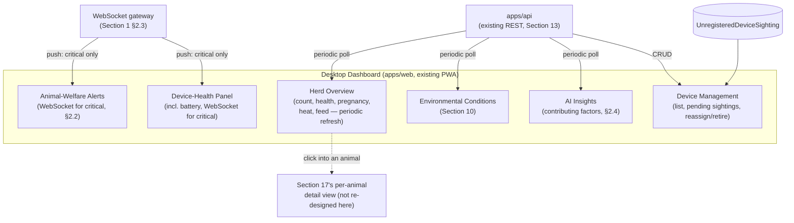

# Pandora IoT Platform — Section 18: Dashboard

## 1. Executive Summary

Section 17 already established the UI-composition patterns and the offline/
live-data rules; this section's job is narrower than it might first look —
design what's genuinely *different* about a desktop management screen versus
a field mobile app, not redesign the same data twice. The organizing
principle: **Section 17 is per-animal and field-focused; this section is
herd-aggregate and management-focused.** Two things get real design
attention here that neither Section 13 (backend-only) nor Section 17
(mobile/field-only) covered: an actual **device management UI**, and an
honest answer to what **"AI Insights"** should show given Section 15's tiered
reality — transparent contributing-factor breakdowns, not a marketing
implication of sophistication that doesn't exist yet.

## 2. Engineering Decisions

### 2.1 Section 18 is herd-aggregate/management; Section 17 is per-animal/field — a deliberate division, not a duplication
- **Why**: without this line, both sections would independently reinvent the
  same "animal detail" and "alert list" screens. This dashboard shows *many*
  animals at once (herd health overview, pregnancy list, battery fleet view)
  and manages fixed infrastructure (§2.5) — it does not re-design the
  per-animal drill-down (Health Timeline, Medical History) Section 17 §2.6
  already owns. A manager clicking into one animal from this dashboard lands
  on Section 17's existing per-animal view, not a second one built here.

### 2.2 Live (WebSocket) updates are reserved for genuinely urgent panels; everything else refreshes periodically
- **Why**: not every panel needs millisecond-live push — a herd animal count
  or a pregnancy-due list doesn't change fast enough to justify it, and
  treating every panel as equally "live" would be over-engineering for data
  that's fine on a periodic refresh. WebSocket push (Section 1 §2.3, Section
  13) is reserved for the panels where seconds actually matter: active
  critical alerts (escape/mortality, §2.3) and device-health critical items
  (gateway offline, §2.6). Everything else — counts, lists, environmental
  readings — refreshes on a reasonable polling interval, matching how
  infrequently the underlying data actually changes.

### 2.3 "Mortality Risk" surfaces active critical alerts, not a continuous graduated risk score
- **Why**: Section 5 §2.5 deliberately designed mortality detection as a
  binary, sensitivity-biased alert — not a gradated per-animal score the way
  illness risk is (Section 5 §2.1). Building a "mortality risk score" panel
  here would imply a capability Section 5 explicitly chose not to build, for
  good reason (a gradated score for a rare, urgent condition invites
  over-interpretation of small differences that don't mean much). This
  panel is the active-critical-alert feed, filtered and prominently
  surfaced — consistent with, not contradicting, how the detector actually
  works.

### 2.4 "AI Insights" means transparent contributing-factor breakdowns — not an implied capability Section 15 says doesn't exist yet
- **Why**: Section 15 was explicit that most of these features are rule-based
  composites for the foreseeable future, with only a few candidates on a
  near/moderate-term path to trained models, and mortality prediction likely
  staying rule-based permanently. A dashboard panel implying sophisticated
  "AI recommendations" would misrepresent what's actually running. This
  panel shows exactly what Section 5 §2.1's explainability requirement
  already promises — "illness score elevated: activity down 40% vs.
  baseline, rumination down 25%, isolated 3 of last 5 days" — the same
  contributing-factor data the alert/notification payload already carries
  (Section 5 §4), surfaced as a readable summary rather than implying more
  than the system currently does.

### 2.5 Device management UI, designed here for the first time
- **Why**: Section 13 §2.3 specified the backend endpoints
  (`POST /iot/devices`, reassign, retire) and Section 13 §2.5 specified the
  provisioning *mechanism*, but no section yet designed the screen a manager
  actually uses. This dashboard's natural desktop/management focus makes it
  the right home: a device list (type, status, battery, zone, last-seen)
  across the whole fleet, a queue of pending `UnregisteredDeviceSighting`
  rows (Section 13 §7) awaiting promotion to a real registration, and
  reassign/retire actions surfaced with the override-guard behavior (422
  `RULE_OVERRIDE_REQUIRED`, Section 13 §2.6) rendered as an explicit
  confirmation step, not a silent API error.

### 2.6 Device-health and animal-welfare alerts get visually separate panels — the concrete payoff of Section 16 §2.1's classification
- **Why**: Section 16 §2.1 introduced the two-class distinction specifically
  because the response differs — a gateway offline needs a maintenance
  action, an escape needs someone to go check a goat right now. Rendering
  both classes in one undifferentiated alert list would waste that
  classification work. Two panels: an animal-welfare feed (escape, fever,
  disease risk, heat cycle, delivery due) and a device-health feed (gateway
  offline, sensor failure, low battery, no communication) — Battery Status
  (§2.7) folds into the device-health panel as one column, not a third
  separate panel.

### 2.7 Battery Status is a column in the device-health panel, not a standalone panel
- **Why**: avoids a redundant fourth panel for data that's already part of
  the device-health fleet view (§2.6) — sortable by lowest-battery-first
  within that same panel gives the same visibility the brief asks for
  without fragmenting the screen.

## 3. Coverage of the Brief's List

| Item | Design | Section |
|---|---|---|
| Live Animal Count | Periodic-refresh aggregate, not WebSocket-critical | §2.2 |
| Live Location Map | Herd-wide schematic zone view (Section 17 §2.4's map, all-animals scope) | §2.1 |
| Health Status | Herd-wide illness-risk overview (Section 5), sortable/filterable | §2.1 |
| Pregnancy | Herd-wide pregnancy list, sorted by proximity to expected kidding date | §2.1, Section 7 |
| Heat Detection | Herd-wide does-in-heat / approaching-window list | §2.1, Section 7 |
| Mortality Risk | Active critical-alert feed, not a graduated score | §2.3 |
| Feed Consumption | Herd/pen-level feed efficiency + wastage trend (Section 9) | §2.1 |
| Battery Status | Column within device-health panel | §2.7 |
| Sensor Health | Device-health panel (gateway/sensor/no-comm), WebSocket for critical items | §2.6, §2.2 |
| Environmental Conditions | Barn sensor readings + THI + forecast (Section 10) | §2.1 |
| AI Insights | Contributing-factor breakdowns, not implied black-box sophistication | §2.4 |

## 4. Architecture Diagram

## 5. Hardware Components

None — a pure frontend section over already-designed backend data.

## 6. Software Components

New `apps/web` dashboard pages, reusing the existing WebSocket client (once
built per Section 13's gateway) for the two critical-only panels (§2.2) and
standard REST polling for everything else.

## 7. Database Design

No new tables — every panel queries data Sections 1–16 already specified.

## 8. Firmware Design

None.

## 9. Communication Flow

Two paths, deliberately different (§2.2): WebSocket push for the narrow set
of critical panels, REST polling for aggregate/overview panels — not a
uniform mechanism applied to everything regardless of actual urgency.

## 10. Security Considerations

Device management actions (reassign/retire) go through the same override-
guarded, audited endpoints Section 13 §2.6/§2.7 already specified — this
section renders that behavior in the UI, it doesn't add a new access path.

## 11. Scalability Plan

Aggregate panels (herd count, health overview) scale by querying
`AnimalDailySummary` (Section 14 §2.4's confirmed analytics layer), not raw
telemetry — consistent with why that table was designed the way it was.
Nothing here assumes a specific herd size.

## 12. Cost Estimate

No new hardware or infrastructure cost — pure frontend design over an
already-built backend.

## 13. Risks

| Risk | Mitigation |
|---|---|
| Over-classifying panels as "needs WebSocket" inflates real-time infrastructure load for no benefit | §2.2's explicit urgency-based reservation prevents this by design, not by later optimization |
| Device management UI making reassignment/retirement feel too easy, encouraging bypassing the override confirmation | Confirmation step rendered explicitly, not auto-dismissed or defaulted to "confirm" (§2.5) |
| "AI Insights" panel still read by staff as more authoritative than it is, despite the contributing-factor framing | UI copy/labeling should reinforce "why this score" language over "AI recommends" language — a content/wording discipline for whoever builds the actual screen, flagged here as a requirement |

## 14. Testing Strategy

- Confirm WebSocket-pushed panels (§2.2) actually update within an
  appropriate latency for genuinely urgent alerts, and confirm
  periodic-refresh panels don't silently starve between polls.
- Validate the device management override-confirmation flow end-to-end
  against the actual 422 `RULE_OVERRIDE_REQUIRED` response shape (Section
  13 §2.6), not assumed to render correctly without testing the real error
  path.

## 15. Future Improvements

- Configurable dashboard layout/panel prioritization once real usage
  patterns show which panels a given farm manager actually checks most —
  not designed speculatively now.
- Cross-farm aggregate dashboard, explicitly deferred to the federated
  multi-farm future direction already flagged in Section 1 §11 and Section
  15 §2.3 — not part of this single-farm design.

## 16. Approval Gate

- [ ] Section 18 (herd-aggregate/management) and Section 17 (per-animal/
      field) treated as a deliberate division — no duplicated screen design
- [ ] WebSocket push reserved for genuinely urgent panels (active critical
      alerts, device-health critical items); everything else periodic-refresh
- [ ] "Mortality Risk" panel is the active critical-alert feed, not a
      graduated per-animal risk score
- [ ] "AI Insights" panel shows contributing-factor breakdowns only,
      explicitly not implying capability beyond Section 15's honest tiering
- [ ] Device management UI (list, pending sightings, reassign/retire with
      rendered override-confirmation) designed here, filling the gap Sections
      13 and 17 left
- [ ] Device-health and animal-welfare alerts render as separate panels;
      Battery Status is a column within the device-health panel, not a
      fourth standalone panel

**On approval → Section 19: Security** — secure boot, encrypted firmware,
TLS, certificate authentication, role-based access, OTA security, key
rotation, and tamper detection, consolidating and completing the security
posture this series has referenced since Section 1.
