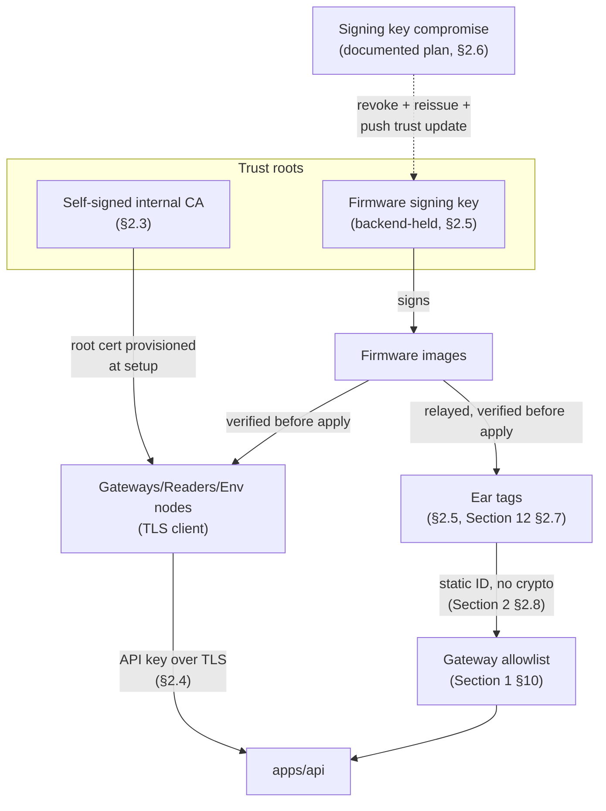

# Pandora IoT Platform — Section 19: Security

## 1. Executive Summary

Most of the security posture is already built — TLS (Section 3 §10),
device allowlisting (Section 1 §10), API-key auth (Section 13 §2.4),
mechanical tamper detection (Section 2 §2.6), and RBAC (Section 1 §2.7) were
all designed where they naturally belonged, not deferred wholesale to this
section. What Section 12 §2.7 explicitly deferred here — OTA signing — gets
designed now, along with three items no prior section touched: secure boot,
firmware encryption, and key rotation. The governing principle for all three
is the same proportionality discipline this series has applied throughout
(Section 2 §2.8's static-ID call, Section 13 §2.4's API-key-over-mTLS call):
enterprise-grade doesn't mean maximum-grade — it means matched to this
farm's actual threat model and device count (~8 fixed devices, ~100 ear
tags), not a defense posture sized for a hostile nation-state adversary.

## 2. Engineering Decisions

### 2.1 Secure boot: enabled if the chosen SoC natively supports it — not built from scratch
- **Why**: modern BLE SoCs in the class already selected (Section 4 §2.4's
  nRF52810-class) commonly include secure-boot capability as part of the
  vendor SDK — enabling an existing capability is low-cost insurance against
  firmware tampering during physical device access. Building custom
  secure-boot infrastructure would be real engineering effort this farm's
  threat model doesn't justify. **Action**: verify secure-boot support on
  the specific SoC variant chosen at implementation time (consistent with
  this document's standing "verify before committing" discipline) and enable
  it if present; don't treat its absence as a blocker requiring a different
  chip family purely for this feature.

### 2.2 Firmware signing (integrity) is the R1 requirement; firmware encryption (confidentiality) is not, for now
- **Why**: the real risk this farm faces is tampered/malicious firmware being
  installed — signing addresses that directly (a device refuses to apply an
  update whose signature doesn't verify against the trusted key). Encrypting
  firmware images protects a different property — preventing someone from
  reading/reverse-engineering the firmware's logic — which matters for
  commercial IP protection, not for a single farm's internal tooling with no
  trade secrets at stake yet. **Reconsidered** only if a genuine multi-farm
  commercial product (Section 1 §11, Section 15 §2.3's federated future)
  makes firmware IP protection commercially relevant — not a concern this
  document invents for a single farm today.
- **Rejected**: encrypting firmware images for R1 — real implementation cost
  (key management for confidentiality, not just signing) for a property this
  farm's actual situation doesn't need protected.

### 2.3 TLS is required, not deferred, even on the farm LAN — self-signed internal CA, root cert provisioned at device setup
- **Why**: reaffirms Section 3 §10's original call rather than treating it as
  optional because it's "just a LAN." Since this is a closed farm network
  with no public-facing domain, a self-signed internal Certificate Authority
  is appropriate — its root certificate is provisioned onto each gateway/
  reader/env node once, during initial setup (part of the provisioning flow,
  Section 13 §2.5), not something devices need to fetch dynamically or trust
  on first use without verification.

### 2.4 Certificate-based (mTLS) device authentication is not chosen for R1 — API-key-over-TLS remains proportionate at this device count
- **Why**: mutual TLS (each gateway presenting its own client certificate
  during the handshake) is a genuinely stronger authentication mechanism
  than a bearer API key, but it requires real PKI machinery — per-device
  certificate issuance and rotation — that's disproportionate for roughly
  eight fixed devices. Section 13 §2.4's API-key-over-TLS choice already
  matches this repo's existing ops-token precedent and is adequate for this
  scale. **Reconsidered** only if the federated multi-farm future (Section
  1 §11) grows the fleet large enough that a formal certificate hierarchy
  starts paying for itself in reduced key-management overhead — not before.

### 2.5 OTA security: signed firmware images, verified before application — closing the gap Section 12 §2.7 deferred here
- **Why**: firmware images are signed by a key held by the backend (the one
  system authorized to originate legitimate updates) before delivery over
  the paths Section 12 §2.7 already specified (LAN deploy for gateways,
  gateway-relay-during-diagnostic-wake for tags). Both gateway and tag
  firmware update handlers verify the signature before applying an image and
  reject anything that doesn't verify — this is the concrete mechanism that
  makes Section 12's OTA delivery design actually safe, not just convenient.

### 2.6 Key rotation: low-frequency, largely manual, proportionate to ~8 fixed devices — with a documented compromise-response plan for the firmware-signing key specifically
- **Why**: building automated key-rotation infrastructure for eight devices
  would be enterprise machinery this farm's scale doesn't call for — device
  API keys (§2.4) are rotated via the device management UI (Section 18
  §2.5) on a low-frequency schedule or on suspected compromise, a manual
  operational task at this device count, not automated infrastructure. The
  firmware-signing key (§2.5) is different: its blast radius is **fleet-
  wide** if compromised (a compromised signing key could sign malicious
  firmware for every device), so even though rotation itself is
  infrequent, this document specifies a **documented compromise-response
  plan** — revoke the old key, issue a new one, push a signed "trust this
  new key" update through the same verified OTA path — worth having written
  down even if the event is rare, because fleet-wide compromise is the one
  security failure mode in this design with real consequences.

### 2.7 Tamper detection: ear tag mechanical/software design reaffirmed; fixed infrastructure relies on physical securing, not additional hardware
- **Why**: Section 2 §2.6's mechanical switch + software debounce is the
  real, needed tamper-detection surface — it protects the thing that
  actually matters (an animal's identity/data association). Section 11
  §10 already correctly assessed that a stolen/tampered gateway is a cost
  nuisance, not a data-integrity risk, because the allowlist/auth design
  (§2.4) already assumes untrusted network conditions at the radio layer —
  adding dedicated tamper-detection hardware to $30–80 relay devices would
  be spending real cost to protect against a risk the architecture already
  handles a different way. Reaffirmed, not re-engineered.

## 3. Consolidated Security Posture

| Layer | Mechanism | Section |
|---|---|---|
| Boot integrity | Secure boot, if SoC-native | §2.1 |
| Firmware integrity | Signed images, verified before apply | §2.5 |
| Firmware confidentiality | Not implemented for R1 | §2.2 |
| Transport | TLS everywhere, self-signed internal CA | §2.3, Section 3 §10 |
| Device authentication | API-key-over-TLS (gateways/readers/env nodes) | §2.4, Section 13 §2.4 |
| Tag "identity" | Static BLE broadcast + gateway allowlist, no crypto | Section 1 §10, Section 2 §2.8 |
| Human authentication | Existing session/RBAC (`@Perm`, `iot` module) | Section 1 §2.7 |
| Key management | Manual, low-frequency rotation; documented signing-key compromise plan | §2.6 |
| Tamper detection (tag) | Mechanical switch + software debounce | Section 2 §2.6, reaffirmed §2.7 |
| Tamper detection (fixed infra) | Physical securing/mounting only | Section 11 §10, reaffirmed §2.7 |
| Audit | Device lifecycle + alert ack logged; readings not | Section 2 §10, Section 13 §2.7 |
| At-rest encryption | Matches repo-wide ERP posture, no IoT-specific scheme | Section 13 §2.8 |

## 4. Architecture Diagram

## 5. Hardware Components

None new — secure boot (§2.1) uses capability already present in Section
4's chosen SoC class, if supported; no additional security-specific hardware.

## 6. Software Components

Firmware signing/verification logic on both the backend (sign) and device
sides (verify) — extends Section 12's OTA delivery mechanism with the
verification step it was missing.

## 7. Database Design

No new tables — `IotDevice.apiKeyHash` (Section 13 §7) already covers device
credential storage; key rotation is an operational process over that
existing field, not a new schema requirement.

## 8. Firmware Design

Signature verification is added to the OTA receiver already specified in
Section 12 §6 — a firmware behavior addition, not a new component.

## 9. Communication Flow

No change to the flows already established — this section adds a
verification gate (signature check) to the existing OTA path (Section 12
§2.7) and confirms TLS applies to every hop already diagrammed since Section
3.

## 10. Security Considerations

This entire section *is* the security design — see §3 for the consolidated
posture.

## 11. Scalability Plan

The proportionality principle running through this section (§2.1, §2.4,
§2.6) is itself the scalability answer: mechanisms sized for ~8 devices
today have explicit, named upgrade paths (mTLS, automated rotation) if the
federated multi-farm future (Section 1 §11) ever grows the fleet enough to
justify them — not built ahead of that need.

## 12. Cost Estimate

No new hardware cost. Signing/verification and CA management are software
work over infrastructure already budgeted in prior sections.

## 13. Risks

| Risk | Mitigation |
|---|---|
| Firmware-signing key compromise | Documented compromise-response plan (§2.6) exists specifically because this is the one fleet-wide-blast-radius risk in this design |
| Self-signed CA root cert provisioning step skipped/misconfigured during setup | Made an explicit part of the provisioning flow (§2.3), not an optional afterthought |
| Secure boot unavailable on the ultimately-chosen SoC variant | Non-blocking (§2.1) — verified at implementation time, doesn't gate hardware selection on this one feature alone |
| Manual key rotation neglected over time at low-frequency schedule | Tied to an operational schedule (e.g., annual) rather than left indefinite, though enforcement is a farm-operations matter, not a technical one at this scale |

## 14. Testing Strategy

- Verify OTA signature checking actually rejects a deliberately-tampered
  test firmware image, not just assumed correct from the design (same
  standard applied to every other "confirm the failure path actually works"
  test in this series — Section 10 §14, Section 12 §14, Section 17 §14).
- Confirm TLS is actually enforced on every gateway/reader/env-node
  connection during the field pilot, not just configured and assumed active.

## 15. Future Improvements

- mTLS/certificate-based device authentication if fleet size grows enough
  to justify the PKI overhead (§2.4).
- Firmware encryption if a commercial multi-farm product ever makes IP
  protection relevant (§2.2).
- Automated key-rotation infrastructure at a fleet size where manual
  rotation becomes genuinely burdensome (§2.6).

## 16. Approval Gate

- [ ] Secure boot enabled if SoC-native, verified at implementation time —
      not a hardware-selection blocker
- [ ] Firmware signing (integrity) implemented for R1; firmware encryption
      (confidentiality) explicitly deferred, not built now
- [ ] TLS required on every hop, including LAN, via a self-signed internal
      CA provisioned at device setup
- [ ] API-key-over-TLS remains the device authentication mechanism for R1;
      mTLS explicitly deferred as a future path, not built now
- [ ] OTA updates verified against a signed image before application, on
      both gateway and tag firmware paths
- [ ] Key rotation is manual/low-frequency for device API keys, with a
      documented (not just implied) compromise-response plan specifically
      for the firmware-signing key
- [ ] Tamper detection stays at the ear tag (mechanical + software); fixed
      infrastructure relies on physical securing, no added hardware

**On approval → Section 20: Power Management** — deep sleep, motion wakeup,
adaptive sampling, scheduled transmission, low-battery mode, and battery
analytics, consolidating the ear tag's power design referenced since Section
2 into the complete firmware state machine.
