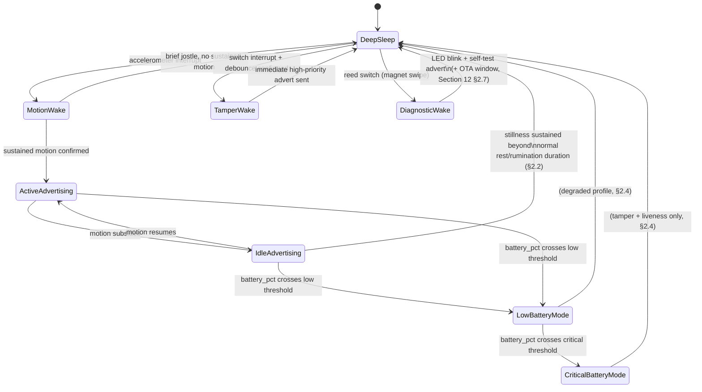

# Pandora IoT Platform — Section 20: Power Management

## 1. Executive Summary

Four prior sections deferred the ear tag's actual firmware state machine
here — Section 2 §8/§9, Section 4 §8, Section 8 §2.1/§8, and Section 12
§2.7's OTA wake window all pointed to this section rather than each
designing a piece of it independently. This section delivers that state
machine, and — for the first time in this series — shows the **arithmetic**
behind Section 2 §2.4's "2.5–3.5 years realistic, 5 years only in a best
case" claim, rather than just asserting it. The number holds up: a 620 mAh
CR2450 needs roughly 14–24 µA average current draw to reach 5–3 years
respectively, and real-world heat de-rating (already flagged in Section 2
§2.4) pushes the practical design target toward the conservative end of that
range — which is exactly where Section 2's honest framing landed.

## 2. Engineering Decisions

### 2.1 The complete firmware state machine
- **Deep Sleep** (baseline): MCU core and radio powered down to minimum,
  only wake-source interrupts live (accelerometer motion/high-g, tamper
  switch, reed switch, RTC periodic timer). Lowest current draw state.
- **Motion Wakeup**: accelerometer interrupt fires, MCU wakes briefly,
  samples at a higher rate for a short window to characterize the motion
  (sustained ambulatory activity vs. a brief jostle) — feeds Section 8
  §2.1's on-device feature-extraction summary.
- **Active/Ambulatory advertising**: while sustained motion continues
  (walking, grazing), advertising interval shortens for better temporal
  resolution — higher average current than deep sleep, but still a
  duty-cycled radio burst pattern, not continuous transmission.
- **Idle/Resting advertising**: low/no locomotion detected — advertising
  interval lengthens, but **does not drop to zero accelerometer sampling**
  (§2.2) — this is not the same as Deep Sleep.
- **Tamper Wake**: switch interrupt → debounce (Section 2 §2.6) → confirmed
  event fires an immediate out-of-cycle high-priority advertisement,
  bypassing the normal duty cycle entirely.
- **Diagnostic Wake**: reed switch (magnet swipe) → LED blink + immediate
  self-test advertisement + the OTA-receptive window Section 12 §2.7 already
  specified.
- **Low Battery Mode** and **Critical Battery Mode**: degraded operation
  under the prioritized scheme in §2.4.

### 2.2 Idle/Resting is not Deep Sleep — periodic accelerometer sampling continues during stillness
- **Why**: rumination (Section 4/5/7/8's proxy signal) happens during
  otherwise-still periods — a goat standing or lying quietly, jaw moving
  rhythmically. If "low motion" collapsed straight to full Deep Sleep with
  zero sampling, rumination bouts would be invisible, undermining a signal
  four prior sections already depend on. True Deep Sleep is reserved for
  stillness that's **sustained well beyond a normal rest/rumination bout
  duration** — which is also, not coincidentally, the same signal Section 5
  §2.5's mortality detection watches for. One state transition rule serving
  two purposes: normal power-saving during genuine rest, and the leading
  edge of the mortality-relevant "prolonged zero activity" window if
  stillness doesn't resolve.

### 2.3 Average current budget: the arithmetic behind Section 2 §2.4's honest life estimate
- Battery life (hours) = capacity (µAh) ÷ average current (µA), for a 620
  mAh (620,000 µAh) CR2450:
  - **5 years** (43,800 hours) → **~14 µA** average current required
  - **3.5 years** (30,660 hours) → **~20 µA** average current required
  - **3 years** (26,280 hours) → **~24 µA** average current required
- Nameplate capacity overstates what's actually available in the field —
  Section 2 §2.4 already flagged West Bengal summer heat de-rating primary-
  lithium capacity and self-discharge below the 25°C datasheet number. That
  pushes the realistic firmware design target toward the **conservative end,
  roughly 15–20 µA average**, which lands almost exactly on Section 2's
  already-stated 2.5–3.5 year honest expectation — this section's
  contribution is showing that number was grounded in real arithmetic, not
  asserted from intuition. Hitting the full 5-year "ideal" case requires
  both a cooler-than-worst-case environment *and* a lower-activity animal
  (less motion-wake frequency) — a best-case combination, correctly framed
  as "ideal," not the design target.

### 2.4 Low Battery Mode degrades in a deliberate priority order — least-critical signal first, safety-critical signal last
- **Why**: not all sensing is equally important, so battery conservation
  under low-battery conditions should degrade the *least* consequential
  signal first, not everything uniformly. Order: **(1)** reduce rumination/
  fine-behavior sampling resolution first — already the lowest-confidence
  signal in this system (Section 4 §16's evidence-gate, Section 5's field-
  validation-pending caveat), the least costly signal to lose. **(2)**
  Lengthen the routine advertising interval further. **(3)** Never
  disabled: tamper-switch responsiveness and a minimal liveness
  broadcast — these feed Section 5 §2.5's mortality/escape detection
  directly, and losing them would mean losing the platform's most
  safety-critical function precisely when the device is least able to be
  serviced quickly. Critical Battery Mode is the far end of this same
  ordering: essentially tamper response + minimal liveness only.

### 2.5 Battery analytics: field-observed depletion rate feeds Section 15's near-term battery-failure-prediction candidate
- **Why**: Section 4 §3 already noted the on-device gauge is coarse
  (voltage-based, three tiers, not a precise fuel gauge). The backend-side
  analytics job is different and more valuable: tracking each device's
  actual `battery_pct` reading history (Section 1 §7's `SensorReading`) over
  time to compute a **real observed depletion rate**, validated against
  this section's §2.3 projection. This is exactly the abundant, label-free,
  continuously-generated data Section 15 §2.2 identified as the fastest
  path to a genuinely useful trained model (battery-failure prediction) —
  this section is where that data collection is actually specified, closing
  the loop Section 15 opened.

### 2.6 "Scheduled Transmission" means adaptive, power-budgeted cadence — not a rigid fixed clock schedule
- **Why**: the brief's "scheduled transmission" is satisfied by the
  motion-driven adaptive interval (§2.1) — predictable in the sense that
  its power cost is bounded and budgeted (§2.3), not predictable in the
  sense of firing at fixed clock times regardless of animal behavior. A
  rigid fixed-interval schedule ignoring actual activity state would waste
  power advertising frequently during genuine stillness and under-sample
  during genuine activity — the adaptive design already serves the brief's
  underlying goal (predictable power draw) better than a literal schedule
  would.

## 3. State Machine Diagram

## 4. Hardware Components

None new — this section specifies firmware behavior over the already-
selected hardware (Section 2, Section 4).

## 5. Software Components

The complete tag firmware state machine (§2.1–§2.4) — the concrete
implementation target for every "detailed state machine belongs to Section
20" deferral across this series.

## 6. Database Design

No new tables. §2.5's battery analytics is a query pattern over existing
`SensorReading` (`battery_pct` readings, Section 14 §3) — no new schema.

## 7. Firmware Design

This entire section *is* the firmware design — §2.1–§2.4 and the diagram in
§3 are the authoritative specification.

## 8. Communication Flow

No change to the transport-level flows already established (Sections 1, 3,
12) — this section governs *when* the tag transmits, not the path data
takes once it does.

## 9. Security Considerations

No new considerations — tamper-wake behavior (§2.1) reaffirms Section 2
§2.6/Section 19 §2.7 without modification.

## 10. Scalability Plan

Per-tag power behavior doesn't change with herd size — the same state
machine runs identically whether this farm has 50 goats or scales within
the federated model (Section 1 §11).

## 11. Cost Estimate

No new hardware cost — this section is firmware design over the battery/
sensor hardware already costed in Sections 2 and 4.

## 12. Risks

| Risk | Mitigation |
|---|---|
| Real-world average current exceeds the ~15–20µA design target, undershooting even the 3-year minimum | §2.3's arithmetic is the design target, not a guarantee — bench current-draw profiling (Section 2 §14) validates it before field commitment, with the field-replaceable battery (Section 2 §2.5) as the fallback if reality falls short |
| Low-battery degradation ordering (§2.4) removes rumination data right when a farm most wants continuity | Accepted trade-off — rumination is already the lowest-confidence signal in the system (Section 4 §16); losing it under low battery is a smaller cost than losing tamper/liveness response |
| Idle/Resting sampling rate insufficient to reliably catch rumination bouts | Same field-validation gate already established (Section 4 §16, Section 8 §14) — this section's sampling-rate choice is subject to that same evidence-gated confirmation, not assumed correct in advance |

## 13. Testing Strategy

- Bench current-draw profiling against this state machine (§2.1) to validate
  the §2.3 average-current target before field commitment — the concrete
  instantiation of the battery-life test Section 2 §14 already planned.
- Confirm the Idle/Resting-to-Deep-Sleep transition threshold (§2.2) doesn't
  fire during genuine rumination bouts observed in the field pilot —
  directly tied to the same rumination-accuracy validation Sections 4, 5,
  7, and 8 already depend on.
- Validate low-battery degradation ordering (§2.4) actually preserves
  tamper/liveness response under simulated low-battery conditions, not just
  assumed from the design.

## 14. Future Improvements

- Revisit the average-current target (§2.3) once real field data (§2.5)
  shows actual depletion rates — the design target is a pre-deployment
  estimate, not a permanently fixed number.
- Solar-assisted power was already ruled out for the tag specifically
  (Section 2 §2.4, weight/orientation impracticality) — nothing in this
  section changes that; it remains a gateway-level future option only
  (Section 11 §2.3).

## 15. Approval Gate

- [ ] Complete firmware state machine (§2.1, §3) — Deep Sleep, Motion Wake,
      Active/Idle Advertising, Tamper Wake, Diagnostic Wake, Low/Critical
      Battery Mode
- [ ] Idle/Resting state maintains periodic accelerometer sampling — not
      equivalent to Deep Sleep — specifically to preserve rumination
      detection capability
- [ ] ~15–20µA average current design target, shown via §2.3's arithmetic
      to align with Section 2 §2.4's already-stated 2.5–3.5 year realistic
      expectation (5 years remains a best-case, not the design target)
- [ ] Low Battery Mode degrades in priority order: rumination sampling
      first, advertising interval second, tamper/liveness response never
      disabled
- [ ] Battery analytics (field-observed depletion rate) explicitly feeds
      Section 15's near-term battery-failure-prediction candidate — no new
      schema, a query pattern over existing `SensorReading` history

**On approval → Section 21: Manufacturing** — PCB cost, sensor cost,
assembly cost, injection mold, testing, packaging, certification, and
maintenance cost, consolidating every per-tag and per-infrastructure cost
figure referenced since Section 2 into target manufacturing and retail cost
estimates.
