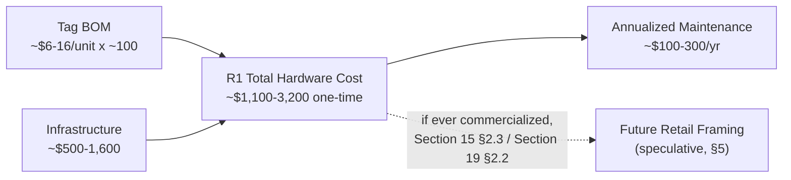

# Pandora IoT Platform — Section 21: Manufacturing

## 1. Executive Summary

Every prior section that touched cost gave a rough range and moved on —
this section itemizes those ranges into an actual bill of materials and
adds up a real total-cost-of-ownership figure for this farm's R1 deployment,
which no section has stated yet. It also resolves an assumption baked into
the brief's own list: **"Target Retail Cost" implies a sale that isn't
happening in R1** — this is an internal farm build, not a commercial
product. This section prices what this farm actually pays, and presents a
retail-cost framing separately, clearly labeled as a future/speculative
scenario tied to the same commercial-multi-farm theme Section 15 §2.3 and
Section 19 §2.2 already introduced, not a current commitment.

## 2. Engineering Decisions

### 2.1 Custom injection molding stays rejected — now with an explicit breakeven calculation
- **Why**: Section 2 §2.1 rejected custom tooling qualitatively ("volumes
  this farm won't reach alone"); this section shows the arithmetic. Custom
  tooling runs roughly $5,000–30,000 depending on complexity. An
  off-the-shelf shell costs an estimated $1–3/unit; mass injection molding
  with amortized tooling might bring that down to roughly $0.30–0.80/unit
  at high volume — a savings of perhaps $1–2/unit. Breakeven at even the low
  end of tooling cost ($5,000 ÷ $1.50 savings/unit ≈ 3,300 units) is more
  than **30x** this farm's ~100-tag R1 volume. This isn't close — reaffirmed
  with numbers, not just restated.

### 2.2 Itemized tag BOM, consolidated from Sections 1, 2, and 4's individual estimates
- Rather than repeating the earlier "$5–15/tag" range unchanged, this
  section breaks it into components (§3) — showing the reasoning, not just
  the conclusion, and landing on roughly **$6–16/unit at ~100-unit volume**,
  consistent with (and now grounded in) what Sections 1 §12 and 2 §12
  already estimated.

### 2.3 "Retail Cost" doesn't apply to R1 — presented separately as an explicitly speculative future framing
- **Why**: this farm is building ~100 tags for its own use, not selling a
  product — there's no margin, no distribution cost, no customer support
  cost to price in, because there's no customer. A "target retail cost"
  figure only becomes meaningful if this platform is ever manufactured and
  sold to other farms (the same commercial-multi-farm future Section 15
  §2.3's federated training and Section 19 §2.2's firmware-IP-protection
  both already flagged as a distinct, later scenario) — §5 presents that
  framing clearly separated from R1's actual build cost, not blended
  together as if both apply today.

### 2.4 Certification: minimal burden for R1 given pre-certified off-the-shelf radio modules; real BIS/WPC certification is a genuine future-phase cost, not incurred now
- **Why**: BLE and WiFi operate in globally license-exempt 2.4 GHz ISM
  bands (Section 3 §10), and using an already-certified off-the-shelf BLE
  SoC/module (rather than a custom radio design) typically inherits that
  module's existing regulatory certification — for ~100 units built for
  this farm's own internal use, additional certification burden beyond what
  the component supplier already carries is minimal. This changes
  materially if this platform is ever manufactured as a commercial product
  for other farms: formal Indian regulatory certification (device-level
  BIS/WPC Equipment Type Approval processes) becomes a real, necessary cost
  and a real timeline item at that point — flagged honestly as a future-
  phase budget line, not detailed further here since it's genuinely out of
  scope for a single-farm R1 build.

### 2.5 Total R1 hardware cost, consolidated into one figure
- Summing the itemized tag BOM (§2.2) across ~100 units and the
  infrastructure estimates already given individually in Sections 1, 3, 6,
  10, and 11 into one total: **roughly $1,100–3,200 one-time hardware cost**
  for this farm's entire R1 deployment (§4), plus near-zero recurring cost
  (occasional battery replacement, no connectivity fees — Section 3 §12).
  No prior section stated this total; it's the actual number a farm owner
  needs for budgeting, and it's worth stating plainly rather than leaving
  the reader to add up eleven scattered ranges themselves.

### 2.6 Maintenance cost is small and labor-time-dominated, not a significant recurring budget line
- **Why**: at ~100 tags with a 2.5–3.5 year average battery life (Section
  20 §2.3), roughly 30–40 tags/year need battery replacement — parts cost
  is trivial (a coin cell), the real cost is staff time during the
  service-cycle musters already tied to existing health-protocol visits
  (Section 2 §2.5). Gasket reseal kits and occasional gas-sensor
  recalibration (Section 10 §13's flagged risk) add a modest amount more.
  Total annualized maintenance is estimated in the low hundreds of dollars
  fleet-wide (§4) — genuinely small relative to the one-time build cost,
  and not a line item this farm needs to budget heavily against.

## 3. Ear Tag BOM (per unit, ~100-unit volume)

| Component | Estimated Cost | Source |
|---|---|---|
| BLE SoC (nRF52810-class) | $1–3 | Section 4 §5 |
| Accelerometer (ADXL362-class) | $1–2 | Section 4 §5 |
| Skin temp sensor (often integrated) | $0.20–0.50 | Section 4 §5 |
| Battery monitor (ADC + divider) | ~$0.10 | Section 4 §5 |
| Tamper microswitch | $0.50–1 | Section 2 §5 |
| Reed switch | $0.30–0.50 | Section 2 §5 |
| Diagnostic LED | $0.05–0.10 | Section 2 §5 |
| Passive LF RFID inlay | $0.30–1 | Section 4 §12 |
| PCB (2-layer, small-batch) | $0.50–1.50 | — |
| CR2450 battery + holder | $0.80–1.50 | Section 2 §2.4 |
| Enclosure (off-the-shelf, UV-stabilized, IP68) | $1–3 | Section 2 §2.1/§2.2 |
| Small-batch assembly labor | $1–3 | — |
| QA/functional test per unit | $0.30–0.70 | §2.7 below |
| Individual + bulk packaging | $0.20–0.50 | §2.8 below |
| **Total** | **~$6–16/unit** | §2.2 |

### 2.7 Manufacturing QA testing, distinct from field-pilot testing
- **Why**: every prior "Testing Strategy" section discussed *field*
  validation (does the rumination proxy work, does BLE range hold up in
  monsoon) — this is different: **per-unit assembly QA** before a tag ever
  reaches an animal. A basic post-assembly check (battery voltage under
  load, BLE radio functional test, tamper switch continuity, LED function)
  catches manufacturing defects before field deployment, cheap per unit
  ($0.30–0.70) relative to the cost of discovering a dead-on-arrival tag
  only after it's applied to a goat.

### 2.8 Packaging
- Individual small-parts packaging (anti-static/moisture-appropriate for
  the electronics) plus bulk shipping packaging for a ~100-unit batch —
  modest cost ($0.20–0.50/unit) not previously itemized anywhere in this
  series.

## 4. Farm Infrastructure Cost (consolidated)

| Item | Quantity | Unit Cost | Subtotal | Source |
|---|---|---|---|---|
| BLE gateway (indoor) | 2–3 | $30–60 | $60–180 | Section 1 §12, Section 11 §12 |
| BLE gateway (outdoor, IP65+) | 1–2 | $50–80 | $50–160 | Section 11 §2.2/§12 |
| LF RFID reader (chute + gate) | 2 | $150–400 | $300–800 | Section 3 §12, Section 6 §12 |
| Environmental sensor set | 1 | $20–40 | $20–40 | Section 10 §12 |
| Unmanaged network switch | 1 | $20–40 | $20–40 | Section 11 §2.7/§12 |
| UPS | 1–2 | $50–150 | $50–300 | Section 11 §2.4/§12 |
| **Infrastructure total** | | | **~$500–1,600** | |

**Total R1 hardware cost: ~100 tags ($600–1,600) + infrastructure ($500–1,600)
≈ $1,100–3,200 one-time**, plus near-zero recurring cost (§2.5).

**Annualized maintenance: roughly $100–300/year fleet-wide**, dominated by
staff time during existing service musters rather than parts cost (§2.6).

## 5. Hypothetical Future Retail Framing (explicitly speculative, not R1)

If this platform were ever manufactured and sold to other farms (Section 15
§2.3, Section 19 §2.2's commercial-future scenario): target retail cost
would need to cover build cost (§3, likely lower at real commercial volume
given §2.1's tooling-breakeven math starts making sense past ~3,000+ units),
margin, distribution, support, and amortized certification cost (§2.4). No
number is committed here — this paragraph exists only to show the framing
is understood, not to price a product that isn't being built.

## 6. Coverage of the Brief's List

| Item | Answer |
|---|---|
| PCB Cost | $0.50–1.50/unit (§3) |
| Sensor Cost | ~$2.30–4.50/unit combined (§3) |
| Assembly Cost | $1–3/unit, small-batch (§3) |
| Injection Mold | Rejected, breakeven ~3,300+ units (§2.1) |
| Testing | $0.30–0.70/unit QA (§2.7), distinct from field-pilot testing |
| Packaging | $0.20–0.50/unit (§2.8) |
| Certification | Minimal for R1 (pre-certified modules); real future cost if commercialized (§2.4) |
| Maintenance Cost | ~$100–300/year fleet-wide (§2.6) |
| Expected Retail Cost | N/A for R1 — not a sold product (§2.3) |
| Target Manufacturing Cost | ~$6–16/unit at ~100-unit volume (§2.2) |
| Target Retail Cost | Explicitly deferred, speculative future framing only (§5) |

## 7. Architecture Diagram

## 8. Hardware Components

Covered fully in §3 and §4 — no new components beyond what Sections 1–20
already specified; this section prices them.

## 9. Software Components

None.

## 10. Database Design

None.

## 11. Firmware Design

None.

## 12. Communication Flow

None — pure cost consolidation.

## 13. Security Considerations

Certification (§2.4) is the one item here with a security/compliance
dimension — flagged, not re-derived from Section 19.

## 14. Scalability Plan

§2.1's breakeven math *is* this section's scalability answer for
manufacturing specifically: costs stay in the per-unit-purchased regime
until volume crosses into the thousands, at which point tooling investment
starts making sense — a threshold this farm's R1 deployment doesn't
approach, consistent with the federated per-farm model (Section 1 §11) not
requiring any single farm to reach that volume alone.

## 15. Risks

| Risk | Mitigation |
|---|---|
| Small-batch component/assembly pricing estimates prove optimistic at actual quote time | Ranges given deliberately wide (§3, §4); real supplier quotes should replace these estimates before committing budget |
| Certification assumption (module-level coverage sufficient for R1) proves wrong for this specific import/use case | Worth a brief regulatory confirmation before bulk ordering, not assumed with full certainty (§2.4) |

## 16. Testing Strategy

QA testing (§2.7) is itself part of this section's design — validate the
per-unit test procedure catches real assembly defects using the first small
batch before committing to the full ~100-unit order.

## 17. Future Improvements

- Real supplier quotes replacing these estimates once actual sourcing
  begins — this document's numbers are planning-stage ranges, not
  procurement commitments.
- Revisit §2.1's tooling breakeven if a genuine multi-farm volume ever
  approaches the threshold identified there.

## 18. Approval Gate

- [ ] Itemized tag BOM (§3) totaling ~$6–16/unit at ~100-unit volume
- [ ] Custom injection molding remains rejected, with an explicit breakeven
      calculation (~3,300+ units) confirming this farm's volume doesn't
      approach it
- [ ] Total R1 hardware cost stated as one figure: ~$1,100–3,200 one-time,
      plus ~$100–300/year maintenance
- [ ] Certification treated as minimal-burden for R1 (pre-certified
      modules), with real BIS/WPC certification flagged as a genuine future-
      phase cost only if commercialized
- [ ] "Retail Cost" explicitly deferred as a speculative future framing
      (§5), not priced as if a sale is happening in R1

**On approval → Section 22: Roadmap** — the phased plan (RFID+QR, BLE Ear
Tag, LoRaWAN Network, AI Monitoring, Predictive Livestock Intelligence)
sequencing everything designed across Sections 1–21 into an actual delivery
order.
