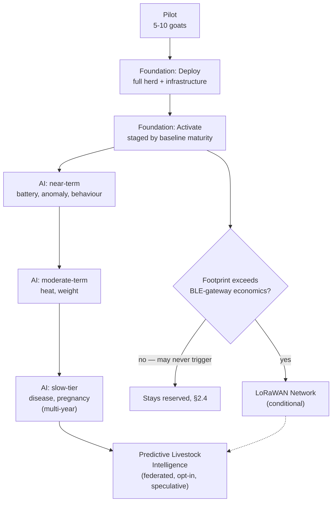

# Pandora IoT Platform — Section 22: Roadmap

## 1. Executive Summary

The brief suggests five phases: RFID+QR, then BLE Ear Tag, then LoRaWAN,
then AI Monitoring, then Predictive Livestock Intelligence. That doesn't
match what the previous 21 sections actually designed. Section 4 §2.2
embedded the passive RFID inlay **inside** the BLE tag from the start
(battery-independent identity fallback in one enclosure), and Section 17
§2.2 added a printed QR code to that same physical tag. RFID, BLE, and QR
were never sequential products in this design — they're three identity
mechanisms on **one integrated tag**, bundled together specifically because
of the reliability benefits that bundling provides. This section states that
reconciliation plainly and proposes the phasing that actually matches 21
sections of accumulated dependencies, rather than mechanically restating a
five-phase list that no longer describes what was designed.

## 2. Engineering Decisions

### 2.1 The brief's Phase 1/Phase 2 split doesn't match the design — reconciled into one Foundation phase
- **Why**: a real "RFID+QR first, upgrade to BLE later" rollout would mean
  building and deploying a simpler passive-only tag, then later replacing
  it fleet-wide with the BLE-capable version — real cost (double tagging
  effort) for no benefit, when the integrated tag (Sections 2, 4, 17) was
  designed specifically to avoid needing that kind of staged hardware
  replacement. The honest, dependency-accurate phasing collapses the
  brief's first two phases into one **Foundation** phase: the full
  integrated tag, ships once, to the whole herd.

### 2.2 Foundation has two internal stages, driven by baseline-maturity requirements already established
- **Why**: Section 5 §2.2 built cold-start suppression directly into the
  detection logic — a score isn't trusted until ~7–14 days of an animal's
  own baseline exists. Section 7 §2.1's heat-cycle prior needs at least one
  full ~18–24 day cycle to produce a first estimate, and gets meaningfully
  better after several. This means detection/alerting can't actually go
  live the same day hardware is deployed, regardless of how "ready" the
  rule-based logic is — the honest rollout has two stages: **(1a) Deploy** —
  hardware, provisioning, infrastructure, data collection begins; **(2a)
  Activate** — detection/alerting turns on per-detector as its own baseline
  requirement is met, staggered rather than a single flip-the-switch moment
  (activity/illness composites first at ~2 weeks; heat-cycle detection
  meaningfully useful only after the first full cycle; rumination/lameness/
  parturition-signature confidence tiers stay at their already-stated lower
  confidence, per Section 4 §16/Section 7 §2.4's evidence gates, until the
  field pilot specifically validates them).

### 2.3 A Pilot stage precedes Foundation — already implied ~15 times across this series, formalized here
- **Why**: nearly every prior section's Testing Strategy pointed to "the
  field pilot" as where a specific design assumption gets validated — BLE
  range in monsoon conditions (Section 3 §14), rumination proxy accuracy
  (Section 4 §16), tamper-switch false-positive tuning (Section 2 §14),
  parturition signature (Section 7 §2.4), zone-attribution hysteresis
  (Section 6 §14). No section put this on an actual timeline until now:
  **5–10 goats, tagged first**, running long enough to observe at least one
  heat cycle per doe and ideally spanning both a dry-season and a
  monsoon-adjacent RF condition (Section 3 §14's explicit requirement) —
  before committing to full ~100-tag procurement (Section 21).

### 2.4 LoRaWAN stays Phase 2 in relative order, but explicitly conditional, not scheduled
- **Why**: consistent with every prior mention (Section 3 §3.2, Section 11
  §2.5) — reserved, not rejected, activated only if this farm's footprint
  grows beyond BLE-gateway economics, or a future federated farm (Section 1
  §11) has more dispersed land. This may **never** trigger for Pandora Farm
  specifically at its current 2.7-acre size — it's placed in phase order,
  not on a calendar, because triggering it is an evidence-based decision,
  not a scheduled milestone.

### 2.5 AI Monitoring is itself staged, following Section 15's tiers exactly — not one phase
- **Why**: Section 15 §2.2 already sorted the ten AI features by realistic
  data-availability timeline. Restating "AI Monitoring" as a single
  brief-list phase would flatten that careful tiering back into the kind of
  undifferentiated "add AI" ambition Section 15 specifically rejected. This
  phase's actual internal order: near-term (battery failure prediction,
  anomaly detection, behaviour classification) → moderate-term (heat-cycle
  refinement, weight prediction) → slow, multi-year (disease/pregnancy
  prediction, health risk score) — with mortality prediction explicitly
  **not** expected to graduate from its rule-based design at this farm's
  scale (Section 15 §2.4), stated here again because a roadmap reader
  skimming phase names shouldn't come away expecting it eventually will.

### 2.6 Predictive Livestock Intelligence is the honest label for the federated, opt-in, long-horizon future — not committed to
- **Why**: this phase is exactly what Section 1 §11's federated multi-farm
  model, Section 15 §2.3's opt-in pooled training, and Section 19 §2.2/
  Section 21 §5's commercial-product framing were all individually pointing
  toward without any one of them fully naming it. This roadmap section is
  where that convergence is stated explicitly, and just as explicitly held
  at arm's length — genuinely speculative, requiring a real multi-farm
  deployment and real privacy/consent design work (Section 15 §11) that
  doesn't exist yet and isn't being built now.

## 3. The Actual Roadmap

| Stage | Contents | Trigger / Duration | Status |
|---|---|---|---|
| **Pilot** | 5–10 goats, integrated tag, infrastructure site survey, evidence-gate validation (rumination, lameness, tamper tuning, BLE range) | Weeks to a few months — spans at least one heat cycle and a monsoon-adjacent RF condition | Not started — first real-world step after this document series is approved |
| **Foundation — Deploy** | Full herd (~100 tags), farm infrastructure (Section 11), backend/database/security/power-mgmt (Sections 13–14, 19–20), provisioning (Section 13 §2.5) | After pilot validates the design assumptions it's testing | Fully designed (Sections 1–21), not yet built |
| **Foundation — Activate** | Rule-based detection/alerting turns on per-detector as baseline maturity is met (§2.2) | ~2 weeks (activity/illness) to ~1–3 cycles (heat/fertility) after Deploy | Logic fully designed (Sections 5–10, 16), staged activation newly specified here |
| **LoRaWAN (conditional)** | Multi-channel gateway, network server (Section 3 §2.5, Section 11 §2.5) | Only if footprint/coverage economics require it — may never trigger | Reserved, on paper only (§2.4) |
| **AI Monitoring (staged)** | Near-term → moderate-term → slow-tier trained models (Section 15 §2.2) | Multi-year, gated by real labeled outcome accumulation | Roadmap and validation discipline designed (Section 15), no models trained yet |
| **Predictive Livestock Intelligence** | Federated cross-farm pooling, mature models, possible commercial product | Long-horizon, opt-in, contingent on a real multi-farm deployment existing | Named and scoped as future (§2.6), not designed in detail |

## 4. Architecture Diagram

## 5. Hardware Components

None new — this section sequences hardware already fully specified in
Sections 2–4, 10–11.

## 6. Software Components

None new — sequences software already specified in Sections 5–9, 12–20.

## 7. Database Design

None new — Section 14's consolidated schema already covers everything this
roadmap deploys.

## 8. Firmware Design

None new.

## 9. Communication Flow

None new — this section is sequencing, not new data flow.

## 10. Security Considerations

None new beyond Section 19 — the roadmap doesn't change what's secured, only
when it's deployed.

## 11. Scalability Plan

This entire section *is* a scalability plan — the conditional LoRaWAN
trigger (§2.4) and staged AI rollout (§2.5) are exactly how this design
scales over time without being over-built in advance of real need.

## 12. Cost Estimate

Pilot cost: a small fraction of Section 21's full ~100-tag estimate (5–10
tags plus a minimal infrastructure subset for pilot-scale validation).
Foundation cost: Section 21's full ~$1,100–3,200 figure. LoRaWAN and later
phases: not costed here, contingent on whether/when they trigger.

## 13. Risks

| Risk | Mitigation |
|---|---|
| Pressure to skip the Pilot stage and go straight to full-herd deployment | Every evidence-gated design decision across this series (rumination confidence, tamper tuning, BLE range) depends on pilot data existing first — skipping it means deploying against untested assumptions at 10x the cost of getting them wrong |
| Staged Activate rollout perceived as "the system isn't working yet" during the baseline-accumulation window | Clear communication that this is a designed, evidence-based staging (§2.2), not a bug or delay |
| Roadmap phase names (matching the brief) read by a future stakeholder as a committed schedule rather than a conditional/evidence-gated sequence | §2.4/§2.6 state plainly which phases are conditional or speculative — this section is the reference point for that distinction going forward |

## 14. Testing Strategy

The Pilot stage (§2.3) *is* this whole platform's testing strategy — every
prior section's individual "validate in the field" requirement converges
here into one actual, timed activity, not left as a scattered set of
unscheduled intentions.

## 15. Future Improvements

Everything in the LoRaWAN, AI Monitoring, and Predictive Livestock
Intelligence stages (§3) is, by definition, this document's own "future
improvements" — already captured in the roadmap rather than repeated as a
separate list.

## 16. Approval Gate

- [ ] Brief's Phase 1 (RFID+QR) / Phase 2 (BLE Ear Tag) reconciled into one
      Foundation phase, matching the integrated tag actually designed
      (Sections 2, 4, 17) — not built as two sequential products
- [ ] Foundation splits into Deploy and Activate stages, with Activate
      staggered per-detector by baseline-maturity requirements already
      established in Sections 5 and 7
- [ ] A Pilot stage (5–10 goats) formally precedes full-herd Foundation
      deployment, consolidating every prior section's field-validation
      requirement into one scheduled activity
- [ ] LoRaWAN remains explicitly conditional (may never trigger for this
      farm), not a scheduled milestone
- [ ] AI Monitoring follows Section 15's tiered order internally, not
      treated as one undifferentiated phase
- [ ] Predictive Livestock Intelligence named as genuinely speculative,
      federated, and opt-in — not committed to

**This is the last of the 22 sections in the brief.** Once approved, the
design phase of this engagement is complete — `docs/iot/01` through `22`
constitute the full architecture. What follows is implementation (starting
with the Pilot stage, §2.3), which is a different kind of work from what
this document series has done and should be scoped separately when the
farm is ready to begin it.
